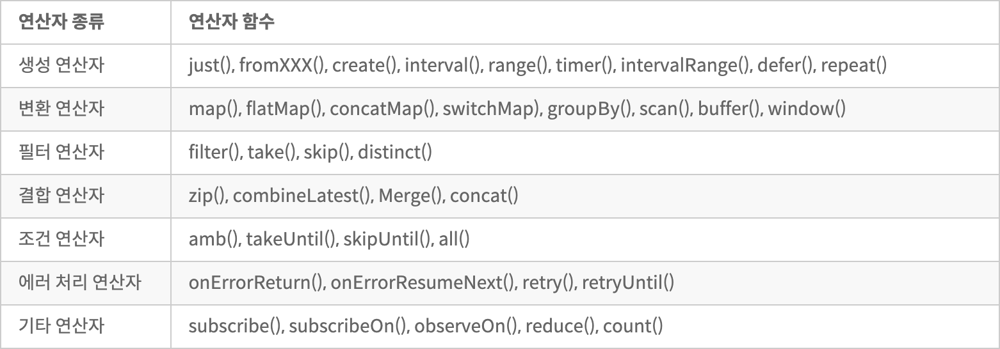
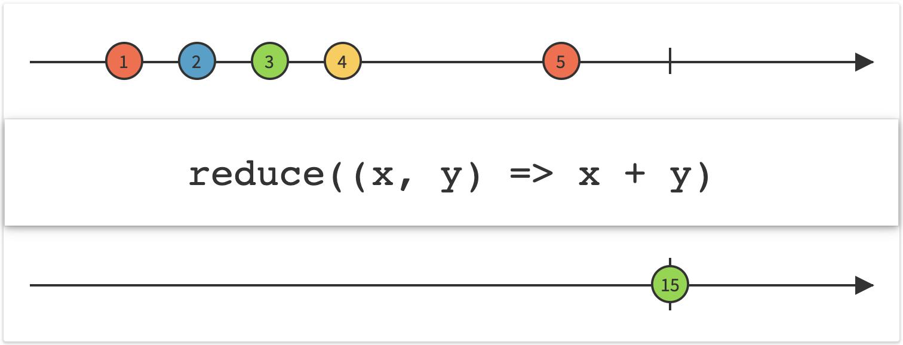

## RxJava 리액티브 연산자 입문

----

* [ReactiveX 문서](http://reactivex.io/documentation/operators.html)의 연산자 부분을 살펴보면 다양한 연산자(operator) 함수가 존재합니다. 
* 리액티브 연산자의 특징은 언어 특성과 크게 연관이 없다는 것입니다. ReactiveX는 자바뿐만 아니라 자바스크립트, 닷넷, 스칼라, 클로저, 스위프트의 리액티브 연산자 목록을 함께 제공하기 때문입니다. 
* 리액티브 연산자 분류



* 연산자
  * 생성(Creating) 연산자 : Observable, Single 클래스 등으로 데이터의 흐름을 만들어내는 함수.
  * 변환(Transforming) 연산자 : 어떤 입력을 받아서 원하는 출력 결과를 내는 전통적인 의미의 함수.
  * 필터(Filter) 연산자 : 입력 데이터 중에 원하는 데이터만 걸러내는 함수.
  * 합성(Combining) 연산자 : 생성, 변환, 필터 연산자가 주로 단일 Observable을 다룬다면, 합성 연산자는 여러 Observable을 조합하는 역할을 하는 함수.
  * 오류 처리(Error Handling) 연산자 : 예외 처리를 담당하는 함수.
  * 유틸리티(Utility) 연산자 : 주요 연산자로는 subscribeOn()과 observeOn() 등이 있으며, 비동기 프로그래밍을 지원
  * 조건(Conditional) 연산자 : Observable의 흐름을 제어하는 역할.
  * 수학과 집합형(Mathematical and Aggregate) 연산자 : 수학 함수와 연관 있는 연산자.
  * 배압(Back pressure) 연산자 : 배압 이슈에 대응하는 연산자.


## map() 함수

----

- map() 함수는 입력값을 어떤 함수에 넣어서 원하는 값으로 변환하는 함수.

  ex) String을 String으로 변환 / String을 Integer나 다른 객체로 변환

- map() 함수는 입력 데이터와 그것을 변환해줄 함수를 이어주는 중개업자가 있다고 생각하자!


*>> map() 함수의 마블 다이어그램*

* 앞서 말했던 중개업자는 마블 다이어그램의 map{} 사이에 있습니다.


*>> map() 함수의 예시*

```java
public void marbleDiagram() {
		String[] balls = {"1", "2", "3", "5"};
		
		Observable<String> source = Observable.fromArray(balls)
				.map(ball -> ball + "<>");
		
		source.subscribe(System.out::println);
}

>>1<>
>>2<>
>>3<>
>>5<>
```

*>> map() 함수의 Example Code*

```java
@CheckReturnValue
@SchedulerSupport(SchedulerSupport.NONE)
public final <R> Observable<R> map(Function<? super T, ? extends R> mapper) {
		ObjectHelper.requireNonNull(mapper, "mapper is null");
    return RxJavaPlugins.onAssembly(new ObservableMap<T, R>(this, mapper));
}
```

*>> map() 함수의 원형*

- `@CheckReturnValue`는 반환값을 확인한다는 의미입니다.
- `@SchedulerSupport`는 스케줄러를 지원하지 않는다는 의미 → 현재 스레드에서 실행한다는 의미입니다.
- map() 함수는 매개변수로 Fuction 인터페이스 타입을 받습니다.

```java
Function<? super T, ? extends R> mapper
```

*>> map() 함수의 인자*

* 위 코드는 람다식인데, RxJava의 람다 표현식은 아래의 제네릭 함수형 인터페이스 중 하나로 나타냅니다.

```markdown
Predicate<T> : t값을 받아서 참이나 거짓을 반환 ( boolean test(T t) )

Consumer<T> : t값을 받아서 처리하고 반환값은 없음 ( void accept(T t) )

Function<T, R> : t값을 받아서 결과 R 반환 ( R apply(T t) )
```

```java
public void mapFunction() {
		Function<String, String> getDiamond = ball -> ball + "<>";
		
		String[] balls = {"1", "2", "3", "5"};
		
		Observable<String> source = Observable.fromArray(balls).map(getDiamond);
		
		source.subscribe(System.out::println);
}

>>1<>
>>2<>
>>3<>
>>5<>
```

*>> 위 marbleDiagram() 예제를 Function 인터페이스를 이용해 분리*

- map() 함수는 입력 타입과 반환 타입이 반드시 같을 필요는 없습니다.

```java
public void mappingType() {
		Function<String, Integer> ballToIndex = ball -> {
			switch(ball) {
				case "RED" : return 1;
				case "YELLOW" : return 2;
				case "GREEN" : return 3;
				case "BLUE" : return 5;
				default : return -1;
			}
		};
		
		String[] balls = {"RED", "YELLOW", "GREEN", "BLUE"};
		Observable<Integer> source = Observable.fromArray(balls).map(ballToIndex);
		source.subscribe(System.out::println);
}

>>1
>>2
>>3
>>5
```


## flatMap() 함수

----

* flatMap() 함수는 map() 함수를 좀 더 발전시킨 함수입니다.
* map() 함수는 원하는 입력값을 어떤 함수에 넣어서 변환할 수 있는 일대일 함수
* flatMap() 함수는 원하는 입력값을 어떤 함수에 넣더라도 결과가 Observable로 나오는 일대다 혹은 일대일 Observable 함수


*\>> flatMap() 함수의 마블 다이어그램*

```java
@CheckReturnValue
@SchedulerSupport(SchedulerSupport.NONE)
public final <R> Observable<R> flatMap(Function<? super T, ? extends ObservableSource<? extends R>> mapper) {}
```

*\>> flatMap() 함수의 원형*

- `@CheckReturnValue`는 반환값을 확인한다는 의미입니다.
- `@SchedulerSupport`는 스케줄러를 지원하지 않는다는 의미 → 현재 스레드에서 실행한다는 의미입니다.
- 위 원형을 압축해서 요약하면 Observable<R> flatMap(Function <T, ObservableSource<R>>)입니다. "T를 넣으면 여러 개의 R이 나오도록 매핑한다."는 의미입니다.

```java
public void marbleDiagram() {
		Function<String, Observable<String>> getDoubleDiamonds = 
				ball -> Observable.just(ball + "<>", ball + "<>");
				
		String[] balls = {"1", "3", "5"};
		
		Observable<String> source = Observable.fromArray(balls)
				.flatMap(getDoubleDiamonds);

		//Observable<String> source = Observable.fromArray(balls)
		//	.flatMap(ball -> Observable.just(ball + "<>", ball + "<>");
		
		source.subscribe(System.out::println);
}

>>1<>
>>1<>
>>3<>
>>3<>
>>5<>
>>5<>
```

*\>> Example Code*

- Observable<String> Type인 source는 balls 배열 값을 가져온 후 getDoubleDiamonds() 함수를 활용해 flatMap() 함수를 호출합니다.
- getDoubleDiamonds() 함수는 String을 넣으면 "여러 개의 String을 발행하는 Observable이 나오는구나"라고 생각하면 됩니다.
- getDoubleDiamonds() 함수는 ball을 입력받아서 ball + "<>"을 두 번 발행합니다.


## 구구단 만들기

----

```java
public void plainJava() {
		Scanner in = new Scanner(System.in);
		System.out.println("Gugudan Input : ");
		
		int dan =  Integer.parseInt(in.nextLine());
		
		for(int row = 1; row <= 9; row++) {
			System.out.println(dan + " * " + row + " = " + dan * row);
		}
}

>>Gugudan Input : 7
>>7 * 1 = 7
>>7 * 2 = 14
>>7 * 3 = 21
>>7 * 4 = 28
>>7 * 5 = 35
>>7 * 6 = 42
>>7 * 7 = 49
>>7 * 8 = 56
>>7 * 9 = 63
```

*\>> Java코드로 작성한 구구단*


### Step 1 : for문을 Observable로 변환하기

```java
public void reactiveV1() {
		Scanner in = new Scanner(System.in);
		System.out.println("Gugudan Input : ");
		
		int dan = Integer.parseInt(in.nextLine());
		
		Observable<Integer> source = Observable.range(1, 9);
		source.subscribe(row -> System.out.println(dan + " * " + row + " = " + dan * row));
}

>>Gugudan Input : 7
>>7 * 1 = 7
>>7 * 2 = 14
>>7 * 3 = 21
>>7 * 4 = 28
>>7 * 5 = 35
>>7 * 6 = 42
>>7 * 7 = 49
>>7 * 8 = 56
>>7 * 9 = 63
```

*\>> for문 Observable 변환*

- Observable.range(start, count)는 start 숫자부터 count 개수만큼의 숫자 값을 발행합니다.


### Step 2 : 사용자 함수 정의하기

- 1개의 입력을 받아서 9개의 줄을 출력하는 함수가 필요합니다.
- map() 함수는 1개를 입력받아서 1개의 결과만 만들어내므로 이 예제에는 적합하지 않습니다.
- 따라서, 한 개의 Integer 값을 입력하면 여러 개의 String을 발행하는 flatMap() 함수를 활용하기에 적합합니다.

```java
public void reactiveV2() {
		Scanner in = new Scanner(System.in);
		System.out.println("Gugudan Input : ");
		
		int dan = Integer.parseInt(in.nextLine());
		
		Function<Integer, Observable<String>> gugudan = num -> 
			Observable.range(1, 9).map(row -> num + " * " + row + " = " + num * row);
		
		Observable<String> source = Observable.just(dan).flatMap(gugudan);
		
		source.subscribe(System.out::println);
}

>>Gugudan Input : 7
>>7 * 1 = 7
>>7 * 2 = 14
>>7 * 3 = 21
>>7 * 4 = 28
>>7 * 5 = 35
>>7 * 6 = 42
>>7 * 7 = 49
>>7 * 8 = 56
>>7 * 9 = 63
```

*\>> flatMap() 함수를 활용한 코드 변환*

- gugudan() 함수를 만들어 두면 subscribe() 메서드를 호출해 출력하기만 하면 됩니다. → 코드 재활용성 증대
- 디버깅 도구들을 추가해 예외 처리하기도 쉽습니다.


## filter() 함수

----

- filter() 함수는 Observable에서 원하는 데이터만 걸러내는 역할을 합니다.
- 필요없는 데이터는 제거하고 필요한 데이터만 filter() 함수를 통과


*\>> filter() 함수의 마블 다이어그램*

- 위 다이어그램을 보면 filter() 함수는 오직 동그란 모양의 원만 통과시킵니다.


*\>> filter() 함수의 예시*

- 위 예시를 보면 인자로 받은 x의 값이 10보다 큰 경우 통과됩니다.

```java
public void marbleDiagram() {
		String[] objs = {"1 CIRCLE", "2 DIAMOND", "3 TRIANGLE", "4 DIAMOND", "5 CIRCLE", "6 HEXAGON"};
		
		Observable<String> source = Observable.fromArray(objs).filter(obj -> obj.endsWith("CIRCLE"));
		
		source.subscribe(System.out::println);
}

>>1 CIRCLE
>>5 CIRCLE
```

*\>> filter() 함수의 활용 예*

```java
@CheckReturnValue
@SchedulerSupport(SchedulerSupport.NONE)
public final Observable<T> filter(Predicate<? super T> predicate) {}
```

*\>> filter() 함수의 원형*

- filter() 함수의 원형을 보면, 함수형 인터페이스인 Predicate를 인자로 넣습니다. Predicate는 진위 판별이라는 뜻이 있으며 boolean 값을 리턴하는 특수한 함수형 인터페이스입니다.

```java
public void marbleDiagram() {
		String[] objs = {"1 CIRCLE", "2 DIAMOND", "3 TRIANGLE", "4 DIAMOND", "5 CIRCLE", "6 HEXAGON"};

		Predicate<String> filterCircle = obj -> obj.endsWith("CIRCLE");
		
		Observable<String> source = Observable.fromArray(objs).filter(filterCircle);
		
		source.subscribe(System.out::println);
}

>>1 CIRCLE
>>5 CIRCLE
```

- filter() 함수와 비슷한 함수들
  1. first(default) 함수 : Observable의 첫 번째 값을 필터함. 만약 값없이 완료되면 대신 기본값을 리턴함.
  2. last(default) 함수 : Observable의 마지막 값을 필터함. 만약 값없이 완료되면 대신 기본갑을 리턴함.
  3. take(N) 함수 : 최초 N개 값만 가져옴.
  4. takeLast(N) 함수 : 마지막 N개 값만 가져옴.
  5. skip(N) 함수 : 최초 N개 값을 건너뜀.
  6. skipLast(N) 함수 : 마지막 N개 값을 건너뜀.

```java
public void otherFilters() {
		Integer[] numbers = {100, 200, 300, 400, 500};
		
		Single<Integer> single;
		Observable<Integer> source;
		
		//1. first
		single = Observable.fromArray(numbers).first(-1);
		single.subscribe(data -> System.out.println("first() value = " + data));
		
		//2. last
		single = Observable.fromArray(numbers).last(999);
		single.subscribe(data -> System.out.println("last() value = " + data));
		
		//3. take(N)
		source = Observable.fromArray(numbers).take(3);
		source.subscribe(data -> System.out.println("take(3) values = " + data));
		
		//4. takeLast(N)
		source = Observable.fromArray(numbers).takeLast(3);
		source.subscribe(data -> System.out.println("takeLast(3) values = " + data));
		
		//5. skip(N)
		source = Observable.fromArray(numbers).skip(2);
		source.subscribe(data -> System.out.println("skip(2) values = " + data));
		
		//6. skipLast(N)
		source = Observable.fromArray(numbers).skipLast(2);
		source.subscribe(data -> System.out.println("skipLast(2) values = " + data));
}

>>first() value = 100
>>last() value = 500
>>take(3) values = 100
>>take(3) values = 200
>>take(3) values = 300
>>takeLast(3) values = 300
>>takeLast(3) values = 400
>>takeLast(3) values = 500
>>skip(2) values = 300
>>skip(2) values = 400
>>skip(2) values = 500
>>skipLast(2) values = 100
>>skipLast(2) values = 200
>>skipLast(2) values = 300
```

*\>> filter() 함수와 비슷한 함수들의 활용 예*


## reduce() 함수

----

- reduce() 함수는 발행한 데이터를 모두 사용하여 어떤 최종 결과 데이터를 합성할 때 활용합니다.
- 함수형 프로그래밍의 가장 기본 연산자인 map/filter/reduce 패턴을 이루는 마지막 필수 함수입니다.


*\>> reduce() 함수의 마블 다이어그램*



*\>> reduce() 함수의 예시*

```java
public void marbleDiagram() {
		String[] balls = {"1", "3", "5"};
		
		Maybe<String> source = Observable.fromArray(balls)
				.reduce((ball1, ball2) -> ball2 + "(" + ball1 + ")");
		
		source.subscribe(System.out::println);
}

>> 5(3(1))
```

*\>> reduce() 함수의 활용 예*

- reduce() 함수를 호출하면 인자로 넘긴 람다 표현식에 의해 결과 없이 완료될 수도 있습니다. 따라서 Observable이 아니라 Maybe 객체로 리턴됩니다.

```markdown
Maybe 클래스

Single 클래스와 마찬가지로 최대 데이터 하나를 가질 수 있지만 데이터 발행 없이 바로 데이터 발생을 완료할 수도 있는 클래스.
```

```java
@CheckReturnValue
@SchedulerSupport(SchedulerSupport.NONE)
public final Maybe<T> reduce(BiFunction<T, T, T> reducer) {}
```

*\>> reduce() 함수의 원형*

- reduce() 함수의 원형을 보면, BiFunction 인터페이스(첫 번째 인자로 받은 T와 그것의 결과로 나오는 두 번째 T를 기반으로 새로운 Observable을 만드는 인터페이스)를 인자로 활용합니다.

```java
public void marbleDiagram() {
		String[] balls = {"1", "3", "5"};

		BiFunction<String, String, String> mergeBalls = (ball1, ball2) -> ball2 + "(" + ball1 + ")";
		
		Maybe<String> source = Observable.fromArray(balls)
				.reduce(mergeBalls);
		
		source.subscribe(System.out::println);
}

>> 5(3(1))
```

*\>> reduce() 함수의 람다 표현식 분리*


## 데이터 쿼리하기

----

map(), filter(), reduce() 함수를 활용하여 간단한 데이터 쿼리 예제 만들기.

```markdown
상점에서 발생한 오늘 매출

 - TV : $2,500
 - Camera : $300
 - TV : $1,600
 - Phone : $800

오늘 발생한 TV 매출의 총합은?

1. 전체 매출 데이터를 입력함.
2. 매출 데이터 중 TV 매출을 필터링함.
3. TV 매출의 합을 구함.
```

```java
public void run() {
		List<Pair<String, Integer>> sales = new ArrayList<>();
		
		sales.add(Pair.create("TV", 2500));
		sales.add(Pair.create("Camera", 300));
		sales.add(Pair.create("TV", 1600));
		sales.add(Pair.create("Phone", 800));
		
		Maybe<Integer> tvSales = Observable.fromIterable(sales)
				.filter(sale -> "TV".equals(sale.getKey()))
						.map(sale -> sale.getValue())
						.reduce((sale1, sale2) -> sale1 + sale2);
		
		tvSales.subscribe(tot -> System.out.println("TV Sales : $" + tot));
}

>> TV Sales : $4100
```

*\>> TV 매출의 총합을 구하는 예제*

- key로 String, value로 Integer인 Pair 타입의 List 객체를 정의합니다.

- 각각 TV, Camera, Phone 제품의 매출액을 List 객체에 추가합니다.

- TV의 매출액은 int 타입이므로 Maybe<Integer>로 정의합니다.

  Observable이 아니라 Maybe 클래스를 사용하는 이유는 결과 계산을 위한 reduce() 함수를 호출하기 위해서.

- TV의 매출을 취합하기 위해 filter 함수를 활용합니다.

- Pair 클래스에서 왼쪽 값(Key)을 얻기 위해서는 getLeft()/getKey() 메서드를, 오른쪽 값을 얻기 위해서는 getRight()/getValue() 메서드를 호출합니다.

- map() 함수를 호출하여 매출액만 매핑합니다.

- reduce() 함수를 활용하여 두 값을 더해줍니다.