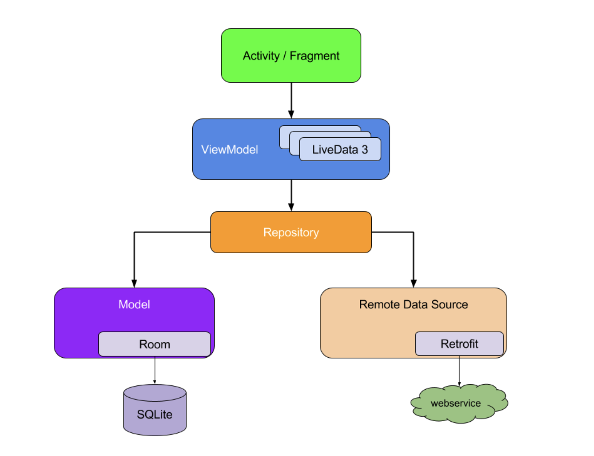

# AAC의 ViewModel 사용 방법 정리

## 소개

구글에서는 안드로이드 개발을 하는데 ViewModel과 Repository 사용을 추천하고 있습니다. 이는 공식 문서 [Guide to app architecture](https://developer.android.com/jetpack/guide)에 나와있는데요. 이번 포스팅은 여기서 사용되는 ViewModel이 왜 나왔으며 어떻게 앱에서 초기화 하여 사용하는지 정리해보고자 합니다.





Activiy와 Fragment는 복잡한 라이프 사이클을 가지고 있습니다. 많은 개발자들은 이 라이프 사이클에 맞춰 작업하는데 많은 고통을 겪고 있었고 이에 구글에서는  안드로이드 개발을 좀더 손쉽게 도와주는 라이브러리의 모음인  Jetpack을 2018년에 발표했습니다.


## [Android Architecture Component](https://developer.android.com/topic/libraries/architecture) 와 [Android Jetpack](https://developer.android.com/jetpack)


Google IO 2017에서 새로운 라이브러리를 Android Architecture Component(이하 AAC)에 묶어서 발표했습니다. AAC는 현재 제트팩의 일부로 UI 라이프 사이클 관리와 데이터 처리를 도와주는 라이브러리 모음입니다. (참고로 이때 구글에서 Kotlin을 공식언어로 지정했죠.. 격변의 시기 🔥)

  [2017 Google Developers site ](https://developers-kr.googleblog.com/2017/06/android-and-architecture.html)


Google IO 2018에서는 com.android.suppport.* 또는 androud.support.* 와 2017년에 공개한 AAC에서 사용하는 androud.arch.*의 패키지 명을 androidx.* 패키지 명으로 교체하였습니다. 이와 함께 차세대 컴포넌트, 도구 및 아키텍처 지침인 android jetpack을 소개했습니다.

[2018 Google Developers site](https://developers-kr.googleblog.com/2018/05/use-android-jetpack-to-accelerate-your.html)


## AAC의 ViewModel


ViewModel이 나온 역사에 대해 간략히 소개해 드렸습니다. 그럼 AAC의 VIewMode은 어떤 역활을 하는걸까요? 이는 [문서](https://developer.android.com/topic/libraries/architecture/viewmodel)에 명확히 설명되어 있습니다.


> The ViewModel class is designed to store and manage UI-related data in a lifecycle conscious way. The ViewModel class allows data to survive configuration changes such as screen rotations.


ViewModel은 화면 회전과 같은 동작에서 데이터의 관리를 라이프 사이클에 맞춰 관리를 도와주는 클래스 입니다. 그렇다면 우리가 알고 있는 MVVM의 ViewModel과 어떤점이 다를까요?


이를 알기위해서는 MVVM이 어떤 문제점을 고치기 위해 생겼는지 알아야합니다. 이는 Microsoft의 MVVM 가이드를 읽어보시길 추천 드립니다. 


[The MVVM Pattern](https://docs.microsoft.com/ko-kr/archive/blogs/msgulfcommunity/understanding-the-basics-of-mvvm-design-pattern)

[The basic of MVVM Design](https://docs.microsoft.com/ko-kr/archive/blogs/msgulfcommunity/understanding-the-basics-of-mvvm-design-pattern)


위 내용의 핵심만 이야기 하자면 **View와 ViewModel간의 의존성을 낮춰 유지보수를 높이기 위함** 입니다.


필자의 생각으로는 MVVM의 ViewModel을 구현하기 위해서는 DataBinding과 DI가 필수라고 생각합니다. 이 두가지를 통해 우리는 View와 ViewMoel간의 의존성을 낮출 수가 있습니다. 여기서 안드로이드 특성에 맞게 관리하기 위해서 사용하는게 AAC의 ViewModel과 LiveData라고 보면 될것 같습니다. 만일 Databinding과 DI를 사용하지 않고 AAC의 ViewModel과 LiveData만으로 구현했다면 이는 MVVM을 구현한게 그냥 ViewModel을 사용한거라고 감히 말할 수 있습니다.


## AAC의 VIewModel 초기화 방법


안드로이드 스튜디오 4.1 기준


별도의 dependency 추가 없이 viewmodel을 사용할 수 있다.


### 1. ViewModelProvider 사용

``` kotlin
//Factory 필요 없는 경우
private val mainViewModel by lazy {
    ViewModelProvider(this).get(MainViewModel::class.java)
}

//Factory 필요한 경우
private val mainViewModel by lazy {
    ViewModelProvider(viewModelStore, object : ViewModelProvider.Factory {
        override fun <T : ViewModel?> create(modelClass: Class<T>): T {
           return  MainViewModel() as T
        }
    }).get(MainViewModel::class.java)
}
```

viewModelStore에 대해 간략히 설명하자면 Activity와 Framgnet는 **ViewModelStoreOwner**라는 인터페이스를 구현하고 있고 구현체가 바로 **viewModelStore**이다. ViewModelStore은 HashMap을 가지고 있어 이를 사용해 키값에는 viewmodel의 class명을 value에는 viewmodel을 저장한다. 이를 통해 우리는 기존에 사용 했던 viewmodel을 다시 불러올 수 있으며 공유할 수 있게 해준다.

``` kotlin
public class ViewModelStore {

    private final HashMap<String, ViewModel> mMap = new HashMap<>();

    final void put(String key, ViewModel viewModel) {
       //..
    }

    final ViewModel get(String key) {
        return mMap.get(key);
    }

    //..
   
    public final void clear() {
        //..;
    }
}
```

### 2. ViewModelProviders 사용


ViewModelProviders 사용할 수 있었지만  [AndroidX Lifecycle 2.2.0-alpha](https://developer.android.com/jetpack/androidx/releases/lifecycle#2.2.0-alpha03)에서 deprecated 되었으므로 넘어가곘다.


### 3. Fragment-ktx 사용


 Fragment-ktx는 아래의 dependency를 build.gradle(APP)에 추가해줍니다. 최신 버전은 문서를 참고해 주세요.

 ``` kotlin
// viewmodel ktx
implementation "androidx.fragment:fragment-ktx:1.2.5"
 ```

 우리는 ViewModelProvider를 사용한 1번과 같은 코드를 viewModels 라는 익스텐션 함수를 통해 손쉽게 사용할 수 있다.

 ``` kotlin
//Factory 필요 없는 경우
private val mainViewModel by viewModels<MainViewModel>()

//Factory 필요한 경우
private val mainViewModel by viewModels<MainViewModel> {
    object : ViewModelProvider.Factory {
        override fun <T : ViewModel?> create(modelClass: Class<T>): T {
            return  MainViewModel() as T
        }
    }
}
 ```

 또한 Fragment에서 사용시 activityViewModels를 사용해 (shared viewmodel)[https://developer.android.com/topic/libraries/architecture/viewmodel#sharing]을 손쉽게 구현할 수 있습니다.

 ``` kotlin
// framgnet의 viewmodel 호출
private val mainViewModel by viewModels<MainViewModel>()

// activity의 viewmodel 호출 (shared viewmodel 구현)
private val mainViewModel by activityViewModels<MainViewModel>()
 ```

 만일 ViewModelProvider를 사용해 구현할 경우 viewStoreOwner 부분에 activity를 인자로 넘겨주면 됩니다. 

 ``` kotlin
// framgnet에서 activity의 viewModel을 사용할 경우
private val sharedViewModel by lazy {
    ViewModelProvider(requireActivity(), object : ViewModelProvider.Factory {
        override fun <T : ViewModel?> create(modelClass: Class<T>): T {
            return  MainViewModel() as T
        }
    }).get(MainViewModel::class.java)
}
 ```

 ### 4. Koin을 사용한 초기화


Koin 설정 방법은 [github](https://github.com/InsertKoinIO/koin)와 [공식문서](https://insert-koin.io/docs/2.0/documentation/reference/index.html)에 잘 나와있으므로 링크를 걸어두겠습니다.

``` kotlin
// koin viewmodel
implementation 'org.koin:koin-androidx-viewmodel:2.2.2'
```

Koin 사용시 AAC의 VIewModel 주입을 위한 dependency를 추가해 주면 아래와 같이 viewModel을 주입할 수있다.

``` kotlin
// framgnet의 viewmodel 호출
val mainViewModel: MainViewModel by viewModel()

// activity의 viewmodel 호출 (shared viewmodel 구현)
val mainViewModel: MainViewModel by sharedViewModel()
```

3번과 비교해서 함수명이 약간 변경되었다. **viewModels -> viewModel**로 변경되었고 **activityViewModels -> sharedViewModel**로 변경되었다. 개인적으로는 koin의 함수명이 좀더 의미가 분명한 것 같아 좋다.

## 정리


이렇게 ViewModel을 초기화 하는 다양한 방법에 대해 알아봤습니다. 우리는 확장함수와 DI 라이브러리를 통해 ViewModelProvider을 직접 구현할 필요가 없어졌습니다. 하지만 라이브러리를 사용하면 코드는 간결해 지지만 그로인해 발생하는 오류는 저희 몫입니다. 그 안에 어떻게 구현되어 있는지를 알고 사용하는 것과 그허지 않은 것은 큰 차이가 있습니다. 예기지 못한 이슈가 발생하게 되면 결국 어떻게 구현되어 있는지를 살펴봐야 됩니다. 위 경우 ViewModelProvider가 각 라이브러리 안에서 어떻게 구현되어 동작되는지를 살펴보는건 매우 중요한 점입니다.

[정상에서 IT를 외치다](https://black-jin0427.tistory.com/322)