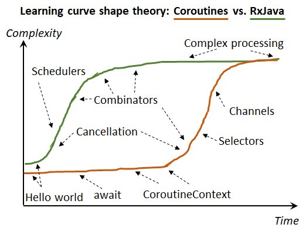

# Coroutine?

- 루틴의 일종으로, 협동 루틴으로 이해하면 쉽다.

- 코루틴의 "Co"는 with, together를 뜻한다.

- 코루틴은 자신의 실행이 마지막으로 중단된 지점 다음의 포인트부터 동작을 재개한다. **즉, 순차 실행이 가능하다.**

- ~~(tmi) 코루틴 최초의 출판물은 1963년에 등장했다.~~

- 러닝 커브는 다음 그림 참고([출처 바로가기](https://twitter.com/akarnokd/status/979732723152687106?s=20))

  

※ IntelliJ나 Android Studio가 설치되어 있지 않다면 Kotlin 공식 사이트에서 지원하는 <u>**온라인 IDE([Kotlin Playground](https://play.kotlinlang.org/))를 사용하여 아래 코드를 실행할 수 있다.**</u>

<br>

## Your First Coroutine

아래 코드를 실행하면,

```kotlin
fun main() {
    GlobalScope.launch { // launch a new coroutine in background and continue
        delay(1000L) // non-blocking delay for 1 second (default time unit is ms)
        println("World!") // print after delay
    }
    println("Hello,") // main thread continues while coroutine is delayed
    Thread.sleep(2000L) // block main thread for 2 seconds to keep JVM alive
}
```

`Would!Hello,` 가 출력될까?

예상했겠지만, 당연히 답이 아니다. `main()` 이 실행되고, `GlobalScope.launch` 에서 1초의 딜레이가 걸린다. 이때 **딜레이는 `GlobalScope.launch` 에만 영향을 주기에 `main()` 의 코드는 그대로 실행되며,** ~~우리 모두가 아는~~ `Hello,World!` 의 출력을 확인할 수 있다.

정확히는 `Hello,` 출력 후 1초의 딜레이, 그리고 `World!` 출력 후 1초 딜레이 이후 해당 프로그램이 종료될 것이다.

<br>

### 정리

- 코루틴은 가벼운 스레드의 일종으로 볼 수 있다.
- coroutine builder인 `launch` 를 이용하여 코루틴을 생성할 수 있다.
- `launch` 를 사용하기 위해서는 CoroutineScope인 GlobalScope를 사용해야 한다.
- `GlobalScope.launch {}` 는 `therad {}` 로 변환될 수 있다.

<br>

## Bridging blocking and non-blocking worlds

`Thread.sleep(2000L)` 로 끝난 코드를 `runBlocking` 으로 바꿔보는 예제이다. 이전에, `delay` 와 `sleep` 의 차이를 짚고 넘어가자.

- `delay` 
  - 일시 중단되는(suspend) 함수
- `sleep`
  - thread를 blocking하는 함수

즉, 이번 예제의 목표는 `main()` 함수에서 suspend 함수 사용법을 배우는 것이다. 아래 코드를 참고하자.

```kotlin
fun main() { 
    GlobalScope.launch { // launch a new coroutine in background and continue
        delay(1000L)
        println("World!")
    }
    println("Hello,") // main thread continues here immediately
    runBlocking {     // but this expression blocks the main thread
        delay(2000L)  // ... while we delay for 2 seconds to keep JVM alive
    }
}
```

`runBlocking` 을 사용하면 blocking하는 코루틴을 생성할 수 있다.

<br>

### 정리

- 코루틴 빌더인 `runBlocking` 을 사용하면 내부 코루틴이 완료될 때까지 메인 스레드가 blocking되어 프로그램이 중단되지 않는다.

<br>

### 코드를 조금 더 깔끔하게 작성할 수는 없을까?

```kotlin
fun main() = runBlocking {
    GlobalScope.launch { // launch a new coroutine in background and continue
        delay(1000L)
        println("World!")
    }
    println("Hello,") // main coroutine continues here immediately
    delay(2000L)      // delaying for 2 seconds to keep JVM alive
}
```

`main()` 함수를 `runBlocking` 으로 감싸서 전체 flow가 완료되기 전까지 종료되지 않는 코드로 변신!

<br>

## Waiting for a job

`delay` 없이 비동기 작업을 깔끔하기 처리하기 위해서는 `job` 객체에 `join()` 하는 방법이 있다.

```kotlin
fun main() = runBlocking {
    // launch로 코루틴을 생성하면 job 객체를 반환한다.
    val job = GlobalScope.launch {
        delay(1000L)
        println("World!")
    }
    println("Hello,")
    // job에 join을 하면 launch로 생성한 코루틴이 종료될 때까지 기다렸다가 프로그램을 종료한다.
    job.join() // wait until child coroutine completes
}
```

위의 코드를 보고 '그럼 runBlocking은 불필요한 것 아닌가?' 하는 생각이 들어 코드를 지우고 실행하니 정상적으로 동작하지 않았다. <u>**`join()`[^1] 은 suspend function으로, 코루틴 내부나 다른 suspend function에서만 실행할 수 있다! 잊지 말 것!**</u>

<br>

여기서 잠깐! 그럼 `main` 에  `job` 을 100개 가지는 코루틴은 `job` 마다 `join` 을 전부 해 줘야 하는 걸까? ~~호엥? 너무 비효율적이잖아?~~

<br>

## Structured concurrency

그래서 코루틴에서는 이런 비효율을 개선하기 위해 `runBlocking` 과 `launch` 의 관계성을 확립하는 구조를 제안한다. 코드를 보자.

```kotlin
fun main() = runBlocking {
    // this: CoroutineScope, this 생략 가능
    this.launch { // launch a new coroutine in the scope of runBlocking
        delay(1000L)
        println("World!")
    }
    println("Hello,")
}
```

`GlobalScope` 에서 `launch` 하지 말고 `runBlocking` 에서 `launch` 로 코루틴을 생성하는 방법이다. 이렇게 생성할 경우 코루틴이 몇 개가 생성되든 `main` 함수는 해당 `job` 들이 모두 끝나기 전까지 프로그램을 종료하지 않는다.

<br>

## Scope builder

위와 비슷한 방법으로 `coroutineScope` 를 이용해서 범위를 선언할 수도 있다. 코루틴 범위를 만들고 그 안에서 만들어진 모든 자식 코루틴이 완료되기 전까지 끝나지 않는 방식이다. 언뜻 보면 structured concurrency와 비슷해 보이지만 차이점이 있다.

- `runBlocking`
  - 대기하기 위해 현재 스레드를 차단한다.
- `coroutineScope`
  - 다른 용도로 사용하기 위해 기본 스레드 상태를 해제한다.

아래 코드 실행 순서를 눈여겨보자.

```kotlin
fun main() = runBlocking {
    launch { 
        delay(200L)
        println("1. Task from runBlocking")
    }
    coroutineScope {
        launch {
            delay(500L) 
            println("2. Task from nested launch")
        }
        delay(100L)
        println("3. Task from coroutine scope")
    }
    println("4. Coroutine scope is over")
}
```

편의를 위해 문장에 번호를 추가했다. 어떤 순서로 실행될까? 이 코드를 처음 봤을 때 4-3-1-2 순서[^2]로 실행된다고 생각했지만 정답이 아니었다. 위의 코드는 3-1-2-4 순서로 실행된다. **즉, `coroutineScope` 가 완료되지 않은 상태에서도 `3. Task from coroutine scope` 바로 뒤에 `1. Task from runBlocking` 이 실행되는 것을 알 수 있다.**

<br>

### 정리

- `delay` 대신 `job.join()` 을 이용하면 비동기 작업이 깔끔해진다.
- `join()` 은 코루틴 내부나 다른 suspend function에서만 실행할 수 있다.
- `join()` 오조 오억 개 쓰기 싫으면 `structured concurrency` 사용해라.
- `runBlocking` 은 대기하기 위해 현재 스레드를 차단(`coroutineScope` 의 플로우가 모두 실행되기 전까지 4번 문장을 출력하지 않는다.)한다.
- `coroutineScope` 는 다른 스레드를 실행하기 위해 현재 스레드를 suspend한다. 즉, 코루틴을 생성한 최상위 함수가 동일한 스레드에서 계속 실행될 수 있다.

<br>

## Extract function refactoring

코루틴 내부에서 호출할 함수에 `delay` 등의 `suspend` 함수를 사용하고 싶다면 다음 코드를 주목하자.

```kotlin
fun main() = runBlocking {
    launch { doWorld() }
    println("Hello,")
}

// this is your first suspending function
suspend fun doWorld() {
    delay(1000L)
    println("World!")
}
```

<br>

### 정리

- 일반 함수를 suspend 함수로 바꾸고 싶다면 `suspend` 를 붙이면 된다. ~~(심플)~~

<br>

## Global coroutines are like daemon threads

코루틴이 계속 실행되고 있다고 해서 스레드가 실행 중이라고 볼 수 없다. 프로세스가 살아 있을 때에만 동작할 수 있다.

```kotlin
fun main() = runBlocking {
    GlobalScope.launch {
        repeat(1000) { i ->
            println("I'm sleeping $i ...")
            delay(500L)
        }
    }
    delay(1300L) // just quit after delay
}
```

위의 코드를 실행시켜 보면 1.3초 이후에는 `main` 함수가 종료되고, 이와 동시에 `repeat()` 도 멈추는 것을 확인할 수 있다. 즉, **메인 프로세스가 종료될 경우 그 안에 생성된 코루틴의 동작 또한 모두 중지된다.**

<br>

# 참고

- [코루틴 공식 문서 - Basics](https://kotlinlang.org/docs/reference/coroutines/basics.html)
- [새차원의 코틀린 코루틴 강좌 #2 - basics](https://youtu.be/14AGUuh8Bp8)
- [stack overflow - runBlocking vs coroutineScope](https://stackoverflow.com/questions/53535977/coroutines-runblocking-vs-coroutinescope)

<br>

---

[^1]: 잊지 말자고는 했지만 사실 에러 로그를 너무나도 명확하게 출력해 준다. ` Suspend function 'join' should be called only from a coroutine or another suspend function`
[^2]: `coroutiuneScope` 를 `launch` 로 바꿀 경우 4-3-1-2 순서로 실행된다.