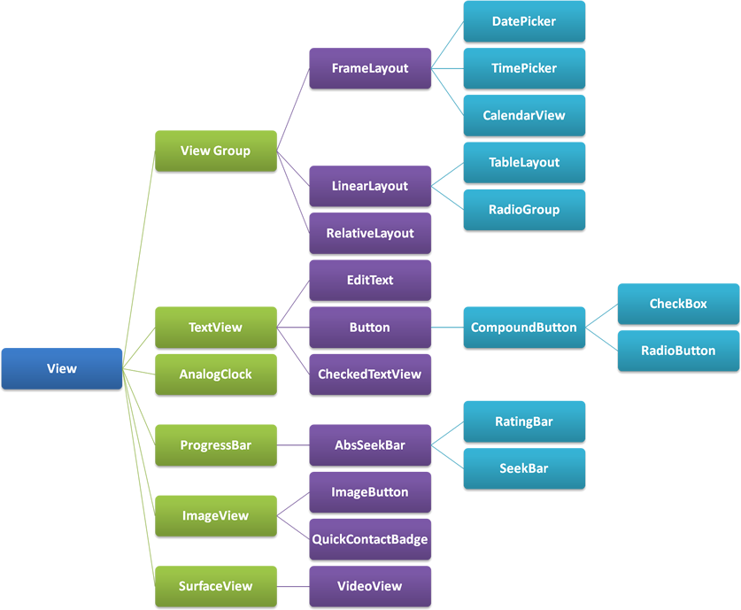
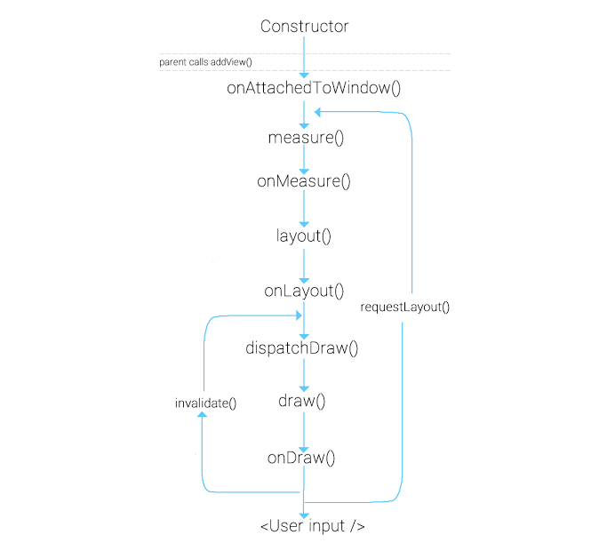

# **Custom View**

안녕하세요 안드로이드 9기 강다현입니다.

이번에 알아볼 내용은 **Custom View** 입니다!

안드로이드로 앱을 개발할 때,

1. 기존에 존재하는 뷰에 기능적인 부분을 조금 더 커스터마이징해서 구현하거나 

2. 여러 화면에서 같은 기능, 속성을 가지는 뷰를 재사용하고 싶을 때 

3. 여러 뷰를 통합하면서 원하는 속성을 넣고 싶을 때 

등등... 

이러한 needs가 생길 때 **Custom View**를 만듭니다.

그러면 어떻게 만드는가? 부터 시작해보도록 하겠습니다.

## **Custom View 만들기**

## View 기본

먼저 View를 좀 알아야 Custom View도 만들던가 하겠죠?

기본적으로 모든 view 클래스들(Button 이라던지..ImageView 라던지)은 View 클래스를 상속하기 때문에, 바로 View를 상속하거나 subclass인 Button등을 상속하거나 하는 방식으로 사용합니다. 

당연히 ViewGroup은 View를 상속하므로 ViewGroup을 상속하는 layout들도 커스텀으로 상속할 수 있죠. 

이걸 크게는 커스텀 뷰와 커스텀 레이아웃이라고 생각할 수도 있겠습니다.

View의 계층에 대해 간단하게 다시 한 번 보고 가도 나쁘지 않을 것 같습니다.

 모든 view는 View! </img>

[출처 - View의 계층](https://lazineer.tistory.com/90)

또한, 뷰의 라이프사이클도 잘 알아둬야 커스텀 뷰를 만들기에 더 좋겠죠!

 View LifeCycle </img>

[출처 - View lifecycle](https://codentrick.com/android-view-lifecycle/)

[참고 - View draw 과정](https://developer.android.com/guide/topics/ui/how-android-draws)

주의해서 볼 부분은 onDraw()와 dispatchDraw()가 아닐까 싶습니다. 

그림의 순서가 dispatchDraw -> onDraw인데, 실제로는 반대입니다. 순서가 같은 그림이 인터넷 상에 여러 개 있어 잘못된 것 같진 않아 자식 뷰를 draw하는 걸로 추측하긴 하는데... 이 부분은 더 자세히 알아본 뒤 추가해보겠습니다.

dispatchDraw는 ViewGroup 은 자식뷰들을 감싸는 녀석이기 때문에, 자신을 그릴 필요가 없다면 measure path를 통해 사이즈만 정하고, onDraw()를 호출하지 않고,
대신에 dispatchDraw()를 호출합니다. dispatchDraw()는 자신을 다 그리고 (onDraw()하고) 자식뷰들을 그리기 전에 호출됩니다.

여기서 ViewGroup 의 onDraw()를 호출하게 하는 방법이 2가지 있습니다.

1. ViewGroup에서 setWillNotDraw(false)를 호출해줍니다. 이는 강제로 onDraw()를 생략하지 않도록 해줍니다.
   
2. ViewGroup에 그릴거리를 줍니다. 예를 들어, ViewGroup에 백그라운드를 설정하면, 자신도 그릴게 생기기 때문에 onDraw()가 호출됩니다.
   
위 2가지 방법을 사용하면 ViewGroup 도 onDraw()가 호출되고 그 다음 dispatchDraw()가 호출됩니다.

여기서 ViewUpdate를 할 때는

> invalidate()

단순히 뷰를 다시 그릴때 사용됩니다. 예를 들어 뷰의 text 또는 color가 변경되거나, touch interactivity가 발생할 때 onDraw()함수를 재호출하면서 뷰를 업데이트합니다.

Ui thread가 아닌 thread에서는 invalidate말고 postInvalidate()를 사용합니다.

> requestLayout()

onMeasure()부터 다시 뷰를 그립니다. 뷰의 사이즈가 변경될 때 그것을 다시 재측정해야 하기에 lifecycle을 onMeasure()부터 순회하면서 뷰를 그립니다.

## 생성자

View를 상속할 때는 여러가지 생성자가 필요합니다.

1. View(Context context)의 경우

2. View(Context context, AttributeSet attrs)의 경우

3. View(Context context, AttributeSet attrs, int defStyleAttr)의 경우

4. View(Context context, AttributeSet attrs, int defStyleAttr, int defStyleRes)의 경우

간단한 경우라면, 1번째 경우와 2번째 경우로도 충분한게 대부분입니다.

1번째 경우는 코드 상에서 바로 뷰의 인스턴스를 만들 때 사용됩니다. 이 녀석은 xml과 상관이 없죠.

2번째 경우는 xml을 통해서 inflate 될 때 필요합니다. 이게 없으면 layout inflater애서 crash가 납니다. `AttributeSet`은 모든 xml상의 attribute value를 줍니다.

3번째 경우는 `defStyleAttr`이 추가가 되었죠. 기본적으로 사용할 디폴트 스타일입니다. 커스텀 한 attr을 포함한 R.attr에 있는 attr이 들어갈 수 있습니다. 보통 이 생성자를 사용합니다.

4번째 경우는 `defStyleRes`로 style resource에서 뽑아 사용합니다. R.style.에 있는 style입니다. 이 부분은 API 21일때 추가되었음을 주의합시다.

3, 4번째의 경우 0이면 default값을 사용하지 않는걸로 봅니다.

이렇게 여러 생성자가 필요한 경우가 생겼습니다. 이럴 때는 @JvmOverloads를 고려해 볼 수 있습니다!

## JvmOverloads

JvmOverloads는 자동으로 생성자들을 생성해주는 어노테이션입니다.

코드 내의 주석 설명입니다.

 * Instructs the Kotlin compiler to generate overloads for this function that substitute default parameter values.
 
 * If a method has N parameters and M of which have default values, M overloads are generated: the first one takes N-1 parameters (all but the last one that takes a default value), the second takes N-2 parameters, and so on.
 
이런 방식입니다.

~~~kotlin
@JvmOverloads constructor(
    context: Context,
    attrs: AttributeSet? = null,
    defStyleAttr: Int = 0
)
~~~

이 경우는 N = 3 M = 2 인 경우가 되겠죠?

그러나 주의합시다!

JvmOverloads를 사용하는 것이 **항상 좋은 경우**는 아닙니다.

EditText 등등의 스타일이 있는 위젯을 상속받는 경우, 기본적으로 상속받을 수 있는 스타일들이 사라지기 때문입니다.

이럴 때는 아래와 같이 super를 사용하면 됩니다. 

혹은! 상속받는 녀석의 스타일을 디폴트 값으로 넣어주면 해결됩니다. 물론 그럴려면 그 스타일을 알아야합니다.

~~~kotlin
// 그냥 JvmOverload 안 쓰고 상속 받는 것으로 해결

constructor(context: Context) : super(context)
constructor(context: Context, attrs: AttributeSet?) : super(context, attrs)
constructor(context: Context, attrs: AttributeSet?, defStyleAttr: Int) : super(context, attrs, defStyleAttr)

// 디폴트 값으로 해결

class CustomEditTextView @JvmOverloads constructor(
    context: Context,
    attrs: AttributeSet? = null,
    defStyleAttr: Int = R.attr.editTextStyle // super class의 스타일을 가지고 온다
) : AppCompatEditText(context, attrs, defStyleAttr)
~~~

위에서 보았듯 API < 21인 경우 JvmOverload 사용시 4번째 parameter도 사용해버리면 안 된다는 점도 주의합시다.

역시 좋다고 해서 막 사용하지 말고, 제대로 이해하고 어떤 부분에 잘 쓰일 수 있을지를 생각해야겠습니다.

또한, 상속하는 뷰가 어떤 뷰를 상속하는지를 확실히 알면 당연히 더 좋겠습니다.

[참고 - Do not always trust @JvmOverloads](https://medium.com/@mmlodawski/https-medium-com-mmlodawski-do-not-always-trust-jvmoverloads-5251f1ad2cfe)

___

자 이제, 기본적으로 뷰를 상속한 커스텀 뷰를 만들었습니다.

그 다음으로 새롭게 속성을 정의하는 법을 알아봅니다.

## **Custom attributes**

res - value 에 attrs.xml을 만들어줍시다.

이 명명은 당연해보이는 컨벤션이 아닐까 싶네요. 이름을 바꿔도 돌아가긴 합니다!

~~~xml
<resources>
    // declaration
    <attr name="carbon_rippleColor" format="color"/>
    <declare-styleable name="ImageView">
        // usage
        <attr name="indicator" format="reference" />
        <attr name="carbon_rippleColor"/>
        
        // declaration and usage in one line
        <attr name="carbon_rippleHotspot" format="boolean"/>
        
        // reuse of android attr, skip the type
        <attr name="android:menu"/>
    </declare-styleable>
</resources>
~~~

이런식으로 사용해주면 됩니다.

> 여기서 reference fortmat은 무엇일까요?

reference format is used when the attribute refers to another resource ID.

~~~xml
<!-- Declaration -->
<attr name="mydrawale" format="reference" />

<!-- Usage -->
app:mydrawable="@drawable/shape1"
~~~

이렇게 사용되는 녀석입니다.

이런 attribute뿐만 아니라 style이 필요한 경우도 있곘죠

~~~xml
<resources>
    
    
    // extend the default style of the view's parent class if there is one
    <style name="carbon_Button" parent="@android:style/Widget.Button"/>
</resources>
~~~

이런 식으로 사용합니다. 

생성자의 네 번째 parameter처럼 default를 넣어줄 때 버튼 상속을 한다면 저런 식으로 style을 extend 해줄 수도 있습니다. 

뷰에서 val a = context.obtainStyledAttributes()를 사용해 속성값들을 가져올 수 있습니다. 

a라는 이름도 컨벤션인듯 합니다. 여러가지 형태로 생성할 수 있습니다. 

~~~kotlin
public final TypedArray obtainStyledAttributes(@NonNull @StyleableRes int[] attrs) {
        return getTheme().obtainStyledAttributes(attrs);
    }

@NonNull
public final TypedArray obtainStyledAttributes(@StyleRes int resid,
        @NonNull @StyleableRes int[] attrs) throws Resources.NotFoundException {
    return getTheme().obtainStyledAttributes(resid, attrs);
}

@NonNull
public final TypedArray obtainStyledAttributes(
        @Nullable AttributeSet set, @NonNull @StyleableRes int[] attrs) {
    return getTheme().obtainStyledAttributes(set, attrs, 0, 0);
}

@NonNull
public final TypedArray obtainStyledAttributes(@Nullable AttributeSet set,
        @NonNull @StyleableRes int[] attrs, @AttrRes int defStyleAttr,
        @StyleRes int defStyleRes) {
    return getTheme().obtainStyledAttributes(
        set, attrs, defStyleAttr, defStyleRes);
}
~~~

TypedArray인 a는 a.recycle()로 garbage collection을 해제시켜 줄 수 있습니다. 

원래라면 자동으로 해주지만 TypedArray는 캐시를 위한 배열을 할당하고 있어 매번 할당해주지 않기 위해 이런 식으로 합니다.

재사용되지 않는 커스텀뷰는 굳이 할 필요 없어보이긴 합니다.
___

이제 속성도 정의했고, 적용해 보았으니 예시 코드로 저번주 우리 안드팀장 재민님의 Hilt 실습 코드 중 LoadingView를 간단히 흝어 보겠습니다.

## **예시 코드 보기**

[LoadingView 전체 코드](https://github.com/dahyun1226/GitSearchExample/blob/master/app/src/main/java/com/example/kotlinexample/customview/LoadingView.kt)

먼저 처음 부분을 봅시다.

~~~kotlin
class LoadingView @JvmOverloads constructor(
    context: Context,
    attrs: AttributeSet? = null,
    defStyleAttr: Int = R.attr.loadingViewStyle
) : LinearLayoutCompat(context, attrs, defStyleAttr)
~~~

LinearLayout을 상속한 형태입니다. JvmOverloads를 사용했다는 것을 알 수 있습니다.

~~~kotlin
init {
    orientation = HORIZONTAL
    val a = context.obtainStyledAttributes(
        attrs,
        R.styleable.LoadingView,
        defStyleAttr,
        R.style.Widget_Sample_LoadingView
    )
    indicatorRadius =
        a.getDimensionPixelSize(R.styleable.LoadingView_radius, context.toPixels(value = 6))
    val indicatorPadding = a.getDimensionPixelSize(
        R.styleable.LoadingView_indicatorPadding,
        context.toPixels(value = 8)
    )
    val background: Drawable? = a.getDrawable(R.styleable.LoadingView_indicator)
        ?: ResourcesCompat.getDrawable(resources, R.drawable.primary_oval, context.theme)
    a.recycle()
    for (i in 0 until LOADING_COUNT) {
        val view = View(context)
        view.background = background
        addView(view, generateLayoutParams(if (i == 0) 0 else indicatorPadding))
    }
    setWillNotDraw(false)
}
~~~

a = context.obtainStyledAttributes(...)를 통해 속성을 가져와서 사용하고 a.recycle()도 사용해주고 있습니다.

setWillNotDraw(false)도 사용했는데, 이 커스텀 뷰에선 아무 효과가 없긴 합니다. 왜냐? 

~~~xml
<com.example.kotlinexample.customview.LoadingView
    android:id="@+id/loadingView"
    android:layout_width="0dp"
    android:layout_height="0dp"
    android:background="@color/grey30"
    android:gravity="center"
    android:visibility="gone"
    app:layout_constraintBottom_toBottomOf="parent"
    app:layout_constraintEnd_toEndOf="parent"
    app:layout_constraintStart_toStartOf="parent"
    app:layout_constraintTop_toBottomOf="@id/searchAppbarLayout"
    tools:visibility="visible">
~~~

xml을 보면 앞서 말했듯, background를 설정해주면 그릴게 있는 거니까 onDraw가 원래 호출되기 때문입니다.

~~~kotlin
override fun dispatchDraw(canvas: Canvas) {
    val currentTime = SystemClock.elapsedRealtime()
    for (i in 0 until childCount) {
        val child = getChildAt(i)
        val input = (currentTime - i * DELAY) % DURATION / (1f * DURATION)
        val interpolated = interpolator.getInterpolation(input)
        child.translationY = interpolated * indicatorRadius
    }
    super.dispatchDraw(canvas)
    if (alpha > 0) {
        postInvalidate()
    }
}
~~~

ViewGroup을 상속한 LinearLayout을 상속한 커스텀 레이아웃이므로 dispatchDraw를 사용했다는 걸 볼 수 있습니다. 

또한, postInvalidate()도 사용해서 다시 그려주는 걸 볼 수 있습니다.

## 정리

지금까지 커스텀뷰에 대해 간단히 알아봤습니다.

사실상 뷰를 직접 만드는 것인 만큼 무궁무진한 가능성이 있기에 정말 활용하기 나름인 것 같습니다.

감사합니다!

## 참고

[구글 커스텀뷰 공식 문서](https://developer.android.com/training/custom-views/create-view)

https://developer.android.com/reference/android/view/View#implementing-a-custom-view

https://medium.com/@Zielony/guide-to-android-custom-views-constructors-df47476e334c

https://github.com/ZieIony/GuideToCustomViews

https://medium.com/@Zielony/guide-to-android-custom-views-attributes-ab28de3e54b7

https://laziness.xyz/2018/06/Android-TypedArray-Recycle