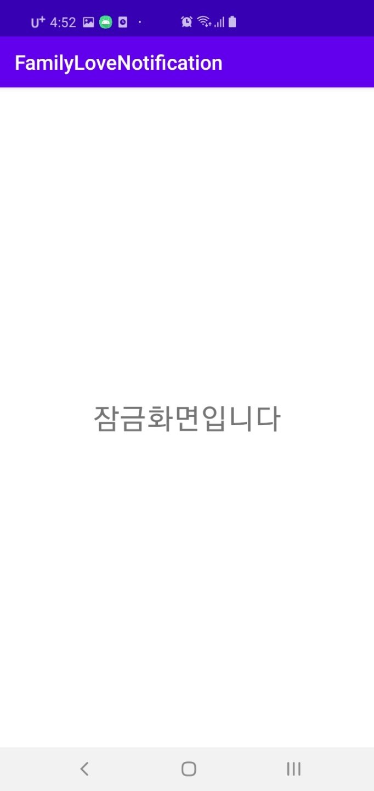

# Lock Screen in Android

안녕하세요, 안드로이드 10기 강다현입니다. 

이번에는 제 개인 프로젝트에 쓰이는 lock screen - 잠금화면에 대해 알아보겠습니다. (프로젝트 전  복습 겸 블로그 글도 써버리기...) 

제가 알기로는 서비스와 브로드캐스트리시버의 사용 에제로 많이 등장하는 친구입니다. 잠금화면 자체가 좀 옛날에 유명했던 느낌? 인것 같네요

잠금화면을 만들기 전에 먼저 **Andoid 8.0 Oreo** 버전에 있었던 변화를 알아봐야 합니다.

## Andoid 8.0 Oreo 에서의 변경점 - Background Execution Limits

[Oreo Background Execution Limits](https://developer.android.com/about/versions/oreo/background)

기본적으로 백그라운드 서비스에 제한이 생깁니다.

**Background Service Limitations**: While an app is idle, there are limits to its use of background services. This does not apply to foreground services, which are more noticeable to the user.

그리고 브로드캐스트 리시버에서도 변경점이 생깁니다.

**Broadcast Limitations**: With limited exceptions, apps cannot use their manifest to register for implicit broadcasts. They can still register for these broadcasts at runtime, and they can use the manifest to register for explicit broadcasts targeted specifically at their app.

[브로드캐스트 변경점](https://developer.android.com/guide/components/broadcast-exceptions)

Beginning with Android 8.0 (API level 26), the system imposes additional restrictions on manifest-declared receivers.

If your app targets Android 8.0 or higher, you cannot use the manifest to declare a receiver for most implicit broadcasts (broadcasts that don't target your app specifically). You can still use a context-registered receiver when the user is actively using your app.

명시적 인텐트를 받을 수 없습니다. (일부 메세지는 받을 수 있습니다!) 따라서 브로드캐스트 리시버를 런타임에서 등록해야 합니다.

이 두 가지 백그라운드 변경점 모두 잠금화면 앱을 만들때 중요한 부분들입니다! 

결국 이 업데이트는 간단히 요약하자면 너무 Background로 자원을 중구난방 여러 앱에서 많이 쓰니까 앵간하면 쓰지마라! 라는 말이죠.

그래서 잠금화면도 Foreground 서비스를 사용하여 만들어야 합니다.

 유명한 잠금화면 앱 캐시슬라이드도 Foreground를 사용하는 것을 볼 수 있습니다. </img>

이 글에서는 변경 후인 Oreo 이상의 minSdk(API level 26)를 가정하겠습니다. (당연히 제한이 많아진 Oreo 이상의 경우가 더 복잡합니다.)

## Lock Screen 만들어보기 

잠금화면 앱은 기본적으로 화면이 꺼진다면 잠금화면 Activity를 start 해주는 방식으로 작동합니다.

하나하나 순차적으로 나아가봅시다.

잠금화면에서는 Foreground Service를 사용합니다. 먼저 manifest에 추가해줍시다.

~~~kotlin
<uses-permission android:name="android.permission.FOREGROUND_SERVICE" />
~~~

다음으로 브로드캐스트 리시버를 보겠습니다.

화면이 꺼졌을때의 intent를 받아 LockActivity를 실행시켜줍니다.

~~~kotlin
class ScreenOffReceiver : BroadcastReceiver() {
    override fun onReceive(context: Context?, intent: Intent?) {
        when (intent?.action) {
            Intent.ACTION_SCREEN_OFF -> {
                val intent = Intent(context, LockActivity::class.java)
                intent.addFlags(Intent.FLAG_ACTIVITY_NEW_TASK)
                intent.addFlags(Intent.FLAG_ACTIVITY_SINGLE_TOP)
                context?.startActivity(intent)
            }
        }
    }
}
~~~

액티비티가 아닌 곳에서 startActivity를 하려면 `intent.addFlags(Intent.FLAG_ACTIVITY_NEW_TASK)`를 적용시켜줘야하고, 함을 알 수 있습니다.

`intent.addFlags(Intent.FLAG_ACTIVITY_CLEAR_TOP)`도 넣어줍시다. LockActivity가 액티비티 스택에서 중복되는 것을 막아줍니다.

adb shell에서 activity 스택을 직접 확인해보면 더 좋습니다.

dumpsys activity activities | sed -En -e "/Stack #/p " -e "/Running activities/,/Run #0/p" 로 확인해 볼 수 있습니다.

다음은 매우 간단한 잠금화면 activity 입니다. 그냥 터치 이벤트로 움직임이 있으면 종료하는 간단한 로직입니다.

 simple </img>

~~~kotlin
class LockActivity : BaseActivity() {

    override fun onCreate(savedInstanceState: Bundle?) {
        super.onCreate(savedInstanceState)
        setContentView(R.layout.activity_lock)
    }

    override fun onTouchEvent(event: MotionEvent): Boolean {
        return when (event.action) {
            MotionEvent.ACTION_MOVE -> {
                finish()
                true
            }
            else -> super.onTouchEvent(event)
        }
    }
}
~~~

다음으로 서비스인 LockScreenService를 봅시다.

메인화면은 별것 없습니다.

 simple too </img>

~~~kotlin
startButton.setOnClickListener {
    this.startForegroundService(Intent(this, LockScreenService::class.java))
}

completeButton.setOnClickListener {
    this.stopService(Intent(this, LockScreenService::class.java))
}
~~~
버튼으로 서비스를 시작하거나 멈출 수 있게 만들었을 뿐입니다.

startForegroundService라는 점을 조심합시다. foreground 서비스입니다!

마지막으로 서비스를 봅시다.

~~~kotlin
class LockScreenService : Service() {
    var receiver: ScreenOffReceiver? = null

    private val ANDROID_CHANNEL_ID = "familylovenotification"
    private val NOTIFICATION_ID = 9999

    override fun onCreate() {
        Log.e("!","oncreate")
        super.onCreate()
        if (receiver == null) {
            receiver = ScreenOffReceiver()
            val filter = IntentFilter(Intent.ACTION_SCREEN_OFF)
            registerReceiver(receiver, filter)
        }
    }
~~~

생성되었을 때 receiver를 등록해줍니다. 

~~~kotlin
    override fun onStartCommand(intent: Intent?, flags: Int, startId: Int): Int {
        super.onStartCommand(intent, flags, startId)
        if (intent != null) {
            if (receiver == null) {
                receiver = ScreenOffReceiver()
                val filter = IntentFilter(Intent.ACTION_SCREEN_OFF)
                registerReceiver(receiver, filter)
            }
        }
        val chan = NotificationChannel(
            ANDROID_CHANNEL_ID,
            "LockScreenService",
            NotificationManager.IMPORTANCE_NONE
        )
        chan.lockscreenVisibility = Notification.VISIBILITY_PRIVATE

        val manager = getSystemService(Context.NOTIFICATION_SERVICE) as NotificationManager
        manager.createNotificationChannel(chan)

        val builder = Notification.Builder(this, ANDROID_CHANNEL_ID)
            .setContentTitle(getString(R.string.app_name))
        val notification = builder.build()

        // Foreground Service 시작!
        startForeground(NOTIFICATION_ID, notification)

        return Service.START_REDELIVER_INTENT
    }

    override fun onDestroy() {
        super.onDestroy()
        if (receiver != null) {
            unregisterReceiver(receiver)
        }
    }

    override fun onBind(p0: Intent?): IBinder? {
        return null
    }
}
~~~

onStartCommand는 Service가 startService 될때마다 콜백됩니다.

notification channel을 이용해서 foreground service를 시작해줍시다.

notification channel 또한 Oreo부터 적용되는 녀석입니다.

[Notification Channel](https://developer.android.com/training/notify-user/channels)

이제 완성입니다. 잘 작동합니다!
___

더 높은 완성도를 가지는 잠금화면을 위해서는 

1. 부팅시 자동으로 작동하는 기능 (다른 브로드캐스트)
2. Oreo 이전 버전의 호환성
3. 터치 이벤트의 자연스러움..!
   
등등등... 추가될 수 있을 것입니다. 기능 추가라도 큰 형태는 비슷하겠죠? 

이러한 부분들은 아마 실제로 프로젝트를 하면서 넣어볼 것 같습니다.

감사합니다.