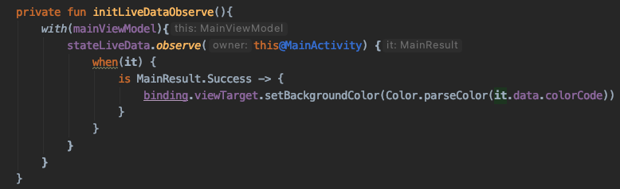

---

title: "Sealed Class를 활용한 상태 제어"

date: "2021-01-29"

tags: ["sealed class", "view manage", "state manage"]

description: "Sealed Class을 이용한 상태 제어 방법이 Interface를 사용한것과 어떤 차이점이 있는지 알아보겠습니다."

cover: "./state_manage_using_sealed_class.png"

---
### Sealed Class로 상태 관리 하기
안녕하세요! Mash-Up 10기 이두한입니다.  
이번에는 10기 현성님이 기술해주신 `Sealed Class`를 사용하여 통신 상태를 제어하고 기존에 제가 사용하던 `Interface`를 사용하는 것과 어떤 차이점이 있는지 기술하도록 하겠습니다.

Sealed Class에 관한 자세한 설명은 현성님의 [Sealed Class로 RecyclerView Multi View Type 때려부수기](https://mashup-android.vercel.app/hyeonseong/sealed_class/)를 참고해주세요.

---
다음과 같이 버튼 클릭시 `View`의 배경색을 변경하는 간단한 프로그램을 작성해보겠습니다.
<p align="center"></p>

### Color Type 지정
```kotlin
enum class ColorType (val title: String, val colorCode: String){
    RED("RED", "#ff0000"),
    BLUE("BLUE", "#0011ff"),
    YELLOW("YELLOW", "#fffb00")
}
```
이와 같이 각 색에 대한 `enum`을 만들고 title과 colorCode 값을 갖도록 하여 `ColorType`을 알면 색에 대한 코드값을 바로 가져올 수 있도록 하였습니다.

### MainActivity에 뷰에 대한 처리 추가
```kotlin
class MainActivity : AppCompatActivity() {
    ...
    private fun initView() {
        with(binding){
            buttonRed.setOnClickListener {
                mainViewModel.requestViewColorType(ColorType.RED)
            }
            buttonBlue.setOnClickListener {
                mainViewModel.requestViewColorType(ColorType.BLUE)
            }
            buttonYellow.setOnClickListener {
                mainViewModel.requestViewColorType(ColorType.YELLOW)
            }
        }
    }

    private fun initLiveDataObserve(){
        with(mainViewModel) {
            stateLiveData.observe(this@MainActvitiy) {
                binding.viewTarget.setBackgroundColor(Color.parseColor(it.colorCode))
            }
        }
    }
    ...
}
``` 
다음과 같이 버튼 클릭시 뷰모델로 `ColorType`을 전달하고 `Live Data`을 옵저빙하여 `View`의 배경색을 지정해주면 코딩이 완료됩니다.

그러나 컬러값을 api를 통해 받아온다면?? 다음과 같이 `MainRepository`를 통해 통신하여 값을 가져온다고 가정해보겠습니다.
### MainRepository를 추가하여 통신 상황 가정
```kotlin
class MainRepository {
    fun query(type: ColorType): Single<Item> {
        return Single.just(
            Item(
                type.title,
                type.colorCode
            )
        )
    }
}
```
```kotlin
data class Item(
    val title: String,
    val colorCode: String
)
```
그리고 다음과 같이 `Interface`을 만들어 통신 상태에 대해 관리합니다.
```kotlin
interface MainResult{
    data class Success(val data: Item): MainResult
    data class Error(val exception: Throwable) : MainResult
    object InProgress: MainResult
}
```
```kotlin
class MainViewModel : ViewModel() {
    ...
        fun requestViewColorType(type: ColorType){
        mainRepository.query(type)
            .observeOn(AndroidSchedulers.mainThread())
            .doOnSubscribe {
                _stateLiveData.value = MainResult.InProgress
            }
            .subscribe ({
                _stateLiveData.value = MainResult.Success(it)
            },{
                _stateLiveData.value = MainResult.Error(it)
            })
            .addTo(compositeDisposable)
    }
    ...
}
```
그리고 `MainActivity`에선 다음과 같이 상태별 로직을 실행하게 됩니다.
```kotlin
class MainActivity : AppCompatActivity() {
    ...
        private fun initLiveDataObserve(){
            with(mainViewModel){
                stateLiveData.observe(this@MainActivity) {
                    when(it) {
                        is MainResult.Success -> {
                            binding.viewTarget.setBackgroundColor(Color.parseColor(it.data.colorCode))
                        }
                        is MainResult.Error -> {
                            println("Error : ${it.exception}")
                        }
                        is MainResult.InProgress -> {
                            println("In progress")
                        }
                    }
                }
            }
        }
    ...
}
```
그러나 만약에 상태에 대한 모든 값을 개발자가 처리하길 원한다면? 예를 들어 현재는 `MainResult`에 대한 처리를 다하지 않고 `Success`에 대한 처리만 하여도 아무런 문제없이 컴파일이 됩니다.

여기서 `Interface`를 다음과 같이 `Sealed Class`로 수정 해보겠습니다.
### Interface를 Sealed Class로 대체
```kotlin
sealed class MainResult{
    data class Success(val data: Item): MainResult()
    data class Error(val exception: Throwable) : MainResult()
    object InProgress: MainResult()
}
```
`Sealed Class`로 수정 후 컴파일시 빌드가 성공되긴 하지만 아래와 같이 `when`에 `warning`이 발생하여 개발자로 하여금 상태에 대한 처리를 다하지 않았음을 알 수 있게 합니다.



이처럼 `Sealed Class`를 이용하면 상태 처리 누락에 대한 실수를 줄일 수 있어 앞으로 유용하게 사용할 수 있을거 같습니다.


