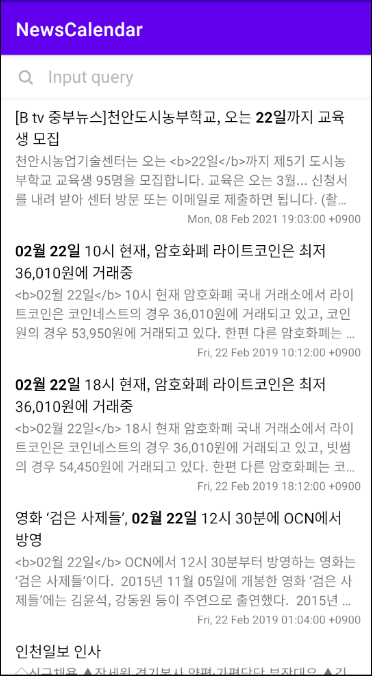

# Paging3 적용기

Android Jetpack에 포함된 paging library가 이번에 paging3 베타버전을 배포했다고 해서 제 개인 프로젝트에 적용해 보았습니다

---

우선 시작하기 전에 제 프로젝트에 대해 설명드리겠습니다. 제 프로젝트는 NewsCalendar로 가까운 미래에 존재하는 사회적 이슈나 이벤트들을 미리 모아 보는 서비스 입니다. 이를 위해 Naver 검색 api를 사용했고 Room을 사용해 뉴스기사들을 Local DB에 저장해야 합니다. 

Naver Api에서 내려오는 Article을 정의해 보았습니다

```kotlin
@Entity(tableName = "articles")
data class Article(
    @PrimaryKey @SerializedName("originallink") @ColumnInfo(name = "article_original_link") val originalLink: String,
    @SerializedName("title") @ColumnInfo(name = "article_title") val title: String,
    @SerializedName("link") @ColumnInfo(name = "article_link") val link: String,
    @SerializedName("description") @ColumnInfo(name = "article_description") val description: String,
    @SerializedName("pubDate") @ColumnInfo(name = "article_publish_date") val publishDate: String,
    @ColumnInfo(name = "article_created_at") val createdAt: Long
)
```

article id가 내려오면 좋을텐데 id가 내려오지 않아 original link를 primary key로 정했습니다.

그리고 Article를 그냥 보여주는게 아닌 특정 날짜에 대한 Article를 보여줘야 하기 때문에 ArticleQueryDateRelation 또한 정의했습니다.

```kotlin
@Entity(
    tableName = "article_query_relations",
    primaryKeys = ["relation_query_date", "relation_article_original_link"],
    foreignKeys = [
        ForeignKey(
            entity = Article::class,
            parentColumns = ["article_original_link"],
            childColumns = ["relation_article_original_link"],
            onDelete = ForeignKey.CASCADE
        )
    ],
    indices = [Index("relation_query_date")]
)
data class ArticleQueryDateRelation(
    @ColumnInfo(name = "relation_article_original_link") val articleOriginalLink: String,
    @ColumnInfo(name = "relation_query_date") val queryDate: String
)
```

ArticleQueryDateRelationDao에서는 query date를 가지고 article를 가져오는 ORM 또한 작성했습니다

```kotlin
@Dao
abstract class ArticleQueryDateRelationDao : BaseDao<ArticleQueryDateRelation>() {

    @Query("SELECT COUNT(*) FROM article_query_relations WHERE relation_query_date = :queryDate ")
    abstract fun countArticlesByQueryDate(queryDate: String): Flow<Int>

    @Query("DELETE FROM article_query_relations WHERE relation_query_date = :queryDate")
    abstract fun delete(queryDate: String)
}
```

이렇게 기본적인 구조는 잡았으니 바로 paging3를 적용해보겠습니다.

Local DB를 사용하는 paging3는 RemoteKey를 저장하는 table를 따로 만들어 줘야 합니다. 그래서 ArticleRemoteKey를 정의했습니다

```kotlin
@Entity(tableName = "article_remote_keys")
data class ArticleRemoteKey(
    @PrimaryKey @ColumnInfo(name = "query_date") val queryDate: String,
    val after: Int?
)
```

그리고 dao에서는 after key를 get 하고 delete해주는 ORM 또한 작성했습니다

```kotlin
@Dao
abstract class ArticleRemoteKeyDao : BaseDao<ArticleRemoteKey>() {

    @Query("SELECT `after` FROM article_remote_keys WHERE query_date = :queryDate")
    abstract fun get(queryDate: String): Int?

    @Query("DELETE FROM article_remote_keys WHERE query_date = :queryDate")
    abstract fun delete(queryDate: String)
}
```

Room을 사용하면 paging3에서 사용할 PagingSource를 바로 받아볼 수 있습니다. 아래의 코드를 ArticleQueryDateRelationDao에 추가했습니다

```kotlin
@Query("SELECT * FROM articles INNER JOIN article_query_relations ON article_original_link = relation_article_original_link WHERE relation_query_date = :queryDate ORDER BY article_created_at")
    abstract fun getArticlePagingSource(queryDate: String): PagingSource<Int, Article>
```

자! 이제 PagingSource가 준비되었으니 바로 RemoteMediator를 작성해 보겠습니다.

```kotlin
// paging api가 stable하지 않기에 추가합니다
@ExperimentalPagingApi
class ArticleRemoteMediator(
    private val database: NewsDatabase,
    private val repository: ArticleRepository,
    private val articleRemoteKeyDao: ArticleRemoteKeyDao,
    private val articleRemote: ArticleRemoteDataSource,
    private val queryDate: String
) : RemoteMediator<Int, Article>() {

		// Remote에 data가 empty인지 체크하는 Channel입니다
    private val isRemoteEmptyChannel = Channel<Boolean>(Channel.CONFLATED)
    val isRemoteEmpty = isRemoteEmptyChannel.receiveAsFlow()

    override suspend fun load(
        loadType: LoadType,
        state: PagingState<Int, Article>
    ): MediatorResult {
        try {
            val loadKey = when (loadType) {
								// REFRESH때는 loadKey를 null로 주어 최상단의 데이터를 로드합니다
                LoadType.REFRESH -> null
								// PREPEND는 지원하지 않기에 Success를 반환합니다
                LoadType.PREPEND -> return MediatorResult.Success(endOfPaginationReached = true)
                LoadType.APPEND -> {
                    // Query DB for ForumListRemoteKey for the forum post list.
                    // ForumListRemoteKey is a wrapper object we use to keep track of page keys we
                    // receive from the Forum List API to fetch the next page.
                    val afterKey = database.withTransaction {
                        articleRemoteKeyDao.get(queryDate)
                    }

                    // We must explicitly check if the page key is null when appending, since the
                    // Forum List API informs the end of the list by returning null for page key,
                    // but passing a null key to Forum List API will fetch the initial page.
                    afterKey ?: return MediatorResult.Success(endOfPaginationReached = true)
                }
            }

            val response = articleRemote.searchArticlesByQueryDate(
                queryDate = queryDate,
                limit = when (loadType) {
                    LoadType.REFRESH -> state.config.initialLoadSize
                    else -> state.config.pageSize
                },
                after = loadKey
            )

            if (response.error != null) return MediatorResult.Error(response.error.asHttpException)

            val articles = response.items
						// 서버에서 따로 after를 주지 않아 start + display를 after로 삼았습니다
            val after = if (response.start != null && response.display != null) {
                response.start + response.display
            } else {
                null
            }

            if (loadType == LoadType.REFRESH) {
                isRemoteEmptyChannel.send(articles.isNullOrEmpty())
            }

						// 아래의 withTransaction으로 묶인 코드들은 실행, 취소, 삭제 등이 같이 이루어져야 합니다
            database.withTransaction {
                if (loadType == LoadType.REFRESH) {
                    repository.clear(queryDate)
                    articleRemoteKeyDao.delete(queryDate)
                }

                articleRemoteKeyDao.insertOrUpdate(ArticleRemoteKey(queryDate, after))
                if (!articles.isNullOrEmpty()) {
                    repository.insertOrUpdate(queryDate, articles)
                }
            }

            return MediatorResult.Success(endOfPaginationReached = after == null)
        } catch (e: IOException) {
            return MediatorResult.Error(e)
        } catch (e: HttpException) {
            return MediatorResult.Error(e)
        } catch (e: Exception) {
            return MediatorResult.Error(e)
        }
    }
}
```

Paging2에 비하면 정말 많이 간소화 되었네요! 다음은 Repository에서 Pager를 ViewModel에 넘기는 코드입니다.

```kotlin
@ExperimentalPagingApi
    fun getArticles(
        pageSize: Int,
        initialLoadSize: Int,
        queryDate: String
    ): PagingDataContainer<Article> {
        val mediator = ArticleRemoteMediator(
            database = database,
            repository = this,
            articleRemoteKeyDao = articleRemoteKeyDao,
            articleRemote = articleRemoteDataSource,
            queryDate = queryDate
        )

        val pagingData = Pager(
            config = PagingConfig(pageSize = pageSize, initialLoadSize = initialLoadSize),
            remoteMediator = mediator,
            pagingSourceFactory = {
                articleQueryDateRelationDao.getArticlePagingSource(queryDate)
            }
        ).flow
        return PagingDataContainer(pagingData, mediator.isRemoteEmpty)
    }
```

저는 isRemoteEmpty 또한 넘기기 위해 PagingDataContainer를 사용해 한 번 wrapping 해줬습니다.

이를 적용하는 ArticleAdapter는 기존에 ListAdapter나 PagingAdapter 방식대로 구현합니다.

다음은 PagingData를 UI에 전달하는 코드입니다.

```kotlin
			lifecycleScope.launchWhenCreated {
            articleViewModel.items.collectLatest {
                adapter.submitData(it)
            }
        }
```

마지막으로 Paging load 상태에 따라 empty state 및 UI의 동작을 명시해주는 코드입니다.

```kotlin
				// 로딩상태가 아니면 SwipeRefreshLayout의 isRefreshing을 false로 세팅합니다			
				lifecycleScope.launchWhenCreated {
            adapter.loadStateFlow.collectLatest { loadStates ->
                if (loadStates.refresh !is LoadState.Loading) {
                    mainNewsSwipeRefreshLayout.isRefreshing = false
                }
            }
        }
				// Refresh가 일어나면 RecyclerView를 최상단에 위치시킵니다
        lifecycleScope.launchWhenCreated {
            adapter.loadStateFlow
                .distinctUntilChangedBy { it.refresh }
                .filter { it.refresh is LoadState.NotLoading }
                .collect { mainNewsRecycler?.scrollToPosition(0) }
        }
				// Local 및 Remote에서 data가 empty이고 로딩상태가 아니면 empty layout을 보여줍니다
        lifecycleScope.launchWhenCreated {
            adapter.loadStateFlow
                .combine(
                    articleViewModel.isLocalEmpty.combine(articleViewModel.isRemoteEmpty)
                )
                .mapLatest { (loadStates, emptySet) ->
                    val (isLocalEmpty, isRemoteEmpty) = emptySet
                    loadStates.mediator?.refresh is LoadState.NotLoading
                            && isLocalEmpty && isRemoteEmpty
                }
                .distinctUntilChanged()
                .collectLatest { isActualEmpty -> mainQueryDivider?.isVisible = isActualEmpty }
        }
```

이번 블로그에서는 간단하게 paging을 구현하는 소스코드를 추가해보았습니다. paging2를 써본 입장에서 이번에 나온 paging3는 정말 간편하게 구현이 가능하네요! Data Stream을 손쉽게 변경하는 점이나 paging 종류에 따라서 여러가지의 PagingSource를 구현할 필요가 없어서 정말 잘 만들어진 것 같다는 생각이 듭니다! 어서 빨리 paging3가 stable한 버전으로 배포가 되면 좋겠네요!

실행결과를 마지막으로 이번 블로그 작성을 마치겠습니다!



