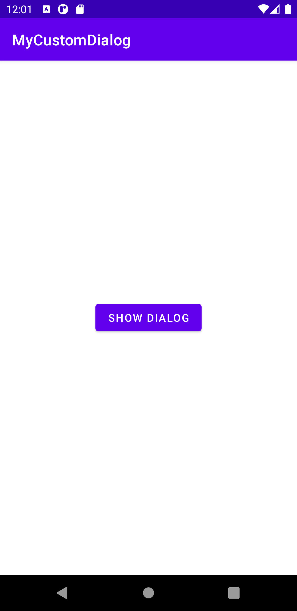
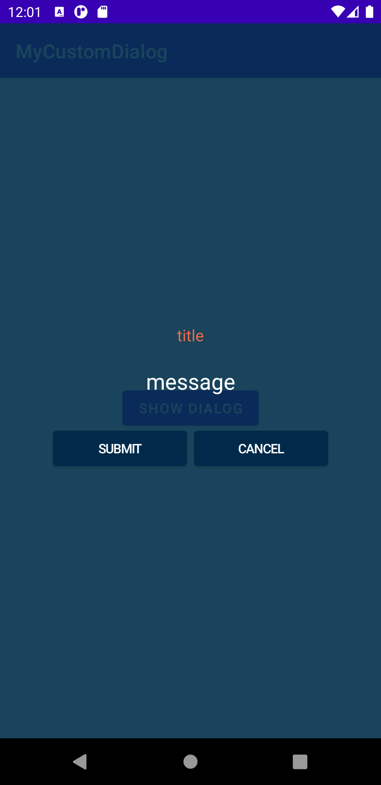
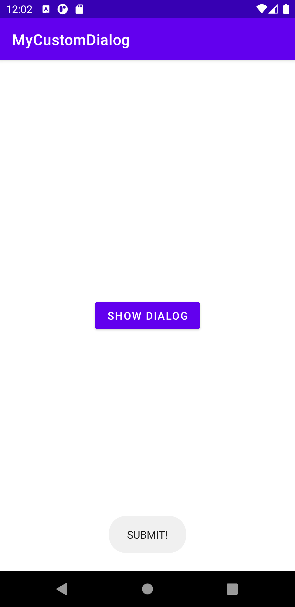

# 개요

Fullscreen으로 동작하는 Dialog를 만드는 방법으로는 크게 두 가지가 있다.

1. Dialog처럼 보이는 Activity를 만들어 띄우기
2. Dialog를 Customizing하여 Fullscreen으로 띄우기

둘 중 어떤 것이 베스트라고 할 수는 없지만, 기왕이면 '다이얼로그'라는 이름답게 2번 방식을 따라 보기로 했다.

최초 작성 코드 언어는 java였으나 kotlin으로 변경하였고, `findViewById` 대신 `ViewBinding` 을 적용하였다.

<br>

## 완성본 미리 보기

SHOW DIALOG 버튼 클릭시 Fullscreen으로 동작하는 Dialog가 출력되고, SUBMIT/CANCEL 버튼 클릭 이벤트와 동시에 Toast가 출력되는 예제 앱이다.



<br>

# 코드 작성

`MyCustomDialog` 라는 이름의 Project를 empty activity로 생성하고, `build.gradle` 에 `viewBinding` 사용 선언을 우선 해 주어야 한다.

```groovy build.gradle
android {
    ...
    viewBinding {
    	enabled = true
	}
}
```

app 수준의 `build.gradle` 에 위 코드를 추가하고 sync 버튼을 눌러 준다.

<br>

## 레이아웃 작업하기

`activity_main.xml` 파일 정 가운데에 SHOW_DIALOG 버튼을 생성한다.

```xml activity_main.xml
<?xml version="1.0" encoding="utf-8"?>
<androidx.constraintlayout.widget.ConstraintLayout xmlns:android="http://schemas.android.com/apk/res/android"
    xmlns:app="http://schemas.android.com/apk/res-auto"
    xmlns:tools="http://schemas.android.com/tools"
    android:layout_width="match_parent"
    android:layout_height="match_parent"
    tools:context=".MainActivity">

    <Button
        android:id="@+id/showDialogButton"
        android:layout_width="wrap_content"
        android:layout_height="wrap_content"
        android:text="SHOW DIALOG"
        app:layout_constraintBottom_toBottomOf="parent"
        app:layout_constraintLeft_toLeftOf="parent"
        app:layout_constraintRight_toRightOf="parent"
        app:layout_constraintTop_toTopOf="parent"
        tools:ignore="HardcodedText" />

</androidx.constraintlayout.widget.ConstraintLayout>
```

<br>

`dialog_full_activity.xml` 파일을 `res/layout` 에 생성한 다음 아래 코드를 넣어 준다.

```xml dialog_full_activity.xml
<?xml version="1.0" encoding="utf-8"?>
<androidx.constraintlayout.widget.ConstraintLayout xmlns:android="http://schemas.android.com/apk/res/android"
    xmlns:app="http://schemas.android.com/apk/res-auto"
    xmlns:tools="http://schemas.android.com/tools"
    android:layout_width="match_parent"
    android:layout_height="match_parent"
    android:background="#E6003049">

    <androidx.constraintlayout.widget.ConstraintLayout
        android:layout_width="match_parent"
        android:layout_height="match_parent"
        android:padding="20dp"
        app:layout_constraintBottom_toBottomOf="parent"
        app:layout_constraintEnd_toEndOf="parent"
        app:layout_constraintHorizontal_bias="1.0"
        app:layout_constraintStart_toStartOf="parent"
        app:layout_constraintTop_toTopOf="parent"
        app:layout_constraintVertical_bias="0.0">

        <TextView
            android:id="@+id/titleTextView"
            android:layout_width="wrap_content"
            android:layout_height="wrap_content"
            android:layout_marginBottom="21dp"
            android:lineSpacingExtra="4sp"
            android:textColor="#ee6c4d"
            android:textSize="16.5sp"
            app:layout_constraintBottom_toTopOf="@id/messageTextView"
            app:layout_constraintEnd_toEndOf="parent"
            app:layout_constraintStart_toStartOf="parent"
            tools:text="@string/default_dialog_title" />

        <TextView
            android:id="@+id/messageTextView"
            android:layout_width="wrap_content"
            android:layout_height="wrap_content"
            android:lineSpacingExtra="4sp"
            android:textColor="#FFFFFF"
            android:textSize="22.5sp"
            app:layout_constraintBottom_toBottomOf="parent"
            app:layout_constraintEnd_toEndOf="parent"
            app:layout_constraintStart_toStartOf="parent"
            app:layout_constraintTop_toTopOf="parent"
            tools:text="@string/default_dialog_message" />

        <Button
            android:id="@+id/submitButton"
            android:layout_width="138dp"
            android:layout_height="0dp"
            android:layout_marginTop="30dp"
            android:layout_marginEnd="3.75dp"
            android:backgroundTint="#012a4a"
            android:letterSpacing="-0.05"
            android:lineSpacingExtra="1.3sp"
            android:text="@string/default_dialog_submit_caption"
            android:textColor="#ffffff"
            android:textSize="13.5sp"
            app:layout_constraintEnd_toStartOf="@id/cancelButton"
            app:layout_constraintHorizontal_chainStyle="packed"
            app:layout_constraintStart_toStartOf="parent"
            app:layout_constraintTop_toBottomOf="@+id/messageTextView"
            app:layout_constraintVertical_chainStyle="packed" />

        <Button
            android:id="@+id/cancelButton"
            android:layout_width="138dp"
            android:layout_height="0dp"
            android:layout_marginStart="3.75dp"
            android:layout_marginTop="30dp"
            android:backgroundTint="#012a4a"
            android:letterSpacing="-0.05"
            android:lineSpacingExtra="1.3sp"
            android:text="@string/default_dialog_cancel_caption"
            android:textColor="#ffffff"
            android:textSize="13.5sp"
            app:layout_constraintEnd_toEndOf="parent"
            app:layout_constraintStart_toEndOf="@+id/submitButton"
            app:layout_constraintTop_toBottomOf="@+id/messageTextView" />

    </androidx.constraintlayout.widget.ConstraintLayout>
</androidx.constraintlayout.widget.ConstraintLayout>
```

이대로 실행할 경우 error가 발생한다. `strings.xml` 에 필요한 값이 누락되어 있기 때문이다. `res/values/strings.xml` 파일을 다음과 같이 수정해 보자.

```xml strings.xml
<resources>
    <string name="app_name">MyCustomDialog</string>

    <!-- Fullscreen custom dialog -->
    <string name="default_dialog_title">다이얼로그 타이틀</string>
    <string name="default_dialog_message">다이얼로그 메시지</string>
    <string name="default_dialog_submit_caption">확인</string>
    <string name="default_dialog_cancel_caption">취소</string>
</resources>
```

모든 레이아웃 작업이 간단히 끝났다.

<br>

## CustomDialogMaker 생성하기

CustomDialogMaker는 object로, Fullscreen Dialog를 쉽게 생성할 수 있도록 만들어 주는 일종의 유틸이다. `getDialog` 를 통해 어느 곳에서나 Custom Dialog 내 text를 수정하여 출력하는 기능을 제공한다.

우선, `CustomDialogMaker.kt` 에서 확인 버튼과 취소 버튼 각각의 이벤트를 전달할 수 있도록 `interface` 를 생성하자.

```kotlin CustomDialogListener.kt
interface CustomDialogListener {
    fun onClickSubmitButton()
    fun onClickCancelButton()
}
```

각 버튼의 클릭 이벤트가 들어왔을 때 각각 이벤트에 따라 위 작성된 `interface` 를 target으로 실질적 구현부(ex-Activity)에서 이벤트를 수신하도록 했다. 말로 풀어 쓰니 어려운데, 아래 코드(`CustomDialogMaker.kt`)를 확인하자. 

```kotlin CustomDialogMaker.kt
object CustomDialogMaker {
    fun getDialog(
        context: Context,
        title: String,
        message: String,
        submitCaption: String,
        cancelCaption: String,
        target: CustomDialogListener
    ) {
        val dialog = Dialog(context, R.style.FullWindowDialog)
        val dialogBinding = DialogFullActivityBinding.inflate(dialog.layoutInflater)
        dialog.setContentView(dialogBinding.root)

        dialogBinding.titleTextView.text = title
        dialogBinding.messageTextView.text = message
        dialogBinding.submitButton.text = submitCaption
        dialogBinding.cancelButton.text = cancelCaption

        dialogBinding.submitButton.setOnClickListener {
            target.onClickSubmitButton()
            dialog.dismiss()
        }

        dialogBinding.cancelButton.setOnClickListener {
            target.onClickCancelButton()
            dialog.dismiss()
        }

        dialog.show()
    }
}
```

`CustomDialogMaker.getDialog(인자)` 로 호출할 때, 이것을 호출한 곳에서 `onClickSubmitButton()`, `onClickCancelButton()` 이벤트를 처리하도록 한 코드이다. `findViewById` 대신 `viewBinding` 을 이용하여 코드를 경량화하였다.

<br>

## MainActivity 수정하기

`MainActivity.kt` 파일에서는 ViewBinding 대신 `findViewById` 를 이용하여 `showDialogButton` 에 `onClickListener` 를 추가하였고, 버튼 클릭시 `Dialog` 가 출력되도록 코드를 작성하였다.

```kotlin MainActivity.kt
class MainActivity : AppCompatActivity() {
    override fun onCreate(savedInstanceState: Bundle?) {
        super.onCreate(savedInstanceState)
        setContentView(R.layout.activity_main)

        val showDialogButton = findViewById<Button>(R.id.showDialogButton)

        showDialogButton.setOnClickListener {
            CustomDialogMaker.getDialog(
                this,
                "title",
                "message",
                "submit",
                "cancel",
                object : CustomDialogListener {
                    override fun onClickSubmitButton() {
                        Toast.makeText(applicationContext, "SUBMIT!", Toast.LENGTH_SHORT).show()
                    }

                    override fun onClickCancelButton() {
                        Toast.makeText(applicationContext, "CANCEL!", Toast.LENGTH_SHORT).show()
                    }
                })
        }
    }
}
```

위 예시와 같이 `CustomDialogMaker.getDialog(values..)` 를 통해 `CustomDialog` 를 손쉽게 가져다 사용할 수 있었다.

<br>

# 마무리하며

위 형태가 베스트 케이스인지에 대해선 확신이 없으나, Custom Dialog의 전반적인 Layout은 유지하고 싶으나 Button의 text나 title, message의 변경이 필요할 때 사용하기 위해 작성하였다. dialog builder를 이용하여 생성하는 방법이 가장 쉬우나, 그 경우에는 fullscreen을 어떻게 세팅해 주어야 할지 감이 오지 않았다. 혹, 이 글을 읽는 분들 중 dialog builder를 이용해 fullscreen을 설정하는 방법을 아는 분이 계신다면 아이디어 공유 부탁드립니다.

예제 코드는 [github repository](https://github.com/d2fault/android-fullscreen-dialog-sample) 에서 확인 가능하다. java/kotlin 두 가지 버전으로 구성해 두었으며, branch를 이동하여 확인할 수 있다.

<br>


