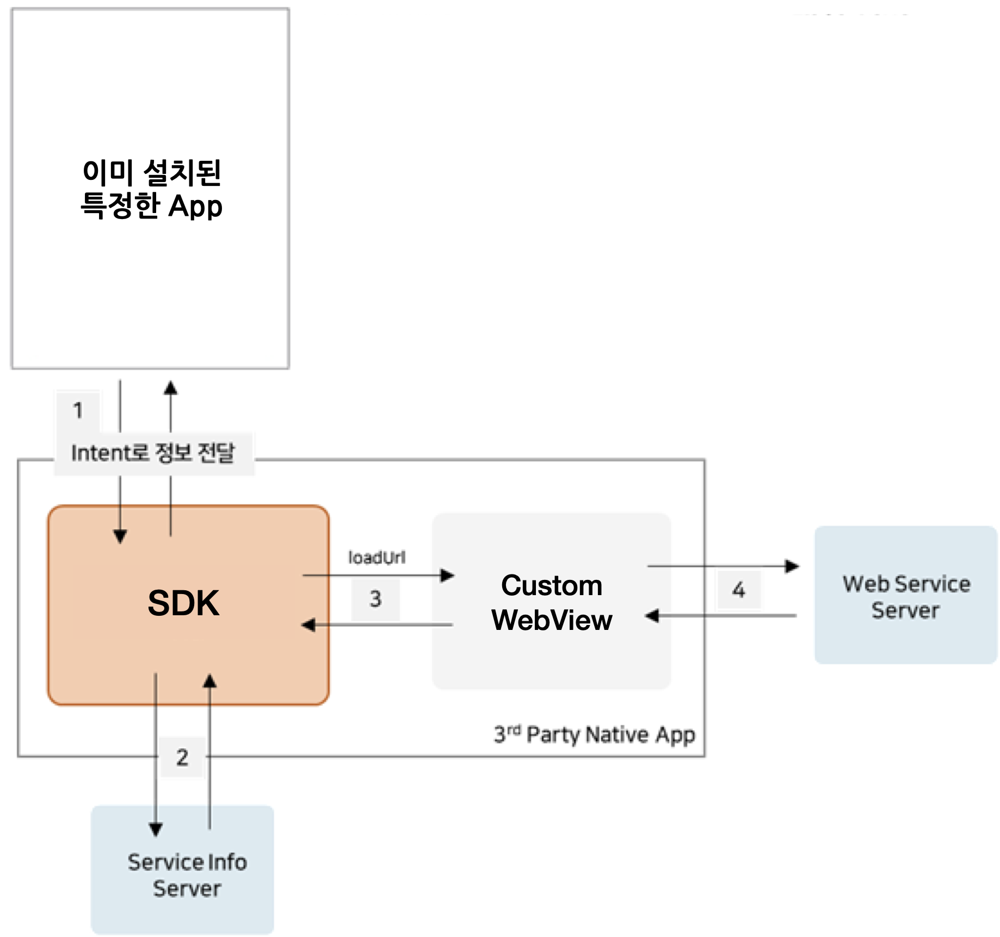
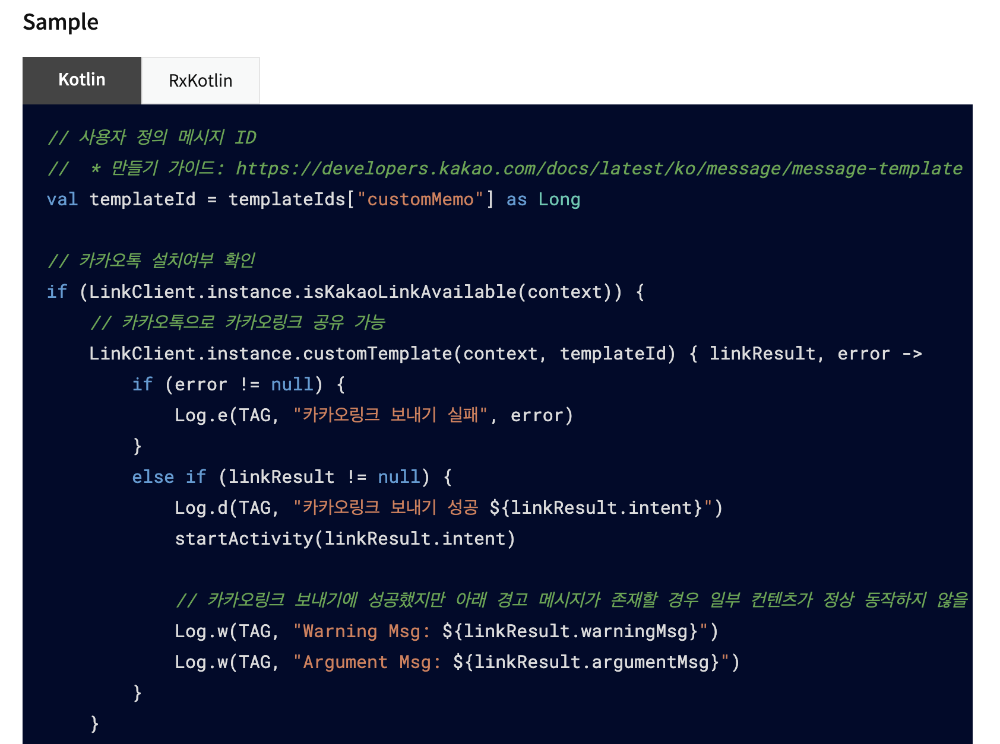

# 개요

기존에 내가 하던 업무는 하이브리드 앱 개발을 위한 API를 설계하고, 제공하는 것이었다. 어쨌거나 유지보수이기 때문에 일은 늘 비슷했다. ~~(어떻게든 구조를 개선해 보고자 노력했지만 혼자만의 노력이었다는 후문이^_ㅠ)~~ 그러던 중 굉장히 갑작스럽게 SDK를 기획, 설계, 개발, 테스트까지 해야 하는 상황이 되었다. 그것도 상반기에 하나, 하반기에 하나 총 두 건이나....... 유경험자나 인력은 당연히 없었기 때문에 **바닥부터 시작해야 했다.**

그래서 이 글은, SDK를 위해 북도 치고 장구도 친 삽질기이다.

 

# 설계부터 막막해요

안드로이드 개발자라면 새로운 프로젝트 설계 시 이미 만들어진 패턴(MVC, MVP, MVVM 등) 중 프로젝트에 적합한 패턴을 적용한다. 그리고 나 또한, 첫 번째 SDK를 설계할 때 MVVM 패턴을 적용하고자 했다. 결론은, "어떻게 저떻게 돌아는 가지만 이게 최선일까?" 의 SDK가 되고 말했다. 구조 설계에만 꽤 오랜 시간(약 1.5달)을 썼는데도 불구하고 왜 이런 결과물이 산출되었을까? 내가 제공하고자 하는 SDK의 기능이 MVVM 패턴과 똑 떨어지지 않았기 때문이다.

## 첫 번째 SDK 설계하기

이 SDK의 경우 특히 '통신' 부분에 신경을 써야 했다. 요구 조건은 다음과 같다.

1. 이 SDK는 커스텀 웹뷰를 제공한다.
2. 웹뷰에 URL을 load하는 것은 SDK이다. (SDK에서 loadUrl을 호출한다. 네이티브 앱은 WebView를 import만 함.)
3. 웹뷰에 load된 웹 사이트는 SDK가 제공하는 API를 호출하고, 응답을 받아야 한다.
4. 단말 내에 설치된 다른 앱과 Intent로 통신해야 한다.
5. 특정 API의 경우 서버와 통신해야 하며, 그 결과를 웹에게 전달해야 한다.

SDK에 붙은 화살표가 무려 세 개! 이 구조에서 MVVM이라, 거의 우겨넣은 것과 다름이 없었다. 어쨌거나 **기존 구조에서 사용하든 무한 callback 대신, ViewModel에 정의해 둔 LiveData의 값을 바꾸어 호출에 따른 응답을 전달하도록 구조를 개선한 것은 꽤 의미있는 시도였다.** 그러나 이것도 LiveData대신 RxJava를 사용하는 것이 더 낫지 않았을까 싶다.

 

## 두 번째 SDK 설계하기

이 SDK의 경우 최근에 설계하고 개발 중인 건으로 디테일한 정보를 오픈할 수는 없지만, 간략하게나마 요구 조건을 살펴보자.

1. Native App은 하고자 하는 동작을 함수로 호출할 수 있다.
2. SDK는 이미 설치된 다른 여러 앱들과 Intent로 통신한다.
3. SDK는 호출된 함수의 결과를 callback으로 전달해 주어야 한다.
4. 추후 init key check 과정이나 로깅이 필요할 경우, 서버와 통신해야 할 수도 있다.

두 번째 SDK의 특징은 어떠한 View도 제공하지 않는다는 것이다. 흔히 사용하는 패턴을 적용할 수 없었기에 내맘대로 구조를 잡고 패키지를 분리했다. Native App에서 호출하는 함수가 담긴 class는 `service` 패키지에, 상수는 `constants` 패키지에, Intent receiver는 `receiver` 패키지에 위치시켰다.

그런데 **<u>Native App에게 이 기능을 '어떻게 제공'해야 하는지는 아무리 고민해도 결론이 안 났다.</u>** 난관에 봉착했다.

 

# 힌트 찾아 삼만리

보통 SDK는 aar 형태로 배포하기 때문에 타인의 코드를 참고하는 게 쉽지 않다. 이가 없으면 잇몸이라고, 순간적으로 모두에게 열려 있는 도큐먼트가 떠올랐다. 유레카! 역시 답은 [카카오 API 가이드 문서에 있었다.](https://developers.kakao.com/docs/latest/ko/getting-started/sdk-android) 

 

`LinkClient.instance.isKakaoLinkAvailable(context)` 과 `LinkClient.instance.customTemplate(context, templateId)` 를 보고 머리를 탁 쳤...지만 코틀린 조무래기 입장에서는 저 형태를 어떻게 만들어내야 할지도 고민이었다. 그 순간 갑자기 **매셥 안드팀의 점냥(재료)님이** 떠올랐습니다. ^^ (늘 이렇게 고민하는 상황이 되면 누군가를 붙잡고 이야기를 막 쏟아내는데 그러다 보면 답이 나와서 신기하다. 되도 않는 이야기 늘 들어주시는 주변 분들께 감사를 전합니다.)

 

 

카카오 API 도큐먼트와 점냥님의 도움으로 SDK 제공 부분까지 설계할 수 있었다.

 

# (번외) 이 값은 숨기고 싶은데?

SDK를 포함한 테스트 앱 개발 중 SDK에서만 사용하고 싶은 함수나 값들이 테스트 앱에서도 접근이 되는 것을 확인했다. 테스트 앱에서 접근을 막으려면  `public` 도, `private` 도 아닌 그 사이의 접근 제어자가 필요했는데 코틀린이 이걸? `internal` 을 사용하니 모든 게 깔끔하게 해결됐다. 예를 들어, class 생성시  `internal` 을 붙이면 해당 class는 같은 모듈(SDK) 에서만 접근이 가능하다.

아직까진 Java가 더 익숙하기에 Java로 개발했으면 어떻게 설계했을까 생각해 보았는데, class 내에 `protected` 를 열심히 선언해 주지 않았을까 싶다. (그런데 class 전체를 숨기고 싶을 땐 어떻게 해야 하지? ~~Java 눈 감아~~)

 

# 무엇을 느꼈나요?

두 SDK를 직접 기획, 설계, 개발, 테스트까지 도맡아 하며 알게 모르게 실력이 향상되었나 보다. 처음으로 SDK 설계할 땐 "아직 4년차인데 내가 할 수 있을까?" 라는 생각이 지배적이었다면, 두 번째는 구조부터 떠올랐을 정도의 성장이랄까. 이번 개발 건으로 SDK에 흥미를 느꼈고, 기왕이면 이 커리어를 계속 갖고 가고 싶다는 생각을 했다.

그리고 무엇보다, 유저 친화적인 설계를 위해 노력한 내 자신 칭찬해. 사용하는 입장에서 제공하는 입장이 되어 보니 카카오가 SDK를 리뉴얼한 이유를 깨달았다. 사용할 땐 '아, 수정 개발 귀찮게! 카카오는 이걸 왜 다 바꾼 거야?'의 스탠스였다면, 지금은 **부정적인 반응을 예상했음에도 불구하고 과감하게 뒤엎은 카카오를 리스펙한다.** 더 멀리, 더 오래 가기 위한 결단이었겠지. (사실, 네이버가 아닌 카카오 API 도큐먼트를 참고한 이유도 리뉴얼 사실을 알고 있었기 때문이다. ^^;)

아쉬운 건, 함께 논의할 사람이 없다는 점이다. 다행스럽게도 주변에 안드로이드 개발자가 많아서(매셥 짱!) 궁금한 게 생길 때마다 함께 답을 찾아가곤 있지만 아무래도 업무이다 보니 디테일한 내용을 공유할 수는 없었다. 머리 맞대고 함께 성장할 사람이 있으면 좋겠다. 혹은 사수라도.

마지막으로, **디자인 패턴에 대해 열린 마음을 가지게 되었다.** 패턴이라고 할 게 없는 앱을 유지보수하며 늘 패턴에 목말라 있었다. 지금에 와서 생각해 보면, 다들 사용하는 것을 사용하지 않는 것에 대한 불안감 때문이 아니었나 싶다. MVVM을 적용해 보고 그에 어긋나는 부분을 발견하며 이것이 최선이 아님을 몸소 깨닫다 보니 패턴은 만능이나 절대적인 게 아닌 취사선택의 대상임이 더욱 확실해졌다. 때로는 **구글에서 제안한 아키텍쳐보다 내가 고안(?)한 아키텍쳐가 더 나을 수 있음을...!**

 

# 마무리하며

하고 싶은 말은 많았지만 막상 업무에 직결되는 이야기를 덜어내니 공유할 수 있는 내용이 별로 없어서 아쉽다. 요즘은 1차 릴리즈 목표치의 70% 정도 개발을 완료해 두었고, 테스트 앱을 만들고 있다. 이용 가이드도 직접 만들어야 하기 때문에 할 일이 태산이긴 하지만 그래도 **4년차에 SDK 개발을 리딩(?)한 커리어가 흔한 커리어는 아니라는 생각으로 즐겁게 개발하고 있다.**

그리고 무엇보다, 팀 내 최초 Kotlin 프로젝트를 생성했다는 것만으로도 뿌듯하고 감격스럽다. 이 시도로 kotlin과 많이 친해졌다. 초기 코드와 지금 코드를 비교하면 엄청난 변화를 느낄 수 있다고요! **어제 짠 코드가 오늘 부끄럽다면 잘하고 있다는 거니까.** ~~(요새는 범위 지정 함수와 확장 함수를 눈여겨보는 중이다. 아직까진 kotlin 코드에서 Java가 느껴져요. ㅠ)~~

 