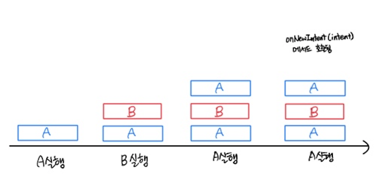
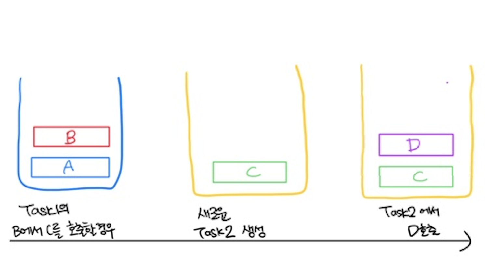

---

title: "Lunch Mode"

date: "2021-08-30"

tags: ["huijiny", "mash-up", "launchmode"]

description: "Android LaunchMode에 대해서 알아보자!"

cover: "./images/heejin.png"

---

안녕하세요 여러분! 10기 유희진입니다:)

저는 생명주기에 대해서 공부하다가 안드로이드에 Launch Mode가 있다는 걸 알게되었어요.

Launch Mode의 4가지 종류에 대해서 알아보고, 그 중 singleTop과 singleTask로 선언된 액티비티들의 생명주기가 어떻게 돌아가는지도 함께 말씀드리려고 합니다.

## Task

일단 시작하기 전에 아래에서 등장할 Task가 뭔지 알아두셔야 해요.

다들 OS 강의 들으실 때 프로세스에 대해서 배워보셨을 것 같은데요, 계속해서 컨텍스트 스위칭이 진행되면서 여러가지 프로그램이 '동시에' 진행되는 것 처럼 작동하잖아요, 그 때 해당 프로그램이 현재까지 어떤 동작을 하고있었는지에 대한 진행상황에 대한 정보를 프로세스에 저장하죠? 태스크도 a little bit 비슷한 친구에요.

안드로이드 OS에서도 또한 이러한 프로세스가 존재하는데, 이 프로세스 내부에 **태스크**라는 개념이 있습니다. 안드로이드와 같은 모바일 환경은 PC의 운영체제와는 다르게 '액티비티' 단위로 동작을 하는것 때문에 존재해요. ` A task is a collection of metadata and information around a stack of activities` 태스크는 액티비티들의 stack에 대한 정보와 metadata를 저장하고 있는 친구입니다.

우리가 app luncher icon을 클릭하여 앱을 시작하게 되면 시스템은 앱을 resume하기 위해 이전에 존재하던 task가 있는지 찾아보게 되고, 우리가 있었던 그 페이지에 되돌려 보내줍니다. 만약 아무런 task도 발견되지 않는다면 새로운 task를 실행하여 activity를 실행하게 되고 그 액티비티를 task의 **back stack**에 base activity로서 시작하게 되죠. 이 태스크를 통해 어플리케이션의 화면 흐름을 관리할 수 있어요.

## LaunchMode

위에서 설명한 대로 Android에서 Task라는 존재가 있기에 이를 관리하는 방법이 중요할 것 같아요. 효율적으로 태스크를 배치할 수 있지않을까요? 어쩌면 앱 액티비티가 시작될 때 현재 Task내에 배치되지 않고, 새 Task로 시작할 수도 있구요, 액티비티가 시작될 때 백 스택의 맨 위에 새 인스턴스가 생기는 대신 액티비티의 기존 인스턴스가 앞으로나오게 할 수도 있습니다. 이와 관련해서 Task를 관리할 수 있는 <activity>[속성들](https://developer.android.com/guide/components/activities/tasks-and-back-stack#ManagingTasks) 중에 LaunchMode를 살펴볼게요 :)!

LaunchMode를 통해 액티비티의 새 인스턴스가 현재 Task와 연결되는 방식을 정의할 수 있습니다.

LaunchMode를 정의하는 방법은 두 가지가 있습니다.

1. Manifest 파일에서 액티비티를 선언 할 때 지정할 수 있습니다.

2. `startActivity()` 를 호출할 때 새 액티비티에 LaunchMode를 선언하는 플래그를 Intent에 포함할 수 있습니다.

위 두 가지 방법 중에서 manifest 파일을 사용할 때 LaunchMode를 선언할 수 있는 4가지 속성이 있습니다.

| 언제?                                | 모드 이름      | 다중 인스턴스 가능? | 설명                                                         |
| ------------------------------------ | -------------- | ------------------- | ------------------------------------------------------------ |
| 대부분 액티비티에 대한 일반적인 시작 | standard       | 가능                | 기본. 시스템이 항상 대상 Task에 새 Activity Instance를 생성하고, intent를 해당 Instance로 routing |
|                                      | singleTop      | 조건부              | Activity의 Instance가 이미 대상 Task의 맨 위에 존재하는 경우 시스템은 새 Activity Instance를 생성하는 대신 onNewIntent() 메서드를 호출해 Intent를 해당 Instance로 routing |
| 특수한 시작(권장 X)                  | singleTask     | 불가능              | 시스템이 새 Task의 Root에 Activity를 생성하고 Intent를 해당 activity로 routing. 이미 Activity Instance가 존재하는 경우 새 Instance를 생성하는 대신 onNewIntent() 메서드를 호출에 기존 Instance로 routing |
|                                      | singleInstance | 불가능              | Activity는 항상 해당 Task의 단일 멤버다. 한 Task에는 하나의 Instance만 온다. |

저는 표를 봤을 때 한 번에 이해가 안가더라구요. 그래서 그림과 함께 각각 모드를 다시 설명해볼게요.

### 0. 다중 인스턴스 가능에 대한 분류

- 가능: **standard, singleTop(조건부**) = 일반적으로 사용됨.

- 불가능: **singleTask, singleInstance** = 일반적으로 사용 안됨. 특수한 시작.

### 1. standard

> 모두 standard로 선언되었을 경우 (기본 값)

- 기본적으로 설정되는 값
- 인스턴스는 어떤 Task던지 속할 수 있고, 액티비티 스택의 어떤 장소에도 위치할 수 있습니다. 일반적으로 instance는 startActivity()를 호출한 작업에서부터 시작합니다.

- 액티비티에 대한 새 Instance가 있을 때마다 새 Intent를 처리하도록 생성됩니다.
- 각 Instance는 단일 Intent를 처리합니다.
- **항상** activity stack을 쌓아 올립니다.

### 2. singleTop

> A가 singleTop으로 선언되었을 경우, 나머지는 기본 값

- 인스턴스는 어떤 Task던지 속할 수 있고, 액티비티 스택의 어떤 장소에도 위치할 수 있습니다. 일반적으로 instance는 startActivity()를 호출한 작업에서부터 시작합니다.
- 액티비티에 대한 새 instance가 있을 때마다 새로운 intent를 처리하도록 생성됩니다. 하지만 대상 Task의 stack 상단에 이미 해당 activity의 기존 instance가 있는 경우 onNewIntent()메서드를 호출해 기존의 액티비티 인스턴스를 재활용합니다.

**예시에서 가장 상위가 A 인 상태에서 B를 다시 호출하게 된다면 B는 다시 생성될까요? 아니면 onNewIntent가 호출될까요?** => singleTop은 가장 상위에 있는 것과만 비교한다는것을 기억하세요:) A가 가장 상위에 있으니, B instance는 새로 생겨 올라갑니다. standard와 같습니다. 

### 3. singleTask

>  C가 singleTask로 선언되었을 경우, 나머지는 기본 값

#### 새로운 액티비티를 호출할 경우

#### 기존 액티비티를 호출할 경우

- singleTask 모드로 설정된 액티비티는 **오직 Task의 Root에만 존재할 수 있습니다.**
- singleTask로 설정된 액티비티를 호출하게 되면 새로운 태스크가 생성되고 singleTask로 설정된 액티비티에서 다른 액티비티를 호출 할 경우 그 액티비티는 새로 생성된 Task위에 쌓입니다.
- 태스크에 이미 생성되고 singleTask로 설정된 액티비티가 다시 호출될 경우 onNewIntent() 메서드를 통해 해당 액티비티를 재활용합니다.
- singleTask모드에서는 singleTop 모드와는 다르게 스택의 최상위 액티비티와 비교하지 않습니다. 

### 4. singleInstance

>  A, B, C가 모두 singleInstance로 선언되었을 경우

- 해당 Task내의 유일한 activity가 되어야 합니다. **즉 하나의 Task에 하나의 activity만 존재할 수 있습니다.**
- singleTask와 동일하게 activity 호출 시 항상 새로운 Task가 생성됩니다.

## singleTop과 singleTask 액티비티들의 생명주기

[공식문서](https://developer.android.com/guide/components/activities/tasks-and-back-stack?hl=ko)에서도 볼 수 있는데, **권장되는 LaunchMode는 기본값인 `standard`이에요**.` singleTask`와 `singleInstance`는 권장되지 않습니다. 하지만 생명주기를 공부하다가 알게 된 만큼 `singleTop`과 `singleTask`의 생명주기정도를 알아보려고 합니다. 위에 있는 내용들을 이해하였다면 금방 이해하게 될 거에요.

왼쪽에 있는 예시는 singleTop을 사용하는 두 가지의 액티비티를 실행시켰을 때 입니다. 백스택에 activity1과 2가 순서대로 올라가는게 보일거에요. 그 뒤에 잠깐 pause되었는데 그 전에 `'Start with SINGLE_TOP flag'`라고 적혀있어요. 위에서는 Manifest에 모드를 선언하는 방법만 말씀드렸는데, 다른 방법으로 flag를 선언하여 activity를 시작하는 방법도 있답니다. `singleTop`으로 activity2를 `onPause`상태에있다가 다시 `onResume` 상태로 가게되었더니 중간에 `onNewIntent` 가 불리는 것을 볼 수 있죠. 현재 태스크 내 가장 상위 인스턴스가 activity2이기 때문이에요!

오른쪽에 있는 예시는` singleTask`로 선언된 액티비티가 먼저 실행되고 그 뒤 Activity2가 실행되는 모습이에요. Activity2에서 1으로 돌아갈 때 `singleTask`로 선언된 Activity1이 현재 작업중인 태스크 내에 있으므로 `onNewIntent`가 불려 activity1이 재사용 된 다는 것을 봐주세요. 그리고 또 알아둘 것은 `singleTask`액티비티(Activity1) 위에서 불린 `standard` 액티비티(Activity2)는 그 대로 그 Task위에 생성이 된 다는 점이에요! 위의 예시에서 C에서 D를 불렀을 때 노란색 Task2에 D가 쌓인것처럼 말이에요!

## References

https://developer.android.com/guide/components/activities/tasks-and-back-stack
https://medium.com/androiddevelopers/tasks-and-the-back-stack-dbb7c3b0f6d4
https://medium.com/androiddevelopers/the-android-lifecycle-cheat-sheet-part-iv-49946659b094
https://maejing.tistory.com/entry/Android-%ED%83%9C%EC%8A%A4%ED%81%ACTask%EC%9D%98-%EA%B0%9C%EB%85%90%EA%B3%BC-launchMode%EB%A1%9C-%EC%84%A4%EC%A0%95%ED%95%98%EA%B8%B0
https://wiserloner.tistory.com/1396

