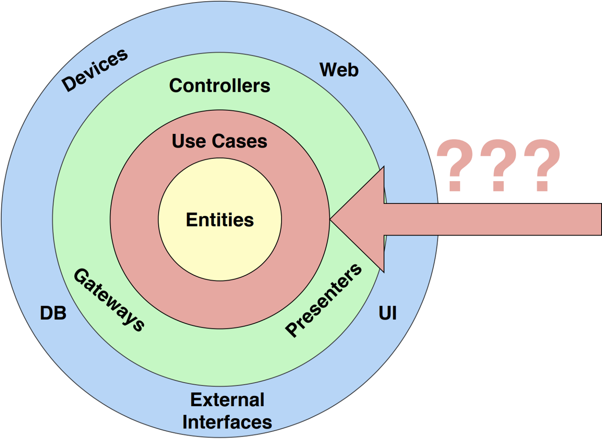

---

title: Clean Architecture - Use case in Android"

date: "2021-10-31"

tags: ["huijiny", "mash-up", "CleanArchitecture", "UseCase", "Android"]

description: "Clean Architecture의 UseCase가 뭐죠?! 안드로이드에선 어떻게 쓰나요?"

cover: "./images/heejin.png"

---


안녕하세요:)


안드로이드 팀 10기 유희진입니다. (꾸벅)


이번 뀨니뀨니와 아이들 안드로이드 팀에서 들어만 보았던 `Clean Architecture`를 적용해보았습니다. 적용하면서, 아예 처음 들어보았던 레이어가 있었는데요, 바로 UseCase 입니다. 


**네 녀석 누구더냐!!?**



진호님께서 유즈케이스레이어에 대해서 설명해주실 때 제가 한 대답이 아직도 생각나네요. 

"(띠용) 그.. 소프트웨어공학에 UML에 나오는 유즈케이스 말하는건가요..?" 


하지만 결국 그 유즈케이스가 이 유즈케이스가 맞더라구요!?!?

## Use case란?

### In general

Use case란 만들고 있는 서비스를 사용하는 유저가 이 서비스(또는 시스템)을 통해 하고자 하는 것을 말한다고 합니다.  

예를 들어, '음식점'이라는 서비스가 있다고 가정해봅니다. 음식점에서 손님은 '음식 주문'을 할 수도 있고 '음식 포장'을 할수도 있고 '가격 지불'을 할 수도 있을거에요. 이 때 이런 '음식 주문', '음식 포장', '가격 지불' 등등이 '음식점'이라는 시스템에 사용자가 요청할 수 있는 Use case가 되는거에요! :)

즉 최소 요청 단위이다! 


### In clean architecture

**UseCase**는Domain Layer에 속해있고 Domain Layer는 안드로이드에 의존하지 않은 순수한 Java / Kotlin 모듈입니다.


## Use case를 쓰는 이유

### Avoid “God” Presenters/ViewModels

만약 관심사 분리를 제대로 하지 않는다면 어떻게 될까요? 모든걸 다 아는 God Object가 될거에요!


Use case가 없는 ViewModel과 유즈케이스가 있는 ViewModel 두 가지 예시를 살펴보겠습니다.

### #1. Usecase가 없는 ViewModel 

```kotlin
class TransactionsViewModelImpl(
    private val userRepository: UserRepository,
    private val transactionRepository: TransactionRepository
) : TransactionsViewModel, ViewModel() {

    private val compositeDisposable = CompositeDisposable()

    override val transactions = MutableLiveData<List<Transaction>>()
    override val showProgress = MutableLiveData<Boolean>()
    override val showError = MutableLiveData<Boolean>()
    override val showContent = MutableLiveData<Boolean>()

    override fun loadTransactions() {
        when (val result = userRepository.getUser()) {
            is Result.Success -> loadUserTransactions(result.value)
            is Result.Failure -> setErrorState()
        }
    }

    private fun loadUserTransactions(user: User) {
        setLoadState()
        transactionRepository.getUserTransactions(user)
            .subscribeBy {
                handleResult(it)
            }.addTo(compositeDisposable)
    }

    private fun setLoadState() {
        showProgress.postValue(true)
        showError.postValue(false)
        showContent.postValue(false)
    }

    private fun handleResult(result: Result<List<Transaction>>) {
        when (result) {
            is Result.Success -> setContentState(result.value)
            is Result.Failure -> setErrorState()
        }
    }

    private fun setContentState(transactionsResult: List<Transaction>) {
        showContent.postValue(true)
        transactions.postValue(transactionsResult)
        showProgress.postValue(false)
        showError.postValue(false)
    }

    private fun setErrorState() {
        showError.postValue(true)
        showProgress.postValue(false)
        showContent.postValue(false)
    }

    override fun onCleared() {
        compositeDisposable.clear()
        super.onCleared()
    }

}
view rawTransactionsViewModel.kt hosted with ❤ by GitHub
```


### Usecase가 있는 ViewModel

**Use case**

```kotlin
// User
interface GetCurrentUserUseCase {
    operator fun invoke(): Result<User>
}

class GetCurrentUserUseCaseImpl(
    private val userRepository: UserRepository
) : GetCurrentUserUseCase {
    override fun invoke(): Result<User> = userRepository.getUser()
}

// Transaction
interface GetUserTransactionsUseCase {

    operator fun invoke(): Single<Result<List<Transaction>>>

}

class GetUserTransactionsUseCaseImpl(
    private val getCurrentUserUseCase: GetCurrentUserUseCase,
    private val transactionRepository: TransactionRepository
) : GetUserTransactionsUseCase {

    override fun invoke(): Single<Result<List<Transaction>>> {
        return when (val result = getCurrentUserUseCase()) {
            is Result.Success -> transactionRepository.getUserTransactions(result.value)
            is Result.Failure -> Single.just(Result.Failure(result.throwable))
        }
    }

}
view rawUsecases.kt hosted with ❤ by GitHub
```

**Viewmodel**

```kotlin
class TransactionsViewModelImpl(
    private val getUserTransactionsUseCase: GetUserTransactionsUseCase
) : TransactionsViewModel, ViewModel() {

    private val compositeDisposable = CompositeDisposable()

    override val transactions = MutableLiveData<List<Transaction>>()
    override val showProgress = MutableLiveData<Boolean>()
    override val showError = MutableLiveData<Boolean>()
    override val showContent = MutableLiveData<Boolean>()

    override fun loadTransactions() {
        setLoadState()
        getUserTransactionsUseCase()
            .subscribeBy {
                handleResult(it)
            }.addTo(compositeDisposable)
    }

    private fun setLoadState() {
        showProgress.postValue(true)
        showError.postValue(false)
        showContent.postValue(false)
    }

    private fun handleResult(result: Result<List<Transaction>>) {
        when (result) {
            is Result.Success -> setContentState(result.value)
            is Result.Failure -> setErrorState()
        }
    }

    private fun setContentState(transactionsResult: List<Transaction>) {
        showContent.postValue(true)
        transactions.postValue(transactionsResult)
        showProgress.postValue(false)
        showError.postValue(false)
    }

    private fun setErrorState() {
        showError.postValue(true)
        showProgress.postValue(false)
        showContent.postValue(false)
    }

    override fun onCleared() {
        compositeDisposable.clear()
        super.onCleared()
    }

}
view rawTransactionsViewModelWIthUseCase.kt hosted with ❤ by GitHub
```


1번 케이스에서는 ViewModel이 Repository 등 모든것에 의존하게 된다고 합니다. 그에 비해 두번째 케이스는 의존도가 UseCase로 옮겨가 data logic이 이동해 더 가벼운 ViewModel을 갖게 됩니다.

만약 비슷한 역할을 하는 Viewmodel이 있다면? 첫번째는 중복된 데이터 로직을 또 작성해야하고, 두번째는 이미 구현한 유즈케이스를 재사용 하면 되겠죠?


## “Useless Use Cases”

제가 가장 궁금했던 점인데요, 제 유즈케이스 코드에는 레포지토리 메소드 호출 코드만 있습니다. (아래에 GetMusicUseCase 참고)

이럴 경우에도 굳이 써야하나? 라는 생각이 들었어요. 답은? Yes!


### 1. Consistency

첫번째로 일관성입니다. 일부 viewmodel은 유즈케이스를 호출하고 다른 ViewModel은 레포지토리를 직접 호출하는 것이 좋지않을까요? 라고 생각하겠지만, 그렇게 되면 코드를 처음 본 사람이나 신입에게 이해하기 어려울 수 있을거에요.


### 2. Protect the code from future changes

두 번째로는 미래 있을 변화에 미리 보호하자는 것입니다. 클린 아키텍쳐의 중요한 목적 중 하나는 요구사항이 변경될 때 쉽게 적응할 수 있는 코드 베이스를 제공하는 것입니다. 이는 즉, 변경해야 하는 코드의 양이 최소여야 함을 의미합니다.


### 3. The “Screaming Architecture”

**What is your app doing?** -> 니 앱 그래서 머하는 앤데?

Screaming architecture는 Robert C. Martin이 제안한 구조라고 하네요. 소프트웨어의 구조가 소리치듯이 구조만 봐도 어떤 서비스 인지 알 수 있어야 한다는 의미를 가지고 있다고해요.

앞에서도 말했듯 Screaming architecture의 핵심은 **구조만 보고도 소프트웨어가 무엇인지 알 수 있도록 명확**해야 한다는 것이고, 때문에 use case를 써서 확실한 구조를 가져가자는 것이라고 합니다!

~~얼마나 확실해야하면 소리까지 지르나 싶어서 상상했다가 웃겨서 혼자 피식했네요ㅋ~~


## Usecase에서 invoke를 사용하는 이유

Usecase를 구현 시 invoke를 사용하는게 좋다고 말씀해주셨어요. 

아래는 저의 음악을 불러오는 유즈케이스 코드인데, `invoke`  연산자를 사용한게 보이시나요?

```kotlin
class GetMusicUseCase @Inject constructor (private val musicRepository: MusicRepository) {
    suspend operator fun invoke(query: String): Videos {
        return musicRepository.getMusic(query)
    }
}
```


### Kotlin의 invoke 연산자를 모르시는 분들을 위해!

```kotlin
object MyFunction {
    operator fun invoke(str: String): String {
        return str.toUpperCase() // 모두 대문자로 바꿔줌
    }
}
```


위와 같은 오브젝트가 하나 있다고 합니다. object기 때문에 MyFunction은 하나의 객체이겠죠. 그래서 너무 자연스럽게 아래처럼 호출하고 싶을거에요.

```kotlin
MyFunction.invoke("something")
```


하지만 Kotlin에서 invoke는 특별한데요, 이름 없이 실행될 수 있는 역할을 합니다. 따라서 아래와 같이 호출이 가능합니다.

```kotlin
MyFunction("something")
```


결국 제가 도움을 받아 쓴 코드는 이렇습니다.

```kotlin
@HiltViewModel
class MusicViewModel @Inject constructor(
    private val getMusic: GetMusicUseCase,
    private val getDuration: GetMusicDurationUseCase
):{
	...
	... getMusic("something")
	...
}
```

위의 유즈케이스를 뷰모델에서 불러올 때, 인스턴스를 주입 받습니다. 인스턴스의 이름부터 동사를 앞에 붙여 `getMusic` 로 생성했다는 것을 볼 수 있을거에요. 그리고 인스턴스에 바로 괄호를 치고 쿼리를 넘기는 것을 볼 수 있을 것입니다.


### 그러면 invoke를 썼을 때 무엇이 좋은가?

- Enforces a pseudo-contract on a contract-less UseCase
- Reads more naturally
- Flexibility in invocation ( loginUseCase() vs loginUseCase.invoke() )


> **Clean Architecture** is a Use Case driven architecture, hence each repository method exists only because it is supporting a Use Case.


## 마무리

### 아키텍쳐가 나 이런애라고 소리지르게 만드세요. 그러려면 유즈케이스를 사용해보세요.


## References

https://proandroiddev.com/why-you-need-use-cases-interactors-142e8a6fe576

https://velog.io/@cchloe2311/%EC%95%88%EB%93%9C%EB%A1%9C%EC%9D%B4%EB%93%9C-UseCase%EB%A5%BC-%EC%99%9C-%EC%93%B0%EB%82%98%EC%9A%94

https://stackoverflow.com/questions/68556352/why-do-we-use-invoke-operator-overloading-in-kotlin-usecases

https://wooooooak.github.io/kotlin/2019/03/21/kotlin_invoke/

https://velog.io/@pond1029/software-architecture