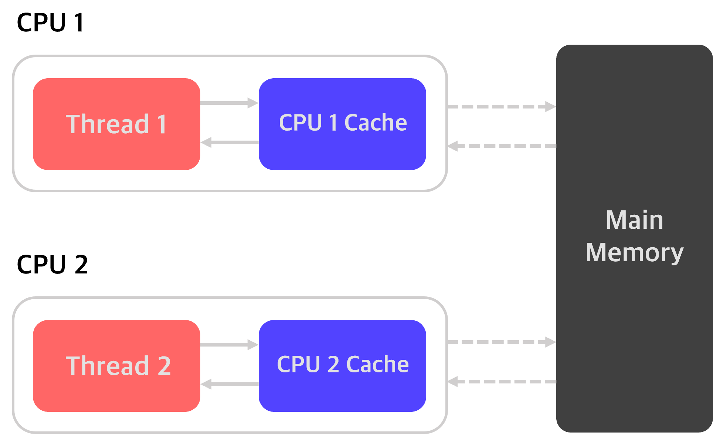
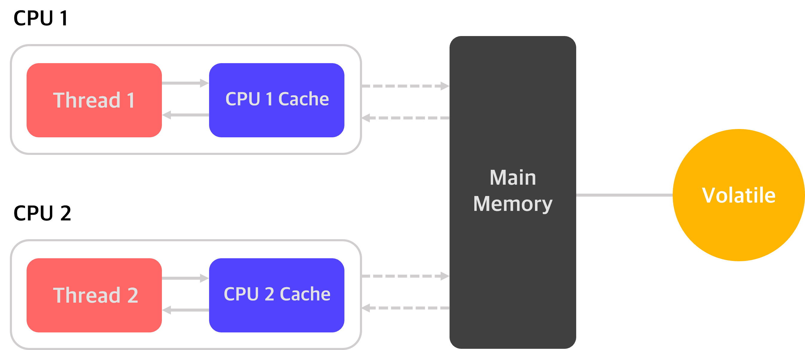
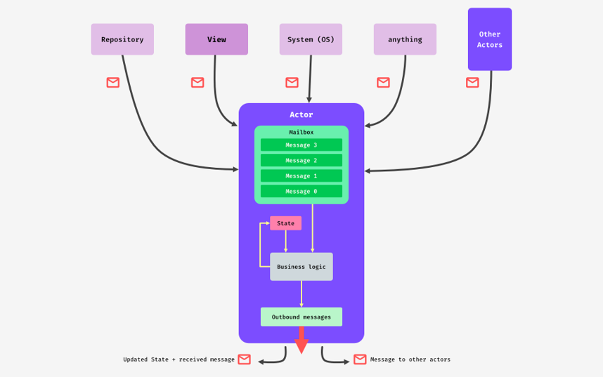

# Shared mutable state and concurrency

<br>

안녕하세요! 안드로이드 11기 강희원입니다.

이번 포스팅에서는 코루틴 공식 가이드의 **Shared mutable state and concurrency**에 대해 알아보도록 하겠습니다.

<br>

### **목차**
- The problem
- Volatiles are of no help
- Thread-safe data structures
- Thread confinement fine-grained
- Thread confinement coarse-grained
- Mutual exclusion
- Actors

<br><br>

> ## The problem
###### 문제 정의

<br>

코루틴은 `Dispatchers.Default`와 같은 디스패처를 이용해서 다중 스레드에서 동작할 수 있습니다.

이 과정에서 여러 동시성 문제가 발생할 수 있는데, 가장 대표적인게 바로 **shared mutable state** 입니다.

**수정 가능한 값에 여러 스레드가 동시에 접근**하려고 할 때 발생하는 문제인데요.

어떤 값을 동시에 읽는 것은 상관 없지만, 동시에 수정하려고 하면 문제가 생기게 됩니다.

<br><br>

> ##### code

##### massiveRun

```kotlin
suspend fun massiveRun(action: suspend () -> Unit) {
    val n = 100  // 코루틴을 실행할 횟수
    val k = 1000 // 각 코루틴마다 action()을 수행할 횟수
    val time = measureTimeMillis {
        coroutineScope { // 코루틴
            repeat(n) {
                launch {
                    repeat(k) { action() }
                }
            }
        }
    }
    println("Completed ${n * k} actions in $time ms")
}
```
<br>

다음 `massiveRun` 함수는 **100개의 코루틴을 실행**하고, 각 코루틴마다 매개변수에서 전달받은 **action을 1000번 수행**하는데 걸리는 시간을 측정하는 함수입니다.
즉, 100개의 코루틴이 하나씩 생성되고, 그 각각의 코루틴이 action을 1000번 수행하는데 걸리는 시간을 측정하는 것입니다.

여기서 `massiveRun`의 인수 자리에 들어오는 코드가 곧 `action` 함수의 내용이 됩니다.

<br>

##### main

```kotlin
var counter = 0

fun main() = runBlocking {
    withContext(Dispatchers.Default) {
        massiveRun {
            counter++
        }
    }
    println("Counter = $counter")
}
```

<br>

100개의 코루틴을 생성했고, 코루틴 한개 당 `action`을 1000번 반복 실행하기 때문에 `action` 함수는 둘을 곱해 총 십만 번 호출되어야 합니다.

`counter++` 라인은 앞서 말씀드린 것처럼 `massiveRun`의 인수로 들어가 `action` 함수 호출 시 실행되기 때문에, 마찬가지로 십만 번 수행됩니다. 
따라서, `counter`의 값을 출력했을 때 십만이 나올 것을 예상할 수 있습니다.

<br><br>

> ##### result
```
Completed 100000 actions in 23 ms
Counter = 95634
```

<br>

하지만, 십만보다 작은 숫자인 **95634**이 출력된 것을 확인할 수 있습니다.
이러한 결과가 나온 이유는 무엇일까요?

바로 `Dispatchers.Defualt`를 통해 코루틴을 생성했기 때문에 **100개의 코루틴이 다중 스레드에서 동작**하게 되었고, 
여러 개의 스레드가 **동기화 처리 없이** `counter` 변수에 마구잡이로 접근했기 때문입니다.

이런 동기화 문제를 해결하기 위한 방법에 대해서 지금부터 알아보겠습니다.

<br><br>

> ## Volatiles are of no help
###### Volatile만으로 동시성 문제를 해결할 수 없다

<br>



<br>

앞서 선언했던 `counter` 변수처럼, class의 멤버 변수는 heap 메모리에 존재하기 때문에 여러 스레드가 공유하며 접근할 수 있습니다.

이때 각 스레드는 속도 향상을 위해 **main memory에 직접 접근해서 값을 가져가는게 아니라, cache에서 변수 값을 읽어**갑니다.

쓰기 또한 cache 값을 이용하며, 그러다가 변경된 cache 값이 어떤 시점에 main memory에 업데이트 됩니다.

<br>

즉, 여러 개의 스레드가 한 변수에 접근할 때 각각 자신의 cache에서 값을 읽고 쓰는데,

그러다가 변경된 값을 어떤 시점에 main memory에 업데이트하기 때문에 **실제 원하는 값과 달라지게** 됩니다.

<br>

예를 들어 thread 1이 어떤 변수의 값을 변경했는데, thread 2는 변경 전 값을 읽어서 이 값을 기준으로 연산하게 될 경우

추후에 실제 main memory에는 엉뚱한 값이 써있게 됩니다.

<br><br>



<br>

이러한 문제를 막기 위한 키워드가 바로 `volatile` 입니다.

`volatile` 키워드 사용 시, 변수의 값을 cache를 통해 사용하지 않고

**스레드가 직접 main memory에 접근**해서 읽고 쓰게 됩니다.

<br><br>

> ##### code
```kotlin
@Volatile // 코틀린에서는 Volatile을 annotation으로 선언
var counter = 0

fun main() = runBlocking {
    withContext(Dispatchers.Default) {
        massiveRun {
            counter++
        }
    }
    println("Counter = $counter")
}
```

<br>

> ##### result
```
Completed 100000 actions in 40 ms
Counter = 91907
```

<br>

하지만 `counter` 변수를 `volatile`로 선언해도, 십만이라는 결과를 도출하지는 못합니다.

`counter` 변수를 `volatile`로 선언함으로써 **선형적인 읽기와 쓰기는 보장**되지만,
**여전히 여러 개의 스레드가 변수를 동시에 읽어올 수 있으므로** 문제가 해결되지 않습니다.

값을 가져오기 위해 메인 메모리에 접근해야 하기 때문에 실행 속도만 더욱 느려지게 됩니다.

<br><br>

> ## Thread-safe data structures
###### 스레드에 안전한 데이터 구조

<br>

일반적인 해결법 중 하나로 **thread-safe한 자료구조**를 사용하는 방법이 있습니다.

`thread-safe`란, **동시에 최대 하나의 스레드만 변수에 접근**할 수 있도록 **자체적으로 제어**하는 데이터 구조입니다.

따라서 thread-safe한 변수를 사용하면, 여러 개의 스레드가 동시에 접근해도 변수를 정상적으로 동기화 할 수 있습니다.

<br>

코틀린에는 `Int`의 thread-safe 타입인 `AtomicInteger` 클래스가 존재합니다.

`incrementAndGet` 함수를 사용하면, 이 `AtomicInteger` 타입의 변수 `counter`를 thread-safe하게 증가시킬 수 있습니다.

<br><br>

> ##### code
```kotlin
val counter = AtomicInteger()

fun main() = runBlocking {
    withContext(Dispatchers.Default) {
        massiveRun {
            counter.incrementAndGet()
        }
    }
    println("Counter = $counter")
}
```

<br>

> ##### result
```
Completed 100000 actions in 33 ms
Counter = 100000
```

<br>

하지만 이러한 `Atomic class`로는 보다 복잡한 상태를 갖거나,
적용할 연산이 증감연산보다 복잡할 경우 처리하기 어렵습니다.

코드를 근본적으로 thread-safe하게 만들어야 합니다.

<br><br>

> ## Thread confinement fine-grained
###### 공유자원에 접근하는 부분만을 단일 스레드로 제한

<br>

`Thread confinemnet`는 **오직 하나의 스레드를 통해서만 변수에 접근**할 수 있도록 하는 해결법입니다.

<br>

예를 들어, 안드로이드에서 UI 작업은 이를 전담하는 UI thread를 통해서만 이루어집니다.

이와 마찬가지로, `counter` 변수에 접근하는 용도로만 사용될 스레드를 만들고

**이 스레드에서만 counter 변수에 대한 증가 연산이 가능하도록 제한**함으로써 동기화 문제를 해결할 수 있습니다.

<br><br>

> ##### code
```kotlin
val counterContext = newSingleThreadContext("CounterContext")
var counter = 0

fun main() = runBlocking {
    withContext(Dispatchers.Default) {
        massiveRun {
            withContext(counterContext) {
                counter++
            }
        }
    }
    println("Counter = $counter")
}
```

<br>

> ##### result
```
Completed 100000 actions in 1738 ms
Counter = 100000
```

<br>

`withContext`를 이용하여 `counter` 변수에 접근하는 부분의 문맥을 새로 생성한 `counterContext`로 바꿔서 실행했습니다.

<br>

공유자원에 접근하기 위한 용도로 만들어진 하나의 스레드를 활용해 동기화 문제는 해결됐지만, 실행시간이 매우 느려졌습니다.

`counter`의 값을 증가시킬 때마다 `Dispatchers.Default`로 수행되던 것을 `counterContext`로 바꿔서 실행하기 때문입니다.

즉, **context를 십만 번이나 바꾸게 되는 것**입니다.

<br><br>

> ## Thread confinement coarse-grained
###### 보다 넓은 단위의 작업을 단일 스레드로 제한

<br>

방금 본 코드에서 `Dispatcher.Default`는 사실상 불필요한 context 입니다.

애초에 코루틴 실행 자체를 `counterContext`에서 하면 **불필요한 context switching을 막을 수** 있습니다.

<br><br>

> ##### code
```kotlin
val counterContext = newSingleThreadContext("CounterContext")
var counter = 0

fun main() = runBlocking {
    withContext(counterContext) {
        massiveRun {
            counter++
        }
    }
    println("Counter = $counter")
}
```

<br>

> ##### result
```
Completed 100000 actions in 25 ms
Counter = 100000
```

<br>

정확히 `counter` 변수를 **증가시키는 작업만을 분리**해내는 게 아니라, `massiveRun` 함수의 작업 자체를 `counterContext`에서 **모두 수행**하도록 했습니다.

앞서 작은 범위로 한정을 한 경우에 비해 훨씬 빠르게 동작하는 것을 확인할 수 있습니다.

<br><br>

> ## Mutual exclusion
###### 상호 배제

<br>

다음으로, `Mutual exclusion`이란 공유변수에 접근하는 코드를 **critical section**으로 보호하여

이 **critical section이 동시에 실행되지 않도록 막는** 방법입니다.

<br>

코루틴에서는 `lock`과 `unlock` 메소드를 갖는 **Mutex**를 사용해서 critical section을 표현합니다.

참고로 여기에서 **Mutex**의 `lock` 메소드는 suspend function이기 때문에 스레드를 block하지 않습니다.

<br><br>

> ##### code
```kotlin
val mutex = Mutex()
var counter = 0

fun main() = runBlocking {
    withContext(Dispatchers.Default) {
        massiveRun {
            // critical section
            mutex.withLock {
                counter++
            }
        }
    }
    println("Counter = $counter")
}
```

<br>

`Mutex.withLock` 블록은 `lock`과 `unlock` 메소드를 편리하게 사용하기 위한 extension function으로,

아래의 `try-finally`문과 동일한 코드입니다.

<br>

```kotlin
mutex.lock()
try {
    counter++
} finally {
    mutex.unlock()
}
```

<br><br>

> ##### result
```
Completed 100000 actions in 465 ms
Counter = 100000
```

<br>

공유자원 `counter`의 값을 변경하기 전에 `lock`을 걸고, 값 변경이 끝난 후에 `unlock`을 하면서 동기화 문제를 잘 처리하고 있습니다.

하지만 **작은 범위로 한정해서 lock과 unlock을 반복**하고 있기 때문에, 어느정도의 비용이 발생하게 됩니다.

<br><br>

> ## Actors

<br>

마지막으로 코루틴 빌더 중 하나인 `Actor`를 활용하는 해결법이 있습니다.

먼저 `Actor`에 대해 알아보겠습니다.

<br>

- #### Actor?
> `Actor`는 **private 변수**와, **다른 코루틴과 의사소통 할 수 있는 channel**로 이루어진 **코루틴 빌더**입니다.
>
> 동기화 이슈가 존재하는 `counter`와 같은 속성값은 `Actor`가 private 변수로 가지고 있고,
> 이 속성 값에 접근하고 싶을 때 `Actor`에게 요청하는 방식을 사용합니다.
>
> `Actor` 내부의 private 변수에 접근하기 위해서는 **Actor에 Message를 전달**해야 합니다.

<br>

- #### Actor에는 sendChannel과 receiveChannel이라는 두 채널이 있습니다.

> 먼저 **sendChannel**은 `Actor`가 다른 코루틴과 통신하는데 사용됩니다.
> 다른 코루틴에서 `Actor`의 private 변수에 접근하고 싶을 때, `Actor`의 sendChannel을 통해 **메시지를 보내고 접근을 요청**합니다.
>
> 다음으로 **receiveChannel**은 다른 코루틴들이 sendChannel로 보낸 메시지를 **`Actor` 스코프 내부에서 수신 후 처리**합니다.

<br>

이처럼 Actor 내부에서 채널을 이용하기 때문에 순차적인 실행이 보장되고, 동시성으로 인한 오류 방지가 가능합니다.

<br><br>



<br>

그림처럼 Message는 **비동기식**으로 `Actor`에 전송되고, 

`Actor`는 수신된 메시지를 **큐**에 담아 두었다가 **FIFO** 순서로 순차적으로 처리합니다.

<br><br>

- #### `Actor`를 사용하기 위해서는 첫 번째로, `Actor`가 처리할 **Message들의 클래스**를 정의해야 합니다.

<br>

> ##### code
```kotlin
sealed class CounterMsg
object IncCounter : CounterMsg()
class GetCounter(val response: CompletableDeferred<Int>) : CounterMsg()
```

<br>

이를 위해, 코틀린의 `Sealed class`를 사용합니다.

`IncCounter`, `GetCounter`와 같은 여러 개의 메시지 타입을 `CounterMsg`라는 **Sealed class**를 통해 하나로 묶고

이후 `when`절을 이용하여 전송받은 **메시지를 각 타입에 따라 처리**할 수 있습니다.

<br>

여기에서 `CounterMsg`는 아래 두 메시지 타입의 **부모 클래스**가 됩니다.

> `IncCounter`는 **변수를 1 증가**시키라는 의미의 메시지 타입입니다.
>
> `GetCounter`는 **변수의 값을 반환**하라는 의미의 메시지 타입입니다.

<br>

`GetCounter`에서는 인자값으로 `CompletableDeffered<Int>` 타입을 사용합니다.

여기서 `CompletableDeffered`는 하나의 정수를 반환하는데, 
반환하는 정수 값에 대한 연산이 완료되어서 **complete를 호출할 때까지 코드를 block** 시킵니다.

`Actor`도 코루틴이기 때문에 본질적으로 **비동기적**이고,
값을 즉시 반환하지 못할 경우가 있을 수 있기 때문입니다.

<br><br>

- #### 이제 이 Message를 처리하는 Actor를 정의하겠습니다.

<br>

> ##### code
```kotlin
fun CoroutineScope.counterActor() = actor<CounterMsg> {
    var counter = 0 // actor의 상태 값
    for (msg in channel) { // 채널을 전부 순회하기 위한 for-loop문
        when (msg) { // 채널을 통해 전송된 msg가 어떤 type인지 구분
            is IncCounter -> counter++
            is GetCounter -> msg.response.complete(counter)
        }
    }
}
```

<br>

`for`문을 통해 **채널 전체를 순회**하며, 들어오는 메시지를 처리합니다.

<br>

`when`절을 이용해 채널을 통해 전송된 메시지가 `Sealed class`의 **어떤 타입인지 구분**합니다.

> 메시지가 `IncCounter` 타입일 경우, `counter` 변수의 값을 **1 증가**시키고
>
> 메시지가 `GetCounter` 타입일 경우, `GetCounter`의 속성인 `response`의 값을 **반환**합니다.

<br>

여기에서 `complete` 함수는 int 타입인 `counter` 변수의 값을 반환한다는 것으로 이해하면 쉽습니다.

<br><br>

- #### 이제 `main` 함수에서 `Actor`를 실행해보겠습니다.

<br>

> ##### code
```kotlin
fun main() = runBlocking<Unit> {
    val counter = counterActor()
    withContext(Dispatchers.Default) {
        massiveRun {
            counter.send(IncCounter)
        }
    }
    val response = CompletableDeferred<Int>()
    counter.send(GetCounter(response))
    println("Counter = ${response.await()}")
    counter.close()
}
```

<br>

> ##### result
```
Completed 100000 actions in 959 ms
Counter = 100000
```

<br>

먼저 `counter`라는 이름의 `Actor`를 하나 생성합니다.

`massiveRun` 내부에서 `action` 함수를 호출하면, **채널로 `IncCounter` 메시지를 전송**합니다.

그럼 `Actor` 스코프의 `when`절에서 **counter 변수의 값을 1 증가**시키게 됩니다.

<br>

`massiveRun`의 동작이 모두 끝난 뒤에 아래 코드들이 실행됩니다.

증가 연산이 완료된 후, 다시 채널로 `GetCounter` 메시지를 전송하면

결과 값이 `response` 변수에 담길 때까지 기다린 후, 출력합니다.

<br>

`Actor`는 **채널을 통해 들어오는 메시지를 순차적으로 처리**하기 때문에, 자연스럽게 **변수에는 한 번에 한 작업만 수행**됩니다.

따라서 동기화 문제가 해결됩니다.

또, 불필요한 **context switching**이 발생하지 않기 때문에 실행 시간도 더 빨라집니다.

<br><br><br>

이상으로 **Coroutine Shared mutable state and concurrency**에 관한 포스팅을 마무리하도록 하겠습니다.

읽어주셔서 감사합니다!

<br>

* * *

<br>

#### 참고

[Coroutine Shared mutable state and concurrency](https://kotlinlang.org/docs/shared-mutable-state-and-concurrency.html)

<br>