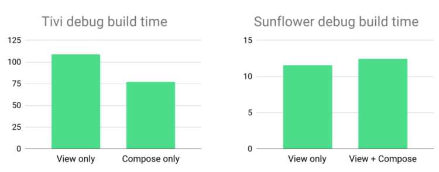

[Jetpack Compose](https://developer.android.com/jetpack/compose)는 구글에서 개발한, 모던한 안드로이드 개발을 위한 UI Toolkit 입니다. 컴포즈는 기존의 View System 대비 보다 적은 코드로 네이티브 UI 를 구축할 수 있게 해줍니다.

최근 개발 생태계에서는 선언형 프레임워크가 주목받고 있습니다. React, SwiftUI, Flutter, Jetpack Compose 등 다양한 플랫폼에서 마크업이 아닌 선언형으로 UI 를 구축하는 방식에 대해 채택하고 있는 것이 그 증거입니다.

안드로이드는 태생부터 xml 기반의 레이아웃 구성을 기반으로 UI 를 구축해왔기 때문에 새로운 패러다임인 Jetpack Compose 로 전환하는 것이 꽤나 큰 변화인데요. 만약 Jetpack Compose 로의 마이그레이션을 검토하고 계시다면, 혹은 컴포즈에 대해 학습을 준비하고 계시다면 몇 가지 알아둬야 할 사항들이 있습니다.

### 1. 실제 제품에 적용 가능할까?
사실 2021년 초까지만 해도 Jetpack Compose 에 대한 사람들의 평가는 "실무에 적용하기엔... 몇 년은 걸릴 것 같다." 였습니다. 당시에는 아직 alpha 버전이기도 했고, 안정성 문제나 관련 레퍼런스 문서의 부재 등 복잡한 앱 서비스를 제공하고 있는 기업에서 도입하기에는 다소 부담스러운 것이 사실이었습니다.

그러나 2021년 8월에 1.0.0 스테이블 버전이 정식 출시 되면서, 공식적으로는 프로덕션에 적용 가능한 수준으로 준비를 마쳤습니다. 그러나 여전히 experimental API 도 많이 있고, 컴포즈와 관련된 개발론이나 설계 방식 등에 대한 정보가 부족하기에 규모가 큰 프로젝트를 마이그레이션 하기에는 여전히 부담스럽습니다. 그러나 신규 프로젝트라면 개발 기간 등을 잘 고려했을 때 충분히 컴포즈를 도입할만 하다 생각이 들고, 실제로 그런 팀들을 심심치 않게 볼 수 있습니다.

### 2. Java 와 사용 가능할까?
Jetpack Compose 는 Kotlin only 입니다. 최근에는 많은 기업과 많은 앱들이 코틀린을 주력 언어로 작성되고 관리되고 있습니다만, 많은 프로젝트에서 여전히 자바를 혼용해서 사용하고 있을텐데요. 안타깝게도 컴포즈는 코루틴이나 `@Composable` 어노테이션이 오직 코틀린 컴파일러에 의해서만 해석되고 동작하기 때문에 자바에서는 사용할 수 없습니다.

### 3. 어떤 것들이 준비 되어야 할까?
Jetpack Compose 를 사용하기 위해서는 아래의 환경을 최소로 요구합니다.
  - Min SDK Version
    - Android 5.0 (API 21)
  - Android Studio Arctic Fox(2020.3.1)
  - Android X

그리고 필수는 아니지만 컴포즈는 Material Design 에 대해서도 커스텀 구현이 제공되고 있습니다.

### 4. 퍼포먼스나 빌드 속도, 앱 용량 등 영향이 있을까?
구글은 Jetpack Compose 를 발표하면서, 기존의 View System 보다 Compose 가 더 성능도 좋고 시간도 단축할 수 있다고 했습니다. 그렇다면 정말 그런지, 아래 지표를 통해 확인해보겠습니다.

깃헙에 공개 되어 있는 안드로이드 프로젝트 중 [tivi](https://github.com/chrisbanes/tivi/) 와 [Sunflower](https://github.com/android/sunflower/tree/compose_recyclerview) 를 통해 테스트를 해볼텐데요. tivi 프로젝트는 only view, only compose 에 대해서, Sunflower 프로젝트는 only view, view + compose 에 대해서 각각 빌드 시간과 앱 용량을 비교해보도록 하겠습니다.

위 결과를 보면 아시겠지만 오직 기존의 View System 만 적용한 케이스보다는 Compose 만 적용한 케이스가 빌드 속도나 앱 용량 측면에서 더 좋은 결과를 가져왔고요. 반면에 기존의 View System 과 Compose 를 혼용한 경우에는 반대로 기존의 View System 보다 부족한 결과를 보이고 있습니다.

따라서 앱 용량이 중요한 프로젝트의 경우에는 Compose 로 마이그레이션 할 때 유의할 필요가 있겠습니다.

### 5. 기존 프로젝트에서 사용 가능할까?
앞서 살짝 언급하기도 했지만, Jetpack Compose 는 기존의 View System 과 완벽하게 상호 운용이 가능하도록 만들어졌습니다. 
> "Jetpack Compose is designed to work with the established view-based UI approach."

어쩌면 당연할 수 있겠지만 기존의 View system 과 컴포즈를 함께 사용할 때는 아래의 케이스가 있겠습니다.
  - 기존의 View System UI 에 Compose element 추가하기
  - 기존의 View System UI 를 Composable function 에 추가하기

위와 같은 상호 운용이 가능하기 때문에 자바에서 코틀린으로 전환하던 것처럼 각자의 프로젝트에서 마이그레이션을 목표로 할 때 점진적으로 조금씩 바꿔나가면 되겠습니다.

### 6. 기존에 많이 사용되던 라이브러리와 함께 사용 가능할까?
Compose 는 통합을 염두에 두고 제작되었기 때문에, 모든 Jetpack 라이브러리와 함께 사용이 가능합니다.
뿐만 아니라 안드로이드 개발에 자주 사용되는 주요 라이브러리들 또한 컴포즈와 함께 사용할 수 있습니다.
  - 이미지 라이브러리 : Glide, Coil 등
  - 의존성 주입 : Dagger, Hilt 등
  - 비동기 처리 : Kotlin Coroutines, Flow 등
  - 네트워크 : Retrofit, Ktor 등
  - 애니메이션 : Lottie 등

Summary
------
글의 서두에서 언급한 것처럼 현재 클라이언트 개발에서 UI 를 개발하는 방식에 대해 선언형 UI 가 당분간은 대세로 자리잡을 것 같습니다. 구글에서도 컴포즈에 힘을 많이 싣고 있고, 최근에 안드로이드와 관련된 리포트나 블로그 발행글만 봐도 컴포즈를 주제로 다룬 것들이 대다수일 정도로 굉장히 주목할만한 기술이란 생각이 듭니다.

만약 사이드 프로젝트나 소규모의 신규 프로젝트를 기획하고 있으시다면 한 번 쯤은 컴포즈를 통해 개발을 하는 것에 대해 검토해보시길 추천합니다. 