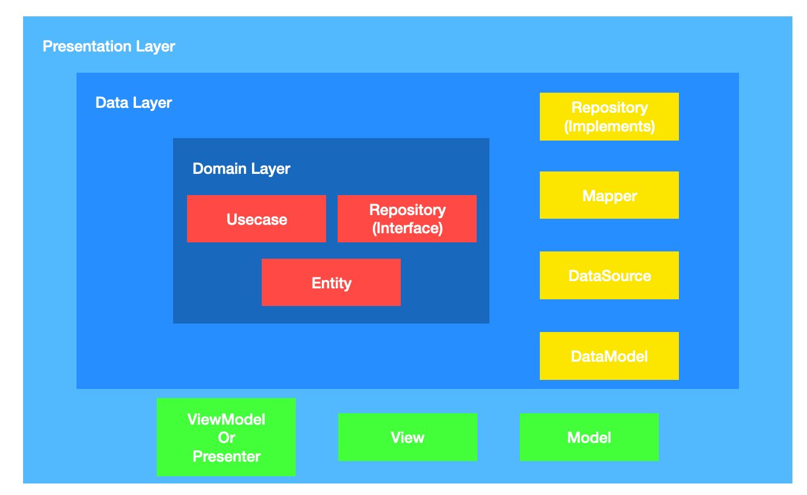

LiveData 는 Lifecycle 라이브러리 중 하나로, 안드로이드 공통의 라이프사이클과 관련된 문제를 해결할 수 있게 해 주면서 앱 개발시 보다 더 유지보수하기 쉽게, 테스트하기 쉽게 만들어주는 라이브러리입니다.
LiveData 는 옵저버 패턴을 활용하여 구현되었으며, 관찰 가능한 일반 클래스인 ObservableXXX 클래스와는 달리 LiveData 는 생명주기의 변화를 인식합니다. 즉, Activity, Fragment, Service 등 안드로이드 컴포넌트의 생명 주기 인식을 통해 Active 상태에 있는 컴포넌트에서만 업데이트합니다.

LiveData 를 사용했을 때 장점은 아래와 같습니다.
  * Activity 와 Fragment 는 LiveData 객체를 안전하게 관찰할 수 있고, 생명 주기가 끝나는 즉시 관찰을 멈추기 때문에 누수를 걱정하지 않아도 됩니다.
  * LiveData 는 옵저버 패턴을 따르기에 LiveData 는 관찰 대상인 데이터가 변경될 때 Observer 객체에 알립니다. 그리고 이러한 Observer 객체를 통해 UI 를 업데이트 한다면 개발자가 직접 업데이트할 필요가 없게 됩니다.
  * Activity 가 Back Stack 에 있을 때를 비롯하여 Observer 의 생명 주기가 비활성 상태에 있으면 Observer 는 어떤 LiveData 이벤트도 받지 않아 비정상 종료가 발생하지 않게 됩니다.
  * 생명 주기가 비활성화(Inactive)되었다가 다시 활성화(Active)될 때 최신 데이터를 수신합니다. 
  * Room 이나 Retrofit 라이브러리 등과 호환되어 함께 사용하기 좋습니다.

위 내용을 봤을 때, LiveData 는 단순히 옵저버 패턴을 통해 데이터의 변화를 관찰하고 UI 를 업데이트하기에 용이하다는 것을 넘어 Activity 나 Fragment 등의 생명주기에 따른 관리도 잘 해주는 라이브러리라는 것을 알 수 있습니다.
그렇기에 꼭 MVVM 디자인 패턴이 아니더라도 데이터를 관리하는데에 지금까지도 굉장히 많이 사용되고 있으며, 주로 함께 사용하는 라이브러리로는 AAC DataBinding, AAC ViewModel 등이 있습니다.

언뜻 보기에는 LiveData 는 흠 잡을 데 없이 좋은 것 같습니다.

그렇다면 이번에는 아키텍처 관점에서 LiveData 를 한 번 살펴보겠습니다.



위 그림은 클린 아키텍처를 안드로이드 개발 관점에서 재구성하여 그림으로 표현한 것입니다. 위 그림은 클린 아키텍쳐에 대한 수많은 재해석 중 하나로, 안드로이드 개발의 다양한 관점에서 클린 아키텍처를 정의한 케이스에 대해 보다 더 알고 싶다면 [여기](https://proandroiddev.com/multiple-ways-of-defining-clean-architecture-layers-bbb70afa5d4a)를 참고하시면 되겠습니다.

클린 아키텍처에서 계층 간의 의존성은 한쪽으로만 발생하여야 합니다. 예컨대, Presentation 계층에서는 Domain 계층을 알지만, 그 반대인 Domain 계층은 Presentation 계층을 알면 안됩니다. 
한 가지 알아두면 좋은 점은 안드로이드 개발에 자주 사용되는 디자인 패턴인 MVVM 패턴이나 MVP 패턴 등은 Presentation Layer 에 포함되는 패턴입니다. 따라서 MVVM 과 클린 아키텍처는 양자 택일의 문제가 아니라 함께 적용이 가능한 부분인 것을 알아두면 좋을 것 같습니다.

이번 포스팅에서는 클린 아키텍처에 대한 내용을 주로 다루기 보다는, LiveData 와 StateFlow 에 대해 중점적으로 살펴볼 것이니 아키텍처와 관련한 자세한 설명은 생략하고 간단하게만 살펴보도록 하겠습니다.

### Presentation Layer
화면과 입력에 대한 처리 등 UI 와 관련된 부분을 담당합니다. Activity, Fragment, View, ViewModel 등을 포함합니다.
여기에서 Activity 와 Fragment 는 View 의 역할을 하는, 다시 말해 데이터를 소유하는 것이 아니라 데이터를 표시하기만 하는 역할을 하므로 LiveData 인스턴스를 보유해서는 안 됩니다.
LiveData 객체는 주로 AAC ViewModel 에서 관리하게 되는데, 이또한 Presentation Layer 에 속해 있으니 크게 문제가 될 것은 없어보입니다.
그리고 Presentation Layer 는 Domain Layer 에 대한 의존성을 가지고 있습니다.

### Data Layer
Domain Layer 에 대한 의존성을 갖습니다. Domain 계층의 Repository 인터페이스를 포함하고 있으며, 이에 대한 구현을 Data Layer 에서 하게 됩니다. 그리고 데이터베이스(Local)와 서버(Remote)와의 통신도 Data 계층에서 이루어집니다. 또한 필요하다면 Mapper 클래스를 두어 Data Layer 의 모델을 Domain 계층의 모델로 변환해주는 역할도 이 계층에서 하게됩니다.

Data Layer 클래스에서 LiveData 객체를 작업하고 싶을 수 있지만 LiveData 는 비동기 데이터 스트림을 처리하도록 설계되지 않았습니다. LiveData transfromation 과 MediatorLiveData 등을 통해 이를 처리하게 할 수는 있겠지만, 모든 LiveData 의 관찰은 오직 Main Thread 에서만 진행되기 때문에 한계점을 갖고 있습니다.

안드로이드의 교과서인 디벨로퍼 사이트에서도 이에 대해 명시하고 있으며, Repository 에서는 LiveData 를 사용하지 않도록 권장하면서 동시에 Kotlin Flow 를 사용하도록 권장하고 있습니다. ([참고](https://developer.android.com/topic/libraries/architecture/livedata#livedata-in-architecture))

### Domain Layer
어플리케이션의 비즈니스 로직에서 필요한 UseCase 와 Model 을 포함하고 있습니다. UseCase 는 각 개별 기능 또는 비즈니스 논리 단위이며, Presentation Layer, Data Layer 계층에 대한 의존성을 가지지 않고 독립적으로 분리되어 있습니다.

**Domain 계층은 안드로이드에 의존성을 가지지 않은 순수 Java 및 Kotlin 코드로만 구성합니다.** 여기에는 Repository 인터페이스도 포함되어 있습니다.

LiveData 의 문제는 여기서도 발생합니다. 우리는 너무나도 자연스럽게 이 Domain Layer 에서 LiveData 를 사용하곤 하는데, 만약 계층 별로 멀티 모듈로 프로젝트를 구성하고 있다면 단지 LiveData 만을 위해서 안드로이드 의존성을 가지도록 해야할 수도 있게 됩니다. 그리고 LiveData 는 안드로이드 SDK 에 포함되어 있다보니 단위 테스트를 할 때도 이를 위한 별도의 테스트 지원 모듈을 의존해야 합니다.

요약을 하자면 클린 아키텍처 관점에서 LiveData 의 문제점은 아래와 같겠습니다.
  1. LiveData 는 UI 에 밀접하게 연관되어 있기 때문에 Data Layer 에서 비동기 방식으로 데이터를 처리하기에 자연스러운 방법이 없다.
  2. LiveData 는 안드로이드 플랫폼에 속해 있기 때문에 순수 Java / Kotlin 을 사용해야 하는 Domain Layer 에서 사용하기에 적합하지 않다.

안드로이드 개발 언어로 코틀린이 자리 잡기 전까지는 위와 같은 문제점을 안고 있으면서도 안드로이드 진영에서는 별다른 선택권이 없었습니다. 그러나 코틀린 코루틴이 발전하면서, Flow 가 등장하게 되었고 많은 안드로이드 커뮤니티에서는 이 Flow 를 이용해서 LiveData 를 대체할 수 있을지에 대한 기대가 생기기 시작했습니다.

그러나 Flow 를 통해 LiveData 를 대체하는 것은 쉬운 일이 아니었습니다.
그 이유는
  1. Flow 는 스스로 안드로이드 생명주기에 대해 알지 못합니다. 그래서 라이프사이클에 따른 중지나 재개가 어렵습니다.
  2. Flow 는 상태가 없어 값이 할당된 것인지, 현재 값은 무엇인지 알기가 어렵습니다.
  3. Flow 는 Cold Stream 방식으로, 연속해서 계속 들어오는 데이터를 처리할 수 없으며 collect 되었을 때만 생성되고 값을 반환합니다. 만약, 하나의 flow builder 에 대해 다수의 collector 가 있다면 collector 하나마다 하나씩 데이터를 호출하기 때문에 업스트림 로직이 비싼 비용을 요구하는 DB 접근이나 서버 통신 등이라면 여러번 리소스 요청을 하게될 수 있습니다.

이를 위해 kotlin 1.41 버전에 Stable API 로 등장한 것이 바로 `StateFlow` 와 `SharedFlow` 입니다.

이번 포스팅에서는 StateFlow 특징과 장점까지만 살펴보고, 다음 기회에 SharedFlow 와 함께 다양한 예제를 통해 활용 방법까지 다뤄보도록 하겠습니다.

## StateFlow
StateFlow 는 현재 상태와 새로운 상태 업데이트를 collector 에 내보내는 Observable 한 State holder flow 입니다. 그리고 LiveData 와 마찬가지로 `value` 프로퍼티를 통해서 현재 상태 값을 읽을 수 있습니다.
StateFlow 는 SharedFlow 의 한 종류이며, LiveData 에 가장 가깝습니다.

특징으로는 다음과 같습니다.
  * StateFlow 는 항상 값을 가지고 있고, 오직 한 가지 값을 가집니다.
  * StateFlow 는 여러 개의 collector 를 지원합니다. 이는 flow 가 공유된다는 의미이며 앞서 설명했던 flow 의 단점(3)과는 다르게 업스트림이 collector 마다 중복으로 처리되지 않습니다.
  * StateFlow 는 collector 수에 관계없이 항상 구독하고 있는 것의 최신 값을 받습니다.
  * StateFlow 는 flow builder 를 사용하여 빌드된 flow 가 cold stream 이었던 것과 달리, hot stream 입니다. 따라서 collector 에서 수집하더라도 생산자 코드가 트리거 되지 않고, 일반 flow 는 마지막 값의 개념이 없었던 것과 달리 StateFlow 는 마지막 값의 개념이 있으며 생성하자마자 활성화 됩니다.

StateFlow 와 LiveData 는 둘 다 관찰 가능한 데이터 홀더 클래스이며, 앱 아키텍쳐에서 사용할 때 비슷한 패턴을 따릅니다. 즉, MVVM 에서 LiveData 사용되는 자리에 StateFlow 로 대체할 수 있습니다. 그리고 Android Studio Arctic fox 버전부터는 AAC Databinding 에도 StateFlow 가 호환됩니다.

그러나 StateFlow 와 LiveData 는 다음과 같이 다르게 작동합니다.
  * StateFlow 의 경우 초기 상태를 생성자에 전달해야 하지만, LiveData 의 경우는 전달하지 않아도 됩니다.
  * View 가 `STOPPED` 상태가 되면 LiveData.observe() 는 Observer 를 자동으로 등록 취소하는 반면, StateFlow 는 자동으로 collect 를 중지하지 않습니다. 만약 동일한 동작을 실행하려면 `Lifecycle.repeatOnLifecycle` 블록에서 흐름을 수집해야 합니다.

예제를 통해 간단한 사용방법도 알아보도록 하겠습니다.
예제는 ViewModel 생성 단계에서 Loading 상태로 설정을 해주고, 이어서 비동기 처리를 통해 어떤 결과 값을 받아오면 업데이트 해주는 코드를 작성해보겠습니다.

먼저 LiveData 를 사용한 예제입니다.
```kotlin
class MyViewModel {
    private val _myUiState = MutableLiveData<Result<UiState>>(Result.Loading)
    val myUiState: LiveData<Result<UiState>> = _myUiState

    // Load data from a suspend fun and mutate state
    init {
        viewModelScope.launch { 
            val result = ...
            _myUiState.value = result
        }
    }
}
```

이번에는 동일한 처리를 StateFlow 를 사용해보도록 하겠습니다.
```kotlin
class MyViewModel {
    private val _myUiState = MutableStateFlow<Result<UiState>>(Result.Loading)
    val myUiState: StateFlow<Result<UiState>> = _myUiState

    // Load data from a suspend fun and mutate state
    init {
        viewModelScope.launch { 
            val result = ...
            _myUiState.value = result
        }
    }
}
```

네. 사실 LiveData 가 StateFlow 로만 변경됐을 뿐 그다지 차이는 없어보입니다. 이번에는 조금 다르게 구현하여 비교해보도록 하겠습니다.

먼저 LiveData 방식입니다.
```kotlin
class MyViewModel(...) : ViewModel() {
    val result: LiveData<Result<UiState>> = liveData {
        emit(Result.Loading)
        emit(repository.fetchItem())
    }
}
```
참고로 위 코드에서 작성된 liveData {} 는 코루틴 빌더입니다.

이어서 StateFlow 방식도 살펴보겠습니다.
```kotlin
class MyViewModel(...) : ViewModel() {
    val result: StateFlow<Result<UiState>> = flow {
        emit(repository.fetchItem())
    }.stateIn(
        scope = viewModelScope, 
        started = WhileSubscribed(5000), // Or Lazily because it's a one-shot
        initialValue = Result.Loading
    )
}
```

처음에 살펴봤던 예제에 비해 이번 예제에서는 LiveData 와 코드가 사뭇 다릅니다. 눈여겨 볼 것은 flow builder 에 `stateIn()` 함수를 사용하여 Flow 를 StateFlow 객체로 변환해준 것입니다. 그리고 `stateIn()` 함수 내부에는 파라미터로 scope, started, initialValue 가 있는데 각각 요구하는 값은 아래와 같습니다.

  * `scope` : 공유가 시작되는 Coroutine Scope.
  * `started` : 공유가 시작 및 중지되는 시기를 제어하는 전략을 설정하는 파라미터.
    * `Lazily` : 첫 번째 subscriber 가 나타나면 시작하고, scope 가 취소되면 중지.
    * `Eagerly` : 즉시 시작되며, scope 가 취소되면 중지.
    * `WhileSubscribed` : collector 가 없을 때 upstream flow 를 취소. 앱이 백그라운드로 전환되면 취소하게 하는 등의 전략 가능.
  * `initialValue` : StateFlow 의 초기 값.


## 정리
다소 긴 내용이었지만, 우리는 LiveData 가 클린 아키텍처 관점에서 갖고 있는 한계점과 이를 대체하기 위한 StateFlow 의 개념과 특징을 비교하며 살펴보았습니다.

마지막으로, LiveData 를 StateFlow 로 사용했을 때 얻게 되는 이점을 정리해보도록 하겠습니다.
  1. 안드로이드 플랫폼에 종속적이었던 LiveData 와는 달리, StateFlow 는 순수 kotlin 라이브러리이기 때문에 Domain Layer 에서 사용할 수 있습니다.
  2. 코루틴을 통해 Work Thread 에서도 비용이 많이 드는 데이터 스트림을 처리할 수 있기 때문에 Data Layer 에서 LiveData 를 사용하는 것보다 향상된 성능으로 사용 가능합니다.
  3. StateFlow 는 zip, flatMapMerge 등 다양한 Flow API 를 사용할 수 있기 때문에 LiveData 보다 풍부하게 활용할 수 있습니다.

StateFlow 와 SharedFlow 가 등장하고, AAC DataBinding 에 StateFlow 가 지원 가능하게 되면서 장기적으로 LiveData 는 deprecated 되는 것이 아니냐는 소문이 돌고 있는데요. 위와 같은 장점들을 고려해봤을 때 앞으로 계속해서 StateFlow 를 위한 API 가 개발이 되고 관련 라이브러리가 많이 등장하게 된다면 충분히 가능성 있는 일이라는 생각이 듭니다.

긴 글 읽어주셔서 감사합니다.