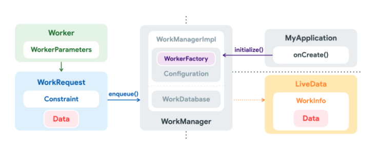

# 백그라운드 앱

앱은 포그라운드에 있을 수도 있고 백그라운드에 있을 수도 있습니다. 이 둘을 쉽게 구분하는 방법은 사용자가 앱이 실행되고 있음을 직관적으로 확인할 수 있고 즉각적으로 상호작용을 할 수 있는 상태인지 아닌지를 따져보는 것입니다. 그렇게 할 수 있다면 포그라운드, 그렇지 않다면 백그라운드에 있다고 할 수 있죠.

앱의 상태를 이렇게 나눈 이유는 무엇일까요? 물론 사용자들의 편의를 위해서입니다. 특정 OS에 국한되지 않도록 조금 더 일반화를 해보자면, 프로세서를 여러 개 가질 수 있는 컴퓨터와는 달리 사람의 프로세서는 단 하나입니다. 커피를 마시면서 개발을 하는 등, 우리는 동시에 여러가지를 작업을 할 수 있는 것 같지만 사실은 싱글 프로세서의 컴퓨터처럼 Concurrency 하게 처리하고 있죠. 즉 한 순간에는 하나의 작업만을 할 수 있습니다. 이런 관점을 연장해보면, 사람은 한 순간에 하나의 프로그램과만 상호작용을 할 수 있다는 결과에 도달하게 되죠. 여기서 사용자와 상호작용 하고 있는 프로그램을 **포그라운드 상태에 있다** 라고 하고, 그 외의 다른 모든 프로그램들은 설사 실행되고 있는 중이라 하더라도 **백그라운드 상태에 있다** 고 말하곤 합니다. 정확한 기준은 OS 에서 정의하기 나름이지만요.

특히 모바일 디바이스 같은 경우에는 화면이 작기 때문에 백그라운드 상태의 앱은 화면에 보여지지도 않습니다. 포그라운드 상태의 앱을 보여주기에도 벅차기 때문이죠. [안드로이드 공식 블로그](https://android-developers.googleblog.com/2018/10/modern-background-execution-in-android.html)에서는 앱이 포그라운드에 있는지 백그라운드에 있는지를 판단하기 위해 다음과 같은 기준을 제시하고 있습니다.

- 포그라운드
  - 앱의 액티비티가 화면에 조금이라도 보이고 있는 경우
  - 앱이 [Forground service](https://developer.android.com/guide/components/foreground-services)를 실행하고 있는 경우
  - 다른 포그라운드 앱과 연결되어 있는 경우
    - 포그라운드에 있는 앱이 실행한 서비스에 바인딩하는 경우
    - 포그라운드에 있는 앱의 [ContentProvider](https://developer.android.com/guide/topics/providers/content-providers)을 사용하고 있는 경우
- 백그라운드
  - 위에 언급한 경우에 아닌 모든 경우

그래서 사용자들은 백그라운드에 있는 앱의 존재를 종종 잊곤 합니다. 하지만 그렇다고 해서 백그라운드에 있는 앱을 모두 종료시켜야할까요? 잠깐 게임을 하다가 누군가 전화라도 건다면 아마 신기록을 잃을 수도 있습니다. 전화를 받는 동안은 게임이 백그라운드로 이동할테니까요.

사용자들은 앱이 앱이 백그라운드로 이동하더라도 계속 실행되고 있기를 기대합니다. 플레이 스토어에서 앱을 다운로드 받는 동안 카카오톡으로 친구와 연락을 주고 받을 수 있기를 원합니다. 하지만 모바일 디바이스는 안타깝게도 백그라운드에 있는 앱들도 동일하게 리소스를 사용할 수 있도록 해줄 여력이 되지 않습니다. 데스크탑 컴퓨터에 비해 적은 메모리 용량과 리소스를 갖고 있기 때문입니다. 따라서 모바일 디바이스의 OS는 한정된 리소스를 효율적으로 배분하기 위해 **비교적 덜 중요한** 백그라운드 앱에는 여러가지 제한을 두고 있습니다. 심지어는 다른 앱을 실행시킬 메모리를 확보하기 위해 백그라운드 앱을 종료시키기도 하죠.

백그라운드 앱이 사용자의 의도와 상관없이 OS에 의해 종료된다면 사용자의 기대와 분명 어긋날 것입니다. 따라서 개발자는 사용자의 기대를 최대한 만족시켜주기 위해서 종료되어선 안되는 중요한 작업들은 OS가 제공하는 솔루션을 활용하여 안전하게 실행될 수 있도록 보장해야합니다. 이번 포스팅에서는 백그라운드에 있는 앱이 작업을 안전하게 실행하는 방법에 대해 다뤄보고 그 중에서도 `WorkManager`에 대해서 알아보고자 합니다.

# 유즈 케이스와 처리 방법들

<figure style="display:block; text-align:center;">
  
  <figcaption style="text-align:center; font-size:15px; color:#808080">
     출처 : <a href="https://developer.android.com/guide/background?hl=ko#categories_of_background_tasks">Categories of background tasks
</a>
  </figcaption>
</figure>

백그라운드 작업은 즉시(Immediate), 지연(Expedite, Deferred), 정시(Exact)에 실행되는 작업으로 나눌 수 있습니다. 음악을 듣기 위해서 재생 버튼을 누르면 음악은 그 **즉시** 흘러나와야합니다. 음악이 마음에 들어 좋아요 버튼을 누르면 최대한 빨리 반영이 되어야 겠지만 다른 작업들 보단 중요하지 않을 수 있죠(<b>Expedite</b>). 그리고 내 개인 설정들을 서버와 동기화시켜뒀다면 너무 늦지 않게 확실히 실행되기만 하면 됩니다(<b>Deferred</b>). 마지막으로 만약 내일 아침 7시에 알람을 설정해둔다면 그 <b>정시(Exact)</b>에 알람이 울려야만 합니다.

이처럼 유즈 케이스에 따라 사용자가 기대하는 동작 방식이 다릅니다. 그리고 마침 안드로이드에서는 각 상황에 따라 다양한 솔루션들을 제공하고 있습니다.

<figure style="display:block; text-align:center;">
  
  <figcaption style="text-align:center; font-size:15px; color:#808080">
     출처 : <a href="https://android-developers.googleblog.com/2018/10/modern-background-execution-in-android.html">Modern background execution in Android</a>
  </figcaption>
</figure>

## WorkManager

위에서 언급한 동기화 작업과 같이, 빠르거나 정확한 시간에 실행될 필요는 없지만 확실히 완료되어야 하는 작업의 경우 `WorkManager`를 사용할 수 있습니다. 단발성으로 작업을 수행하거나 특정 주기에 따라 반복할 수도 있으며 다른 예약된 작업들과 함께 실행되도록 할 수도 있습니다. 심지어 단말기가 유휴상태이거나 충전을 시작할 때, `ContentProvider`에 따라 뭔가를 실행할 때 제약조건을 걸어둘 수도 있습니다. 이런식으로 유연한 백그라운드 작업이 가능하기 때문에 안드로이드에서는 `WorkManager` 사용을 권장하고 있습니다.

## Firebase Cloud Messaging

만약 동기화 작업을 트리거하는 주체가 외부에 있는 경우, 해당 작업을 예약하기 위해서는 `Firebase Cloud Messaging`을 사용할 수 있습니다. 이는 `WorkManager`에게 동기화 작업을 실행해달라는 요청을 함으로써 작업을 위임합니다.

## ForegroundServicee

음악 재생 등 온전히 사용자가 요구한 작업을 그 즉시, 심지어는 단말기의 화면이 끄거나 다른 앱을 포그라운드로 꺼내더라도 안전하게 실행되기를 바란다면 `ForegroundService`를 사용해야합니다. 참고로 `ForegroundService`는 안드로이드의 4대 컴포넌트 중 하나로, 기본적으로 메인 스레드를 사용합니다. 백그라운드 작업을 처리한다고 해서 백그라운드 스레드를 사용하는 것은 아니기 때문에 오래걸리는 작업을 수행한다면 `Corountine`, `Thread` 등을 사용해 별도로 백그라운드 스레드로 context switching을 해야합니다.

## AlarmManager

매일 아침 울리는 알람과 같이 정확한 시간에 특정 작업을 실행하고 사용자가 그 작업과 즉시 상호작용해야한다면 `AlarmManager`를 사용해야합니다. 하지만 `AlarmManager`를 통해 알람이 트리거 되었다면 작업을 완전히 수행하기 위해 주어지는 시간이 무척 짧고, 단말기 상태에 따라 네트워크를 이용하지 못할 수도 있습니다. 예를 들어 [도즈 모드](https://developer.android.com/training/monitoring-device-state/doze-standby) 상태일 때 알람이 트리거 된다면 네트워크를 사용할 수 없을 겁니다. 따라서 오래 걸리는 작업을 수행하거나 작업에 네트워크가 반드시 필요한 경우에는 `AlarmManager`가 적합하지 않을 수 있습니다. 이럴 때는 정확한 시간을 다소 포기하더라도 `WorkManager`를 사용해야할겁니다.

<br>

각 유즈 케이스에 따른 솔루션들을 표로 정리하자면 다음과 같습니다.

| 유즈 케이스                                                 | 예시                                                | 솔루션            |
| :---------------------------------------------------------- | :-------------------------------------------------- | :---------------- |
| 조금 늦어도 되지만 작업 완료를 보장하는 경우                | - 로그 백업<br>- 서버 동기화                        | WorkManager       |
| 작업을 실행하는 주체가 외부(서버 등)에 있는 경우            | - 서버 동기화                                       | FCM + WorkManager |
| 사용자가 작업을 요청하고 즉시 실행되어야 하는 경우          | - 음악 재생<br>- 헬스 데이터 트래킹<br>- 네비게이션 | ForegroundService |
| 정확한 시간에 실행되어 사용자와 즉시 상호작용 해야하는 경우 | - 알람<br>- 리마인더<br>- 빅스비 루틴               | AlarmManager      |

# WorkManager

위에서 백그라운드 상태의 앱에서 각 유즈케이스에 따른 작업을 실행할 수 있는 네 가지 솔루션들을 살펴봤습니다. 그 중에서 `WorkManager`라는 솔루션은 모든 백그라운드 작업을 통틀어 안드로이드가 가장 권장하는 방법입니다. 앱이 처리하는 백그라운드 작업들 중에서 정확한 시간에 실행되어야 하는 작업은 극소수입니다. 하지만 중간에 실패하지 않고 끝까지 완료되어야 하는 작업들은 대다수를 차지하고 있습니다. `WorkManager`는 백그라운드 작업 중 앱이 종료되거나 단말기를 재부팅 하더라도 작업을 다시 이어나갈 수 있는, 신뢰할 수 있는 API 입니다.

`WorkManager`가 등장하기 전에는 `FirebaseJobDispatcher`, `GcmNetworkManager`, `JobSceduler` 등 다양한 솔루션들로 백그라운드 작업을 수행했지만 `WorkManager`는 이들을 완전히 대체할 수 있으며, 더 간단하고 일관된 API를 제공하기 때문에 현재로써는 가장 권장되는 방법입니다.

하지만 그렇다고 해서 `WorkManager`가 완전히 새로운 설계의 API는 아닙니다. 기존 솔루션들을 대체할 수 있다고는 했지만 사실은 내부적으로 기존 솔루션들을 **적절히** 혼합하고 커스텀해서 사용하고 있기 때문이죠.

<figure style="display:block; text-align:center;">
  
  <figcaption style="text-align:center; font-size:15px; color:#808080">
     출처 : <a href="https://developer.android.com/topic/libraries/architecture/workmanager?hl=ko">Schedule tasks with WorkManager </a>
  </figcaption>
</figure>

이미지에서 볼 수 있듯이 `WorkManager`는 API 버전과 호환되고 단말기의 접근 권한 등을 고려해서 적합한 솔루션을 선택합니다. 그리고 하나의 일관된 API 인터페이스로 한 번 Wrapping 하고 있습니다. 따라서 개발자들은 이런 부가적인 조건들을 고려하지 않고, 간단한 API로 백그라운드 작업을 처리할 수 있게 됩니다.

## 기능

`WorkManager`는 일관되고 간단한 API를 제공할 뿐만 아니라 여러가지 새로운 기능들도 함께 제공합니다.

### 작업 제약조건

위에서도 잠깐 언급한 기능입니다. 작업이 실행되는 최적의 조건을 선언적으로 정의할 수 있습니다. 예를 들어 단말기가 Wi-Fi에 연결되어 있거나 유휴 상태일 때, 그리고 저장공간이 충분하지 않은 경우에만 작업이 실행되도록 정의할 수 있습니다. 이를 직접 구현한다면 무수히 많은 어플리케이션 서비스 접근 코드가 필요할테지만 `WorkManager`를 사용하면 간단한 코드 몇 줄로 대체할 수 있습니다.

### 향상된 예약 관리

가변 예약 기간을 통해 한 번 또는 반복적으로 실행할 작업을 예약할 수 있습니다. 작업을 예약해두면 해당 작업은 `WorkManager`가 내부적으로 관리하는 SQLite 데이터베이스에 저장되고, 단말기를 재부팅해도 작업이 유지되고 다시 예약되도록 보장합니다. 그 외에도 도즈모드, 절전 기능 및 여러가지 정책들에 대응하고 권장사항을 준수하기 때문에 작업이 반드시 실행됨을 보장할 수 있습니다.

### 재시도 정책

그럼에도 불구하고 경우에 따라 작업이 실패할 수도 있습니다. `WorkManager`는 [BackoffPolicy](https://developer.android.com/reference/androidx/work/BackoffPolicy)를 비롯해 여러가지 유연한 재시도 정책을 제공합니다. 개발자들은 해당 정책의 세부 내용들은 간단하게 재구성할 수 있습니다.

### 작업 체이닝

하나의 작업이 아니라 여러 개의 작업들이 복잡하게 실행되어야 하는 경우, 유연하게 이들을 체이닝 할 수 있는 인터페이스가 제공됩니다. 이를 통해 순차적으로 실행할 작업과 동시에 작업할 작업들을 제어할 수 있습니다.

```kotlin
WorkManager.getInstance(...)
    .beginWith(listOf(workA,workB))
    .then(workC)
    .enqueue()
```

각 작업의 경우 작업에 대해 입력 값이나 반환 값을 정의할 수 있습니다. 그 경우에 이런식으로 작업을 체이닝하게 되면 `WorkManager`가 자동으로 한 작업의 반환 값을 다음 작업의 입력 값으로 전달합니다.

### 스레드 상호운용

`WorkManager`에서는 `RxJava`나 `Coroutine`과 함께 사용할 수 있습니다. 자체 비동기 API를 연결할 수 있는 유연한 인터페이스를 제공합니다.

## 구성

<figure style="display:block; text-align:center;">
  
  <figcaption style="text-align:center; font-size:15px; color:#808080">
     출처 : <a href="https://dongsik93.github.io/til/2020/05/15/til-jetpack-workmanager/#workmanager-%EA%B5%AC%EC%84%B1">[Android] WorkManager - 동식이 블로그</a>
  </figcaption>
</figure>

### Worker

`Worker`는 작업을 정의할 수 있는 추상 클래스입니다. `doWork()` 라는 추상 메서드를 가지고 있는데, 이를 호출하면 `WorkManager`가 선별한 백그라운드 스레드에서 작업을 수행합니다. 개발자는 이를 오버라이딩해서 작업 내용을 기술해야합니다. 예를 들어 이미지를 업로드하는 `Worker`를 만들려면 다음과 같이 작성할 수 있습니다.

```kotlin
class UploadWorker(appContext: Context, workerParams: WorkerParameters):
       Worker(appContext, workerParams) {
   override fun doWork(): Result {

       // 작업 내용을 기술합니다. 여기서는 이미지를 업로드하는 것으로 예시를 듭니다.
       uploadImages()

       // 작업오의 결과를 반환합니다. Result 타입을 사용합니다.
       return Result.success()
   }
}
```

`doWork()`에서 반환타입인 `Result`는 작업의 성공여부를 가리킵니다. 만약 작업이 실패한 경우에는 `WorkManager`가 어떻게 대처해야할지도 알려줄 수 있습니다.

- `Result.success()` : 작업이 성공적으로 완료
- `Result.failure()` : 작업에 실패
- `Result.retry()` : 작업에 실패했으며 재시도 정책에 따라 다른 시점에 재시도되어야 함

### WorkRequest

작업을 정의했으면 이를 실행하기위해 `WorkManager`에게 부탁을 해야합니다. 여기에는 다양한 방법이 있습니다. 일정한 간격으로 주기적으로 실행되도록 하거나 한 번만 실행되도록 예약할 수가 있죠. 어떤 방법을 택하든 항상 `WorkRequest`라는 클래스를 사용합니다. 이는 언제, 어떻게 작업이 실행되어야할지를 정의합니다.

#### 일회성 작업 예약

```kotlin
val uploadWorkRequest: WorkRequest =
   OneTimeWorkRequestBuilder.from(UploadWorker::class.java)
```

여기서는 한 번만 실행할 것으로 기대되는 `OneTimeWorkRequestBuilder`를 사용해서 `WorkRequest` 인스턴스를 생성합니다. 이때 작업을 정의한 `Worker`를 제네릭으로 알려줍니다.

#### 주기적 작업 예약

한 번이 아니라 주기적으로 실행해야하는 작업은 어떻게 처리하면 좋을까요 ? 주기적으로 데이터를 백업하거나 최신 컨텐츠를 다운로드 받아야할 수 있습니다. 이 경우, `PeriodicWorkRequest`를 사용하면 됩니다.

```kotlin
val saveRequest =
       PeriodicWorkRequestBuilder<SaveImageToFileWorker>(1, TimeUnit.HOURS)
    // 추가 구성 연결 가능
           .build()
```

여기서는 작업이 1시간 간격으로 예약됩니다.

#### 작업 제약조건

작입이 수행될 수 있는 최적의 조건에 대해 제약을 정의할 수 있습니다. 예를 들어 다음과 같은 제약 조건들이 있습니다.

- NetworkType : 작업을 실행하는데 필요한 네트워크 유형을 제한 (WI-FI 연결 여부 등)
- BatteryNotLow : true 로 설정하면 배터리 부족 모드인 경우 작업이 실행되지 않음
- RequiresCharging : true 로 설정하면 기기가 충전 중일 때만 작업이 실행
- DeviceIdle : true 로 설정하면 작업이 실행되기 전에 단말기가 유휴 상태여야 함
- StorageNotLow : true 로 설정하면 저장공간이 부족한 경우 작업이 실행되지 않음

이런 다양한 제약조건을 만들고 작업과 연결시키려면 `Constraint.Builder()`를 사용해서 `WorkRequest.Builder()`에 할당하면 됩니다.

```kotlin
// 제약 조건 정의
val constraints = Constraints.Builder()
   .setRequiredNetworkType(NetworkType.UNMETERED)
   .setRequiresCharging(true)
   .build()

val myWorkRequest: WorkRequest =
   OneTimeWorkRequestBuilder<MyWork>()
       .setConstraints(constraints) // 제약 조건 할당
       .build()

```

여기서는 사용자의 기기가 충전 중이고 Wi-Fi에 연결되어 있을 때만 실행되도록 하는 `WorkReqeust`를 구성해봤습니다.

#### 재시도 및 백오프 정책

`Worker`의 `doWork()`를 재정의할 때 `Result.retry()`를 반환하면 백오프 지연 및 백오프 정책에 따라 작업이 다시 예약됩니다. 여기서 백오프 지연은 첫 번째 시도 후 작업을 다시 시도하기 전에 기다릴 최소 시간을 말합니다. 그리고 백오프 정책은 다음 재시도의 백오프 지연이 시간 경과에 따라 증가하는 방식을 정의합니다.

모든 작업 요청에는 백오프 정책과 지연이 있습니다. 기본 값은 10초 지연이 있는 `EXPONENTIAL` 정책입니다만, 물론 재정의가 가능합니다.

```kotlin
val myWorkRequest = OneTimeWorkRequestBuilder<MyWork>()
   .setBackoffCriteria(
       BackoffPolicy.LINEAR, // 정책 설정
       OneTimeWorkRequest.MIN_BACKOFF_MILLIS,
       TimeUnit.MILLISECONDS) // 지연 설정
   .build()
```

여기서는 최소 백오프 지연을 10초로 설정합니다. 정책은 `LINEAR`로 변경하였는데 따라서 재시도 간격이 새로 시도할 때마다 약 10초씩 증가합니다. 물론 백오프 지연 시간은 정확하지 않습니다. 하지만 여기서 정의한 10초 보다는 작지 않습니다.

### WorkManager

`Worker`에 작업을 정의하고 `WorkRequest`로 작업을 언제 어떻게 실행할지를 정의했습니다. 그럼 이제 `WorkManager`에게 작업을 부탁할 수 있습니다. 단순히 `enqueue()` 메서드를 사용해서 `WorkRequest`를 제출하기만하면 됩니다.

```kotlin
WorkManager
    .getInstance(myContext)
    .enqueue(uploadWorkRequest)
```

제출한 작업이 실행되는 정확한 시간은 `WorkManager`에 사용된 제약조건과 시스템 최적화에 따라 달라집니다. `WorkManager`는 이러한 제한사항에 따라 최상의 상태로 동작하도록 설계되었기 때문이죠. 위에서도 언급했지만, 정확한 시간을 요구한다면 `WorkManager`가 옳은 선택이 아닐 수 있습니다.

# 마지며

이렇게 안드로이드에서의 포그라운드, 백그라운드 기준을 알아보았고 백그라운드에서의 유저 경험을 증대시키기 위한 작업 처리 방식들을 알아봤습니다. 그 중에서도 `WorkManager`에 대해서는 자세히 살펴보았는데요, 보시다시피 아주 간결하고 일관된 API로 복잡한 작업들을 손쉽게 예약 및 처리할 수 있습니다. 특히나 API 레벨에 대해서 호환성이나 단말기의 상태를 고려하지 않아도 된다는 점이 강력한 장점이라고 생각이 드네요.

저같은 경우에는 포그라운드 및 백그라운드 "스레드" 작업에 대해서만 고려하고 개발하는 경험이 많았습니다. 그러나 앱은 백그라운드에서도 기대되는 동작을 정확히 수행할 수 있어야한다는 점을 최근에 알게 되었고, 이 부분도 반드시 공부해봐야겠다는 생각에 이번 포스팅을 정리했습니다. 혹시 저와 비슷한 경험을 가지고 계신 분들은 참고하셔서 백그라운드에서도 튼튼한 앱을 개발하시길 바랍니다.

---

References:  
[Guide to background processing](https://developer.android.com/guide/background)  
[Define work requests ](https://developer.android.com/topic/libraries/architecture/workmanager/how-to/define-work)  
[Modern background execution in Android](https://android-developers.googleblog.com/2018/10/modern-background-execution-in-android.html)  
[[Android] WorkManager - 동식이 블로그](https://dongsik93.github.io/til/2020/05/15/til-jetpack-workmanager)
