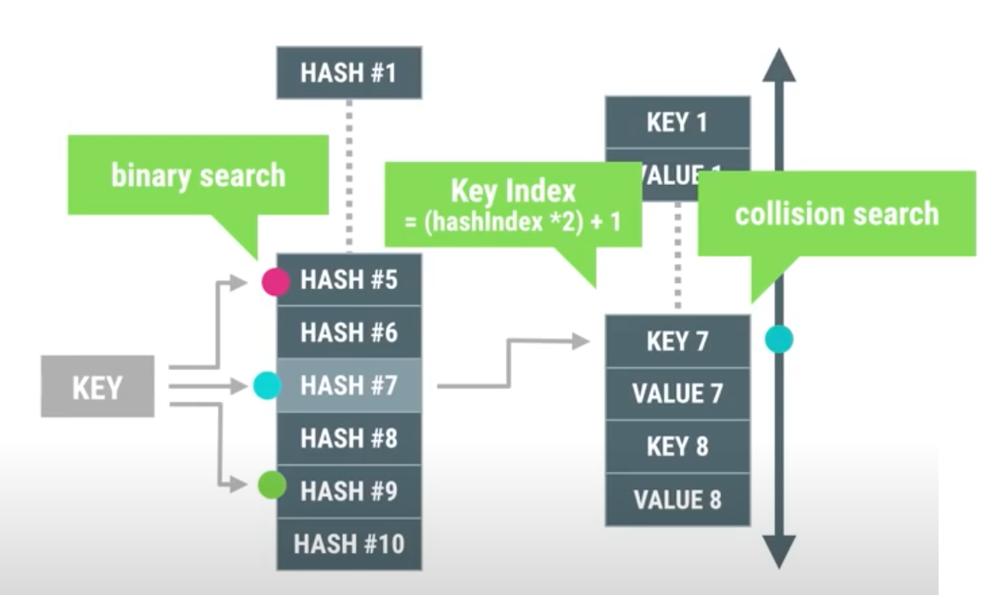
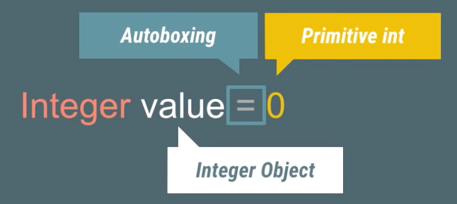
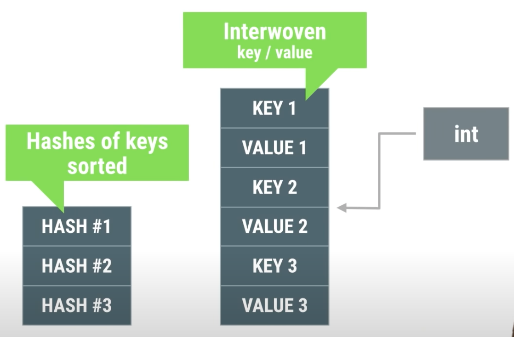
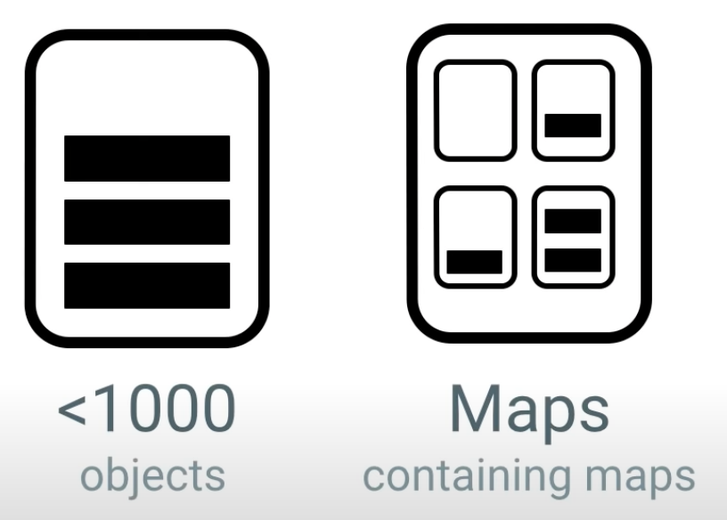

우리는 소프트웨어를 개발할 때 데이터를 효율적으로 다루기 위해 많은 고민을 합니다. 어떤 구조로 데이터를 저장하고 조회해야 효율적일지를 말이죠. 이는 데이터 구조(Data Structure)라고 불리는데 데이터의 형태나 CURD의 성격에 따라 다양한 방법으로 설계될 수 있습니다. 배열과 같이 메모리에서 연속적인 주소에 데이터를 나열해서 인덱스를 통해 데이터의 주소를 예측하고 바로 접근할 수 있도록 하거나, 연결 리스트와 같이 특정 데이터가 다음 데이터의 주소 값을 함께 갖고 있도록 해서 데이터 간의 연결고리를 정의하고 이를 변경해가면서 순서를 자유롭게 변경할 수도 있습니다.  

# Map  

배열이나 리스트 같이 데이터 간의 "순서"를 부여하는 데이터 구조에서는 찾고자 하는 데이터의 인덱스를 알지 못하면 결국 모든 데이터를 순회하며 찾아야합니다. 정렬이라도 되어 있다면 이분 탐색(Binary search)를 사용해서 약간의 시간을 단축시킬 수는 있지만 여전히 탐색하는 시간이 필요합니다.  

Map은 요소를 키(Key)와 값(Value)으로 연관시켜 저장하는 데이터 구조입니다. 찾고자 하는 데이터에 대한 키를 통해 데이터의 위치를 예측할 수 있습니다. 실질적으로 어떻게 구현하느냐에 따라 다르겠지만 일반적으로 배열이나 리스트보다 데이터를 저장하고 조회하는 속도가 빠릅니다.  

   

(Map으로 나타낸 월별 강우량 통계 - 출처 : [mathworks](https://www.mathworks.com/help/matlab/matlab_prog/overview-of-the-map-data-structure.html))

이를 가능토록 만들어주는 Map의 몇 가지 제약은 다음과 같습니다.  
1. Key는 중복일 수 없다.
1. Key와 Value 중 하나만 존재하지 않는다.
1. Value는 중복이 가능하다.  

## HashMap  

그렇다면 어떻게 키를 통해 데이터의 위치를 빠르게 예측할 수 있을까요? 다양한 방법이 있겠지만 가장 많이 사용하는 방법은 해싱(Hashing)입니다. 

  

(출처 : [위키피디아](https://en.wikipedia.org/wiki/Hash_function))

해시는 "으깨다", "잘게 썰다" 라는 의미로, 해시 함수는 임의의 크기의 데이터를 고정된 크기의 값으로 매핑시키는 역할을 합니다. 이렇게 해시 함수에 의해 반환되는 값을 해시 값이라고 부릅니다.  

자바의 HashMap은 키를 해시 함수에 통과시켜 대응하는 해시 값을 구하고, 이를 데이터의 주소 값을 가지고 있는 테이블의 인덱스로 활용합니다. 따라서 일반적으로 O(1)이라는 고정된 시간 안에 데이터를 추가 및 제거를 할 수 있게 됩니다.  

```java
Map<String, Double> productPrice = new HashMap<>();

// add value
productPrice.put("Rice", 6.9);
productPrice.put("Flour", 3.9);
productPrice.put("Sugar", 4.9);
productPrice.put("Milk", 3.9);
productPrice.put("Egg", 1.9);

//get value
Double egg = productPrice.get("Egg");
System.out.println("The price of Egg is: " + egg);
```  
(출처 : [자바 HashMap을 효과적으로 사용하는 방법](http://tech.javacafe.io/2018/12/03/HashMap/))  

(이후로 해당 포스팅에서 언급하는 HashMap은 자바 API를 일컫습니다.)  

하지만 HashMap에서 사용하는 해시 함수의 반환 타입은 `int`입니다. 따라서 논리적으로 생성 가능한 객체의 수는 2<sup>32</sup>이며, O(1)를 보장하기 위해서는 크기가 2<sup>32</sup>인 배열을 HashMap이 가지고 있어야합니다.    

물론 이렇게 불필요한 메모리를 확보하지 않도록 서로 다른 해시 값을 갖는 객체가 1/M의 확률로 동일한 인덱스를 갖도록 합니다. 따라서 실제 정수 표현 범위보다 작은 M의 크기의 배열만 사용합니다. 하지만 이럼에도 불구하고 실제로 사용하는 배열 공간보다 사용하지 않는 공간이 많은 경우에는 불필요한 메모리 공간만 낭비하는 셈이죠.  

# ArrayMap  

안드로이드는 메모리를 상당히 중요하게 다룹니다. 아무래도 컴펙한 형태의 휴대용 디바이스의 운영체제이다 보니, 사용할 수 있는 메모리가 한정적이기 때문입니다. 메모리를 확보하기 위해 우선 순위가 떨어지는 앱을 강제로 종료하는 경우도 잦으니 메모리를 얼마나 중요하게 다루는지 가늠할 수 있습니다.  

따라서 안드로이드에서는 HashMap의 불필요한 메모리 공간을 줄이기 위해 Map인터페이스를 확장하는 ArrayMap이라는 새로운 컨테이너를 만들었습니다.  

하나의 큰 배열을 가지고 비교적 띄엄 띄엄 데이터를 갖는 HashMap과는 다르게, ArrayMap은 촘촘한 배열 두 개를 사용합니다. 저장할 데이터가 많아지면 배열의 크기를 늘리고, 삭제되면서 배열의 크기를 줄이는 식으로 빈 메모리를 최소화합니다.  

  

하지만 그만큼 약간의 오버헤드가 발생합니다. 키를 찾기 위해 이분 탐색을 사용해야하고 데이터를 추가하거나 삭제할 때 배열에 대한 삽입 삭제 연산을 수행해야하기 때문이죠.

  

그리고 ArrayMap은 데이터를 순회할 때 인덱스를 사용합니다.  

```java
// SparseArray
for (nt i = 0; i < map.size(); i++) {
    Object keyObj = map.keyAt(i);
    Object valObj = map.valueAt(i);
}

// HashMap
for (Iterator it = map.iterator(); it.hasNext();) {
    Object obj = it.next();
}
```  

이렇게 Iterator를 사용하지 않으므로 비교적 빠르고 메모리도 아낄 수 있습니다.  

# SparseArray  

SparseArray는 ArrayMap과 거의 동일한 구조를 갖고 있지만 SparseArray의 키는 항상 제네릭이 아닌 기본형이라는 차이점이 있습니다. 왜 굳이 기본형을 사용할 수 있는 라이브러리를 따로 만들었을까요?

## AutoBoxing  

JVM에는 [오토박싱](https://docs.oracle.com/javase/tutorial/java/data/autoboxing.html)이라는 개념이 있습니다. 이는 컴파일러가 기본형(Primitive)의 데이터를 대응하는 Wrapper 클래스의 객체로 변경해주는 것을 말합니다.

  

오토박싱에는 두 가지 단점이 있습니다.
- Wrapper 객체를 추가로 할당한다.
- Wrapper 타입은 기본형보다 메모리를 많이 사용한다. (int는 4 Byte, Integer는 16 Byte)  

즉, 불필요한 객체 할당이 이루어지는데 그 할당된 객체마저도 필요보다 더 큰 메모리 공간을 요구합니다.  

위 문제는 `HashMap`이나 `ArrayMap`과 같은 제네릭 타입 컨테이너를 다룰 때 큰 영향을 줍니다. 기본형의 Key나 Value를 사용하더라도 `HashMap`은 Wrapper 타입을 사용해야하기 때문이죠. 기본형 데이터를 삽입할 때 뿐만 아니라 가져올 때에도 오토박싱이 매번 발생합니다.

```java
Map<Integer, Integer> aMap;
//Autoboxing 발생
int heartRate = aMap.get(heartKey);
```  

## No AutoBoxing  

따라서 기본형의 키를 사용한다면 오토박싱을 제거해 메모리를 더욱 절감하기 위해 SparseArray를 사용할 수 있습니다.  

  

물론 값에 대해서는 제네릭을 사용하지만 이마저도 기본형으로 사용하고자 한다면 다음과 같은 라이브러리를 사용하면 됩니다.

- `SparseLongArray`
- `SparseBooleanArray`
- `SparseIntArray`  

# HashMap vs ArrayMap, SparseArray  

그렇다면 ArrayMap이나 SparseArray 컨테이너는 언제 사용하는 게 좋을까요? 안드로이드 개발팀에 따르면 다음과 같은 두 상황에 적합하다고 합니다.  

 

- 아이템의 개수가 1,000개 미만일 때
- `Map`이 값으로 `Map`을 중첩하여 사용하고 있을 때

이 외의 경우라면 그냥 `HashMap`을 사용하는 것이 더 낫다고 덧붙였습니다.  

# 마무리  

ArrayMap과 SparseArray는 안드로이드에서 제공해주는 강력한 라이브러리입니다. 비록 속도는 HashMap에 비해 비교적 느릴 수는 있지만 1,000개 미만의 데이터에서는 유의미한 차이를 내지 못하죠. 이런 경우에는 메모리를 효과적으로 아낄 수 있는 ArrayMap을 사용해보는 게 어떨까요? 게다가 키로 기본형을 사용한다면 SparseArray로 더욱 최적화시킬 수 있을듯 합니다.  

---  
Reference :  
[AndroidDeveloperDocuments - ArrayMap](https://developer.android.com/reference/android/util/ArrayMap)  
[AndroidDeveloperDocuments - SparseArray](https://developer.android.com/reference/android/util/SparseArray)  
[Fun with ArrayMaps Android Performance Patterns Season 3 ep1](https://www.youtube.com/watch?v=fdHupu3jvO4)  
[SparseArray Family Ties (100 Days of Google Dev)](https://www.youtube.com/watch?v=I16lz26WyzQ)  


