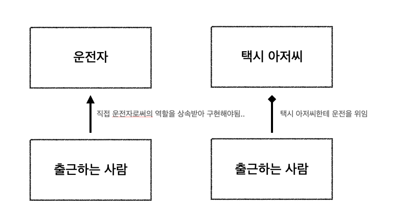

다른 언어들에 비해 코틀린이 제공해주는 독특한 기능이 있는데요. 바로 델리게이션입니다. 델리게이션을 지칭하는 위임 패턴은 이미 전통적인 디자인 패턴 중 하나이지만, 코틀린은 이러한 위임 패턴을 아주 간단히 구현할 수 있게 만들어, 언어 차원에서 위임 패턴 사용을 적극 권장하고 있습니다. 안드로이드 개발에서도 by lazy, by remember 등의 위임 패턴을 이미 많이 사용하는데요. 오늘은 코틀린 델리게이션에 대해 간단히 알아보는 시간을 가져볼까 합니다.


## 상속과 위임이란 무엇일까?

코드의 재사용성은 프로젝트가 커질 수록 매우 중요해집니다. 재사용성을 늘리는 기법은 아주 많은데요, 그 중 상속과 위임 패턴도 아주 대표적인 재사용성을 늘리는 기법입니다.


객체지향 개발 방식에서는 상속을 자주 사용하게 되는데요, 이펙티브 자바를 비롯해 여러 개발자들 사이에서 상속에 대해 정확히 알고 사용하는 것이 중요하다고 말합니다. 특히, 상속을 잘못 사용하면 부모 클래스에 매우 강하게 결합되는 문제가 발생합니다.


예를 들어, 부모 클래스의 메서드가 변경이 되거나 추가되면 이를 상속한 모든 자식 클래스에 대해서 변경이 가해질 수 있고, 컴파일 에러가 빈번해질 수 있습니다.


이러한 문제를 해결하기 위해 여러 개발자들은 컴포지션을 대안으로 내세우고 있습니다. 그리고 컴포지션을 비슷한 맥락이자 좀 더 넓은 의미로 위임 패턴으로 사용하기도 합니다.


위임 패턴은 말 그대로 위임 객체에게 어떤 행동을 요청하는 것을 의미합니다. 프로퍼티라면 getter와 setter에 대한 구체적인 실행 방법을 위임 객체를 통해 실행한다고 볼 수 있고, 특정 인터페이스에 대한 구현을 위임 객체에게 맡기는 것이라고도 볼 수 있죠. 즉, 메서드나 구현을 위임 객체에게 전달하는 기법으로 볼 수 있습니다.




운전해서 출근하는 사람이 있다고 가정해봅시다. 이 사람은 운전자라는 인터페이스나 추상 클래스를 직접 구현해서 운전하는 사람이 될 수 있습니다. 위임 패턴은 이와 다르게 같은 역할을 할 수 있는 다른 객체에게 역할을 맡기는 것입니다. 택시 아저씨에게 운전을 맡기거나 좀 더 빨리 가달라, 다른 길로 가달라는 식으로 운전에 대한 커스텀이 가능하기도 하죠.


코틀린은 기본적으로 클래스를 생성할 때 자바의 final class와 동일한 성격을 가지도록 하고 있습니다. 기본적으로는 상속이 되지 않고, 반드시 open 키워드를 붙여야 상속을 허용합니다. 반대로 **위임에 대해서는 by 키워드를 통해 아주 쉽게 구현할 수 있도록 했습니다.** 이것은 코틀린 언어 차원에서 상속보다 위임을 더 중요시한다는 의미라고 볼 수 있습니다.


## 프로퍼티 델리게이트 (Delegated Properties)

코틀린이 제공해주는 위임 패턴은 크게 프로퍼티 델리게이트와 델리게이트를 통한 인터페이스 구현입니다. 이 중 프로퍼티 델리게이트는 프로퍼티에 대한 getter, setter를 위임 객체에게 위임하는 패턴인데요. 프로퍼티의 특정 속성을 직접 구현하는 것이 아니라 위임 객체를 통해서 구현한다고 볼 수 있습니다.


### by lazy 동작 방식

코틀린에서 가장 범용적으로 쓰이는 델리게이트 패턴이 있는데요. 'by lazy' 입니다. 'by lazy'는 프로퍼티에 대한 초기화를 지연시키는데 특히 read-only 프로퍼티인 val 에 대한 지연 초기화를 목적으로 합니다. 최근 소프트웨어 패러다임에서 불변성을 매우 강조하는데, 이러한 불변성을 위해 val 사용을 많은 레퍼런스에서 권장하고 있습니다.


하지만, val은 프로퍼티를 선언하면서 **바로 초기화**를 해야하는데요, 선언 시점이 컴파일 시점보다 느릴 때가 있습니다. 이럴 때 'by lazy'를 사용해 초기화 시점을 지연시켜주는 방식을 사용합니다.


by lazy 키워드는 Lazy 타입을 리턴하는데요, Lazy는 다시 다음과 같은 확장함수가 있습니다.


```kotlin
@kotlin.internal.InlineOnly
public inline operator fun <T> Lazy<T>.getValue(thisRef: Any?, property: KProperty<*>): T = value
```


operator 함수인 getValue를 확장함수로 정의함으로써 프로퍼티에 대한 getter를 정의할 수 있는 것입니다. Lazy 인터페이스를 구현하는 몇가지 구현체가 있는데, 가장 기본적인 구현체인 UnsafeLazyImpl 클래스의 코드를 살펴봅시다.


```kotlin
internal class UnsafeLazyImpl<out T>(initializer: () -> T) : Lazy<T>, Serializable {
    private var initializer: (() -> T)? = initializer
    private var _value: Any? = UNINITIALIZED_VALUE

    override val value: T
        get() {
            if (_value === UNINITIALIZED_VALUE) {
                _value = initializer!!()
                initializer = null
            }
            @Suppress("UNCHECKED_CAST")
            return _value as T
        }
```


UnsafeLazyImpl은 Lazy 인터페이스를 상속합니다. 내부에 캡슐화된 _value와 initializer가 있고 이 두 프로퍼티는 객체화되면서 이미 초기화가 되는 상태입니다. 특히 _value는 UNITIALIZED_VALUE로 초기화가 되네요.


외부에서 value를 호출하면 get() 이하 코드가 실행됩니다. 만약 처음 실행된다면 _value 값은 UNITIALIZED_VALUE 이므로, initializer를 통해 새롭게 값이 갱신됩니다. 그리고 이 초기화된 값이 리턴되는 방식입니다.


### by remember 동작 방식

최근 Android에서는 Jetpack Compose가 유행하고 있습니다. 특히 Compose에서 많이 사용하는 키워드인 remember도 일반적으로 by remember라는 형태로 사용하는데, 마찬가지로 프로퍼티 델리게이트로 볼 수 있습니다.

remember를 바로 참조해서 사용하면 다음과 같이 사용해야합니다.


```kotlin
var state = remember {
    mutableStateOf("test")
}

TextField(value = state.value, onValueChange = {
    state.value = it
})
```


하지만, remember를 위임한다면 다음과 같이 사용합니다.


```kotlin
var state by remember {
    mutableStateOf("test")
}

TextField(value = state, onValueChange = {
    state = it
})
```


by remember를 사용하면 한번 더 .value를 호출하지 않아도 됩니다. 왜 이렇게 사용이 가능할까요?


remember는 calculation이라는 () -> T 타입의 함수 인자를 받아 T를 리턴하는 함수입니다. 따라서 remember를 직접적으로 참조하면 이 calculation의 결과값인 위의 코드 상에서는 MutableState 타입을 가지게 되는 것이죠. 그래서 =을 통해 직접적으로 참조한다면 state는 MutableState<String>이 되므로, .value를 통해 값을 한번 꺼내서 사용해야합니다. 하지만, by를 통해 위임 패턴을 활용한다면, MutableState의 getter, setter를 사용하게 됩니다.


```kotlin
@Stable
interface MutableState<T> : State<T> {
    override var value: T
    operator fun component1(): T
    operator fun component2(): (T) -> Unit
}

inline operator fun <T> MutableState<T>.setValue(thisObj: Any?, property: KProperty<*>, value: T) {
    this.value = value
}

inline operator fun <T> State<T>.getValue(thisObj: Any?, property: KProperty<*>): T = value
```


따라서 MutableState 타입이 가진 value를 가져오게 되는 형식입니다. 그래서 state는 String 타입이 되는 것이죠.


## 델리게이트로 인터페이스 구현하기

코틀린은 인터페이스에 대한 구현을 위임 객체에 맡기는 기능을 쉽게 구현할 수 있습니다. 위임을 통해 인터페이스를 구현한다면 필요한 메서드에 대해서만 사용하는 클래스에서 구현하고, 나머지는 위임 객체에게 맡기는 식으로 유연하게 구현할 수 있습니다.


예를 들어, 마지막으로 제거한 원소를 저장했다가 다시 복원할 수 있는 메서드를 가진 스택을 구현한다고 해봅시다. 그러면, Stack 클래스를 직접 상속해서 구현할 수도 있지만, 이렇게 되면 위에서 언급했듯이 강한 커플링을 가지게 되는 문제가 발생합니다.


따라서, 위임을 사용하기 위해 구현할 클래스가 Collection에 대한 인터페이스를 상속받게 하고, 이를 위임받은 클래스로 구현합니다. 그리고 필요한 메서드 오버라이드해서 사용할 수 있습니다.


프로퍼티 델리게이트와 마찬가지로 인터페이스에 대해서 위임 객체를 by로 전달하면 이와 같이 구현이 가능합니다.


```kotlin
class RecoverStack <T>(
    private val innerStack: MutableList<T> = Stack()
) : MutableCollection<T> by innerStack {
    var deletedItem : T? = null

    override fun remove(element: T): Boolean {
        deletedItem = element
        return innerStack.remove(element)
    }

    fun recover() : T? {
        return deletedItem
    }
}

class StackTest <T> : Stack<T>() {
    override fun remove(element: T): Boolean {
        return super.remove(element)
    }
}
```


생성자를 통해 주입받은 위임 객체로 구현하므로 언제든지 다른 위임 객체로 변경할 수 있는 장점이 있습니다.


## 델리게이트 사용해보기

예시를 위해 아주 간단하게 예제 코드를 작성해봤는데요, 일반적으로 savedStateHandle을 ViewModel에서 사용할 때, 

savedStateHandle.get(key) 와 같은 코드로 호출합니다. savedStateHandle을 통해 특정 값을 가지고 올 때, null 값에 대한 처리를 프로퍼티 자체에서 하고 싶다면 다음과 같이 사용할 수 있을 것 같습니다.


```kotlin
private var _repository : Repository? = savedStateHandle.get<Repository>(REPOSITORY)
```


위 코드는 프로퍼티 위임 전 repository 라는 데이터를 가지고 오기 위한 코드인데요, 단순히 savedStateHandle을 통해 값을 가지고 오기 때문에 결과값에 null이 들어올 수 있습니다.. null이 들어올 때 별도의 처리를 간단하게 하기 위한 프로퍼티를 작성해봅시다.


```kotlin
fun <T> safeStateHandleProperty(
    savedStateHandle: SavedStateHandle,
    stateHandleKey: String,
    safeCall: () -> Unit
): ReadWriteProperty<Any?, T?> =
    object : ReadWriteProperty<Any?, T?> {
        override fun getValue(thisRef: Any?, property: KProperty<*>): T? {
            val result = savedStateHandle.get<T>(stateHandleKey)

            return if (result != null) {
                result
            } else {
                safeCall()
                null
            }
        }

        override fun setValue(thisRef: Any?, property: KProperty<*>, value: T?) {
            /**
             * 예시를 위해 임의로 작성한 setValue 함수입니다.
             */
            println("test")
        }
    }
```


예시를 위해 가볍게 작성했습니다. 프로퍼티 위임을 받을 수 있는 객체를 만들어주려면 ReadOnlyProperty 나, ReadWriteProperty라는 인터페이스를 구현합니다.


```kotlin
public fun interface ReadOnlyProperty<in T, out V> {
    public operator fun getValue(thisRef: T, property: KProperty<*>): V
}

public interface ReadWriteProperty<in T, V> : ReadOnlyProperty<T, V> {
    public override operator fun getValue(thisRef: T, property: KProperty<*>): V

    public operator fun setValue(thisRef: T, property: KProperty<*>, value: V)
}
```


ReadOnlyProperty는 val과 같이 getter만을 가지는 프로퍼티에 대한 정의, ReadWriteProperty는 var과 같이 setter와 getter를 가지는 프로퍼티에 대한 정의를 담당합니다.


safeStateHandleProperty는 ReadWriteProperty를 상속받아 getValue, setValue를 모두 구현해줍니다. 이렇게 되면 위임을 맡기는 기존 프로퍼티를 get할 때 getValue가 호출되고, set할 때 setValue가 호출됩니다.


```kotlin
fun <T> safeStateHandleProperty(
    savedStateHandle: SavedStateHandle,
    stateHandleKey: String,
    safeCall: () -> Unit
): ReadWriteProperty<Any?, T?> =
    object : ReadWriteProperty<Any?, T?> {
        override fun getValue(thisRef: Any?, property: KProperty<*>): T? {
            val result = savedStateHandle.get<T>(stateHandleKey)

            return if (result != null) {
                result
            } else {
                safeCall()
                null
            }
        }

        override fun setValue(thisRef: Any?, property: KProperty<*>, value: T?) {
            /**
             * 예시를 위해 임의로 작성한 setValue 함수입니다.
             */
            println("test")
        }
    }
```


위와 같이 ReadWriteProperty를 구현한 익명 객체를 리턴하는 함수를 만들어줍니다. 함수는 요구사항에 맞게 safeCall이라는 람다를 받아 savedStateHandle에서 null 값이 반환될 경우 핸들링하는 역할을 수행합니다. 이렇게 만들어진 함수는 다음과 같이 사용할 수 있습니다.


```kotlin
private val _repository: Repository? by safeStateHandleProperty<Repository>(
    savedStateHandle = savedStateHandle,
    stateHandleKey = REPOSITORY,
    safeCall = { println("safe Call!") })
```


위와 같이 by를 통해 생성한 함수에 위임합니다. _repository를 get하면 위에서 정의된 getValue가 호출됨으로써 위임을 완료할 수 있습니다.


## 마무리

코틀린에서 제공하는 프로퍼티 델리게이트와 델리게이트로 인터페이스 구현 기능에 대해서 알아봤는데요. 위임 패턴은 컴포지션과 비슷한 맥락으로 상속과 비교하여 여러 상황에서 사용되었으나, 상속에 비해 구현하기가 비교적 까다로울 때가 있었습니다.


코틀린은 언어 차원에서 by 라는 강력한 키워드를 제공해줌으로써 이러한 위임을 아주 간편하게 사용하도록 만들어주었습니다. 직접 위임을 적재적소에 사용하기는 어렵지만, by lazy, by remember 등 android에서 자주 사용하는 위임 패턴이 있으므로 위임 패턴에 대해서 명확히 이해한다면, 이러한 기능들에 대한 이해도가 훨씬 높아질 것이라고 생각합니다.


참고문서

https://kotlinlang.org/docs/delegation.html

https://kotlinlang.org/docs/delegated-properties.html

https://medium.com/til-kotlin-ko/kotlin%EC%9D%98-%ED%81%B4%EB%9E%98%EC%8A%A4-%EC%9C%84%EC%9E%84%EC%9D%80-%EC%96%B4%EB%96%BB%EA%B2%8C-%EB%8F%99%EC%9E%91%ED%95%98%EB%8A%94%EA%B0%80-c14dcbbb08ad

https://medium.com/androiddevelopers/delegating-delegates-to-kotlin-ee0a0b21c52b

https://www.geeksforgeeks.org/delegation-vs-inheritance-java/

https://www.baeldung.com/kotlin/delegation-pattern

