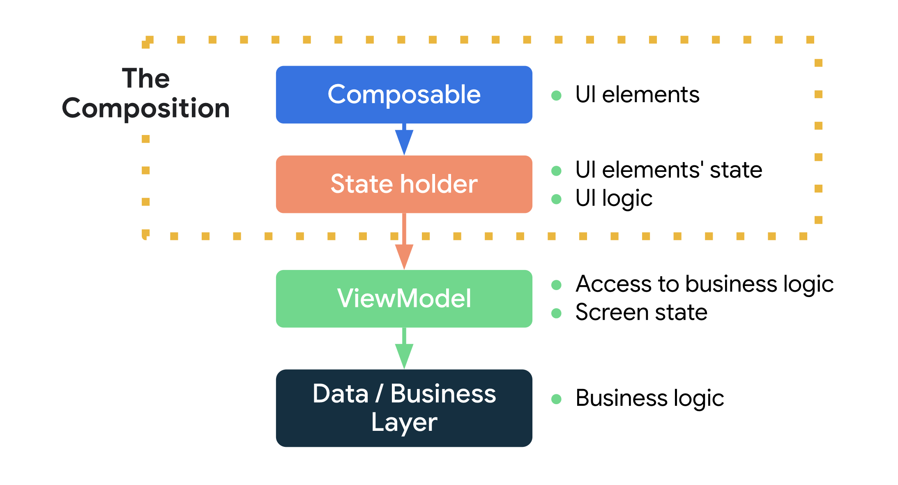

안녕하세요 여러분~ 안드로이드 12기 유희진입니다!! 반갑습니다.~

여러분 요즘 컴포즈로 열심히 프로젝트중이시지않나요? 저도 마찬가지로 컴포즈로하구있는데 화면 그리는건 이제 얼추 감이 오는 것 같은데, 요즘에 state관리를 시작하면서 막 갑자기 막 헷갈리기 시작했어요.

state를 어떻게 하면 잘 관리할 수 있을까.. 도데체 뭐가 맞는 방법인가.. remember만 주구장창 쓰면 되는것인가.. hoisting을하라했으니까 여까지 올리면 되겠지?... 

머리가 지끈지끈~ 여러분도 같은 고민중이실거 알아요~

물론 발표자분께서 State를 잘 알려주시긴했지만! 그때는 우리의 실력이 미비하여 기초만 알려주셨으니, 저는 조금 더 나아가서 복잡한 state에 사용될 수 있는 걸 말씀드릴려구 합니다. StateHolder라는 개념이에요!

## StateHolder란?

간단한 state의 hoisting은 composable 함수 자체가 쉽게 관리할 수 있습니다. 하지만 많은 양의 상태들을 계속 트래킹해야하는 경우, 또 다양한 로직들이 동시에 일어나게 되는 경우 이런 로직들을 다른 클래스에 이관하는 것도 좋은 방법이 됩니다 🙂 

바로 StateHolder class를 만들어보는건데요, 이름 그대로 여러 state들이 존재하는 경우 관리를 쉽게 하기 위하여 한 곳에 모아둔 것을 의미합니다. 함께 변경되어야 하는 관련된 State들을 관리하는 클래스죠!

이 경우 

- 상태를 조금 더 쉽게 제어할 수 있고,
- 연관된 상태들이 한 번에 묶이므로 hoisting이 쉬워지며
- composable의 재활용성도 올라갑니다

## State를 관리하는 방법 3가지

state를 관리할 수 있는 방법에는 3가지가 있습니다!

- Composables : 간단한 UI 요소의 상태를 관리합니다.
- State holders : 복잡한 UI 요소의 상태를 관리하며 각자 UI 상태와 UI로직을 분리해 가지고 있습니다.
- ViewModel : 조금은 특별한 타입의 state holder라고 볼 수 있는데, 비지니스 로직과 UI state에 접근하기 위해 사용하게 됩니다. 



이 다이어그램을 보면 조금 더 이해가 되실텐데요, 

컴포저블은 복잡성에 따라 0개 이상의 State holder(그냥 stateholder든, viewmodel이든)에 종속될 수 있고, state holder는 비지니스 로직과 화면 상태에 접근하기 위해선 뷰모델에 종속될 수 있습니다. 그리고 뷰모델은 

비즈니스 로직 또는 데이터 레이어 딴에 종속되게 됩니다. 레포지토리나, saveStateHandle에 접근할 경우에는 뷰모델을 사용해야겠죠.

## 적용 예시

### 1. Composable에 State, Logic 두기

아주 간단한 수준의 logic과 state정도면 composable에 보관해두는 것도 좋은 방법이죠.

```kotlin
@Composable
fun MyApp() {
    MyTheme {
        val scaffoldState = rememberScaffoldState()
        val coroutineScope = rememberCoroutineScope()

        Scaffold(scaffoldState = scaffoldState) {
            MyContent(
                showSnackbar = { message ->
                    coroutineScope.launch {
                        scaffoldState.snackbarHostState.showSnackbar(message)
                    }
                }
            )
        }
    }
}
```

### 2. StateHolder에 State, Logic 두기

위에 말씀드렸듯, 다양한 state와 logic을 composable안에 두면 가독성이 떨어지고 관리하기 어려운 부분이 생길 거에요. 이 경우 state holder로 코드를 이관에 관심사를 분리해줍니다.

state holder는 composition에서 생성되고 지워집니다. composition의 라이프사이클을 따르기 때문에 composition의 의존성을 갖습니다. 

```kotlin
class MyAppState(
    val scaffoldState: ScaffoldState,
    val navController: NavHostController,
    private val resources: Resources,
    /* ... */
) {
    val bottomBarTabs = /* state */

    val shouldShowBottomBar: Boolean
        get() = /* ... */

    fun navigateToBottomBarRoute(route: String) { /* ... */ }

    fun showSnackbar(message: String) { /* ... */ }
}

@Composable
fun rememberMyAppState(
    scaffoldState: ScaffoldState = rememberScaffoldState(),
    navController: NavHostController = rememberNavController(),
    resources: Resources = LocalContext.current.resources,
    /* ... */
) = remember(scaffoldState, navController, resources, /* ... */) {
    MyAppState(scaffoldState, navController, resources, /* ... */)
}
```

위와 같이 MyAppState라는 클래스를 생성, 기본 생성자에는 remember이후에 들어갈 관리해야할 데이터들을 생성합니다. 관련 UILogic은 MyApState class안에 작성합니다. rememberXXX() 컴포저블 함수로 클래스를 반환하도록 합니다. 

```kotlin
@Composable
fun MyApp() {
    MyTheme {
        val myAppState = rememberMyAppState()
        Scaffold(
            scaffoldState = myAppState.scaffoldState,
            bottomBar = {
                if (myAppState.shouldShowBottomBar) {
                    BottomBar(
                        tabs = myAppState.bottomBarTabs,
                        navigateToRoute = {
                            myAppState.navigateToBottomBarRoute(it)
                        }
                    )
                }
            }
        ) {
            NavHost(navController = myAppState.navController, "initial") { /* ... */ }
        }
    }
}
```

사용할 땐 아래와 같이 `rememberMyAppState()`로 사용합니다. 훨씬 코드가 깔끔해지겠죠?

### 3. ViewHodel에 State, Logic 두기

뷰모델은 비즈니스 로직과 데이터 레이어에 접근할 수 있죠. 또 현재 화면상태(SavedStateHandle)등에 접근할 수 있기 때문에 StateHolder의 특별한 형태로 말할 수 있습니다.

하지만 뷰모델은 UIComponent보다 Lifecycle이 길기 때문에 composition의 lifecycler에 종속되어있으면 안됩니다. 이는 즉, 뷰모델에서는 context를 가지면 안된다는 것과 같은 의미이겠죠. 

즉, viewModel을 state holder로 이용한다는 것은 화면(Screen)수준의 composable에 적절할 것입니다.

뷰모델을 state holder로서 사용하면서 얻는 것은 아래와 같아요.

- config가 바뀌는 와중에도 실행되는 프로세스를 보전하기 좋다
- Navigation, Hilt와의 호환성이 있다.

```kotlin
data class ExampleUiState(
    dataToDisplayOnScreen: List<Example> = emptyList(),
    userMessages: List<Message> = emptyList(),
    loading: Boolean = false
)

class ExampleViewModel(
    private val repository: MyRepository,
    private val savedState: SavedStateHandle
) : ViewModel() {

    var uiState by mutableStateOf<ExampleUiState>(...)
        private set

    // 비즈니스 로직
    fun somethingRelatedToBusinessLogic() { ... }
}

@Composable
fun ExampleScreen(viewModel: ExampleViewModel = viewModel()) {

    val uiState = viewModel.uiState
    ...

    Button(onClick = { viewModel.somethingRelatedToBusinessLogic() }) {
        Text("Do something")
    }
}
```

## Stateholder vs ViewModel

둘이 헷갈리신다구요!?

**StateHolder**: 컴포저블 UI Element(작은 컴포넌트들) State와 그 관련 logic 관리

**ViewModel**: Screen 단위의 Screen UI State(Loading, Error 등) 과 Business logic 관리

이렇게 보니 확 다가오지 않나요? StateHolder은 작은 컴포저블 컴포넌트 단위, 뷰모델은 화면단위! 

동시에 사용하는게 전혀 이상하지 않은 부분이니 걱정마세요! 오히려 권장되는 사항이라고 합니다!

동시에 사용하면 아래와 같이 되겠죠 !

```kotlin
class ExampleState(
    val lazyListState: LazyListState,
    private val resources: Resources,
    private val expandedItems: List<Item> = emptyList()
) {
    fun isExpandedItem(item: Item): Boolean = TODO()
    /* ... */
}

@Composable
fun rememberExampleState(/* ... */): ExampleState { TODO() }

@Composable
fun ExampleScreen(viewModel: ExampleViewModel = viewModel()) {

    val uiState = viewModel.uiState
    val exampleState = rememberExampleState()

    LazyColumn(state = exampleState.lazyListState) {
        items(uiState.dataToDisplayOnScreen) { item ->
            if (exampleState.isExpandedItem(item)) {
                /* ... */
            }
            /* ... */
        }
    }
}
```

## 마무리

여러분도 컴포즈 프로젝트 하실 때 StateHolder 사용해보시는게 어떠신가요? ViewModel과 StateHolder의 정확한 역할도 이해하시구요! 🙂

참고
[https://developer.android.com/jetpack/compose/state#state-holder-source-of-truth](https://developer.android.com/jetpack/compose/state#state-holder-source-of-truth)