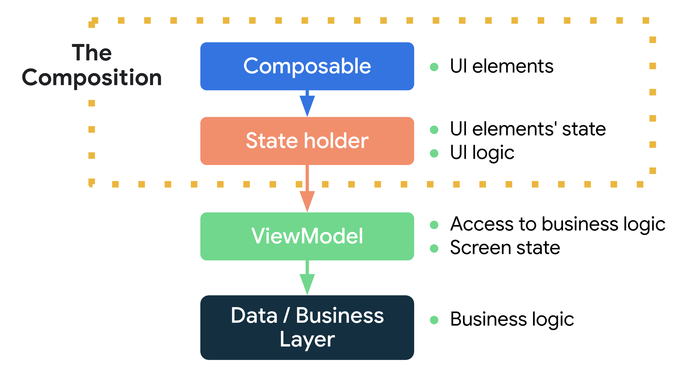

> Compose는 State를 사용하는데 State가 무엇인지 어떻게 관리해야 하는지를 알아보고자 하였고, 
구글 공식 문서의 상태 관리에 대해서 번역해 보았습니다.

#State in Jetpack Compose


앞서 Compose 설명을 먼저 진행하고 시작하겠습니다!

Compose는 기존의 명령형 방식이 아닌 선언형 프레임워크입니다.
선언형 프레임워크는 앱의 현재 상태를 설명하면, 프레임워크에서 상태가 변경될 때마다 UI를 업데이트합니다.

일단 예시를 보겠습니다.
```kotlin
@Composable
fun HelloContent(){
	var str = ""
	Column(modifier = Modifier.padding(16.dp)){
		Text(
			text = "Hello",
			modifier = Modifier.padding(bottom = 8.dp),
			style = MaterialTheme.typography.h5
		)
		OutlinedTextField(
			value = str,
			onValueChange = { str = it },
		)
	}
}
```

위의 함수는 상태가 바뀌어도 재구성되지 않습니다.    
그 이유는 str 변수를 Compose에서 추적하지 않기 때문입니다.    
Compose는 특별한 상태 추적 시스템이 있어서, 특정 상태를 읽는 Composable에 대해서 재구성(recomposition)을 예약합니다.    
<p align="center">

</p>

<u>그렇다면 Compose에서 상태를 추적하게 하려면 어떻게 해야할까요?</u>   
Compose에서는 State API를 제공하고 있습니다.

##Compose State API
```kotlin
interface MutableState<T> : State<T> {
    override var value: T
}
```
Compose의 State와 MutableState 유형으로 상태를 관찰할 수 있습니다.
Compose는 State의 값을 읽는 Composable을 추적하고, 값이 변경된다면 재구성(recomposition)을 트리거 합니다.

```kotlin
@Composable
fun HelloContent() {
    var str: MutableState<String> = mutableStateOf("")
    OutlinedTextField(
			value = str.value,
			onValueChange = { str.value = it }
	)
}
```
하지만 이 코드 역시 OutlinedTextField에 입력한 텍스트가 쓰이지 않습니다.

그 이유는 Compose에서 상태의 변화를 감지하여 recomposition이 일어나면, 다시 str의 값을 “”으로 초기화하기 때문에 아무런 변화가 없는 것입니다.

recomposition에서 상태를 재사용하기 위해서는 Composition에 포함을 해야 합니다. 

remember 컴포저블 함수를 사용해서 Composition에 객체를 저장할 수 있습니다.

```kotlin
@Composable
fun HelloContent() {
    var name by remember { mutableStateOf("") }
    Column(modifier = Modifier.padding(16.dp)) {
        Text(
            text = "Hello",
            modifier = Modifier.padding(bottom = 8.dp),
            style = MaterialTheme.typography.h5
        )
        OutlinedTextField(
			value = name, 
			onValueChange = { name = it }
	    )
    }
}
----------
Composition Tree

HelloContent
ㄴ MutableState( var name )
ㄴ Column
			 ㄴ Text
			 ㄴ OutlinedTextField 
```
remember에 의해 계산된 값은 초기 컴포지션 중에 컴포지션에 저장되고 그 값은 재구성 중에 반환됩니다.

따라서 위의 코드는 OutlinedTextField의 onValueChange 이벤트가 발생하면 상태를 업데이트하고 재구성이 발생하게 됩니다. 재구성이 발생하면 저장된 상태의 값을 꺼내와서 OutlinedTextField에 반영한다고 볼 수 있겠습니다.

##Stateful Composable & Stateless Composable

remember를 사용해서 객체를 저장하는 컴포저블은 Composable 내부에 state가 있기 때문에 Stateful Composable이라고 부릅니다. 

Stateful Composable은 재사용이 어렵고, 테스트가 힘듭니다.

따라서 State Hoisting이라는 패턴을 통해 Stateless 한 컴포저블로 만들어줘서 테스트와 재사용성을 높일 수 있습니다.

State hoisting 이란 State를 컴포저블의 호출자로 이동하는 패턴입니다.

State hoisting 패턴은 상태 변수를 다음 두개의 매개변수로 바꿉니다.
- value : T → 표시할 현재값
- onValueChange: (T) → Unit :  T가 새로운 값인 경우 상태의 업데이트를 트리거 하는 이벤트

```kotlin
@Composable
fun HelloScreen() {
    var text by rememberSaveable { mutableStateOf("") }
    Column() {
        HelloContent(
            text, onTextChange = { value ->
                text = value
            }
        )
    }
}
@Composable
fun HelloContent(text: String, onTextChange: (String) -> Unit) { // state hoisting
    Column(modifier = Modifier.padding(16.dp)) {
        Text(
            text = "Hello $text",
            modifier = Modifier.padding(bottom = 8.dp),
            style = MaterialTheme.typography.h5
        )
        OutlinedTextField(value = text, onValueChange = { onTextChange(it) }, label = { Text("TextField") })
    }
```

위의 코드는 State hoisting을 진행한 코드입니다. State hoisting을 통해서, text 와 상태 변경을 요청할 때 호출할 수 있는 onTextChange를 호출자인 HelloScreen으로 이동했습니다. 

상태 호이스팅 패턴을 적용하면 다음과 같은 장점이 있습니다.

- 단일 소스 저장소, 상태 캡슐화
    - 상태를 복제를 하지 않고, 옮겼기 때문에 소스 저장소가 하나만 있습니다.
    - 따라서 상태는 한 곳에서만 업데이트할 수 있기 때문에 일관성 없는 상태로 인해 버그가 생성될 가능성이 적습니다.
- 공유 가능
    - 호이스팅한 상태를 여러 컴포저블과 공유할 수 있습니다.
- 가로채기 가능
    - 호출자는 상태를 변경하기 이전에, 이벤트를 반영할지 말지 결정할 수 있습니다.
- 분리됨
    - 호이스팅한 상태는 어디나 저장할 수 있다. 예를 들어서 ViewModel로 옮길 수도 있습니다.

<u>만약에 한 Composable에 관리해야 하는 상태가 많아진다면 어떻게 될까요?</u>

쉽게  테스트하지 못하고, 복잡성이 증가될 것입니다.

따라서 State를 관리하는 방법이 필요합니다.

#Compose에서 State 관리
Composable의 복잡성에 따라  State를 관리하는 방법은 3가지가 존재합니다.

- 간단한 UI 요소 상태 관리를 위한 <span style="color: #008000">Composable</span>.
- 복잡한 UI 요소 상태 관리를 위한 <span style="color: #008000">State Holder</span>. UI  요소의 상태와 UI 로직을 소유합니다. Composition에 의해 생성되고 기억되는 일반 클래스입니다.
- <span style="color: #008000">ViewModel</span>. 비즈니스 로직과 화면 또는 UI 상태에 대한 액세스를 제공합니다.

다음은 Compose 상태 관리와 관련한 항목의 관계를 보여주는 다이어 그램입니다. 
- 컴포저블은 복잡성에 따라 0개 이상의 상태 홀더(일반 객체 또는 ViewModel이거나 둘 다일 수 있음)를 사용할 수 있습니다.
- 일반 상태 홀더는 비즈니스 로직이나 화면 상태에 액세스해야 하는 경우 ViewModel을 사용할 수도 있습니다.
- ViewModel은 비즈니스 레이어 또는 데이터 영역을 사용합니다.
<p align="center">

</p>

##그렇다면 State와 Logic 유형에는 무엇이 있을까요?

Android 앱에는 다양한 유형의 상태가 있습니다.

- UI 요소 상태(UI element’s state)는 UI 요소의 호이스트된 상태입니다. 예를 들어 Scaffold Composable의 ScaffoldState의 상태를 말합니다.
- 화면 또는 UI 상태(Screen State)는 화면에 표시되어야 하는 것. 예를 들어 장바구니 항목, 사용자에게 표시할 메시지 등등을 포함하는 CartUiState  Class입니다. 이 상태는 애플리케이션 데이터를 포함하기 때문에 다른 계층과 연결됩니다.

 다음은 다양한 로직 유형입니다.

- UI 로직. 화면에 상태 변경 사항을 표시하는 방법과 관련이 있습니다. 예를 들어 탐색 로직(navigation)은 다음에 표시할 화면을 결정하거나 스낵바 또는 토스트를 사용할 수 있는 화면에 사용자 메시지를 표시하는 방법을 결정하는 UI 로직입니다.  UI 동작 로직은 항상 컴포지션에 있어야 합니다.
- 비즈니스 로직은 상태 변경에 따라서 진행해야 할 작업입니다. 이 로직는 일반적으로 비즈니스 또는 데이터 계층에 배치됩니다.

##UI  로직과 UI element’s State in Composable
UI 로직과  UI 요소 상태를 컴포저블에 두는 것은 상태와 로직이 단순한 경우 좋은 접근 방법입니다.

##UI 로직과 UI element’s State in State Holder
컴포저블에 여러 UI 요소의 상태를 포함하는 복잡한 UI 로직이 포함된 경우 해당 책임을 상태 보유자에게 위임해야 합니다. 이렇게 하면 로직을 쉽게 테스트할 수 있고 복잡성을 줄일 수 있습니다. 컴포저블은 UI 요소를 내보내는 역할을 하고 상태 홀더는 UI 로직과 UI 요소의 상태를 포함합니다.

아래의 예시를 보시겠습니다.
```kotlin
// Plain class that manages App's UI logic and UI elements' state
class MyAppState(
    val scaffoldState: ScaffoldState,
    val navController: NavHostController,
    private val resources: Resources,
    /* ... */
) {
    val bottomBarTabs = /* State */

    // Logic to decide when to show the bottom bar
    val shouldShowBottomBar: Boolean
        get() = /* ... */

    // Navigation logic, which is a type of UI logic
    fun navigateToBottomBarRoute(route: String) { /* ... */ }

    // Show snackbar using Resources
    fun showSnackbar(message: String) { /* ... */ }
}

@Composable
fun rememberMyAppState(
    scaffoldState: ScaffoldState = rememberScaffoldState(),
    navController: NavHostController = rememberNavController(),
    resources: Resources = LocalContext.current.resources,
    /* ... */
) = remember(scaffoldState, navController, resources, /* ... */) {
    MyAppState(scaffoldState, navController, resources, /* ... */)
}
```
```kotlin
@Composable
fun MyApp() {
    MyTheme {
        val myAppState = rememberMyAppState()
        Scaffold(
            scaffoldState = myAppState.scaffoldState,
            bottomBar = {
                if (myAppState.shouldShowBottomBar) {
                    BottomBar(
                        tabs = myAppState.bottomBarTabs,
                        navigateToRoute = {
                            myAppState.navigateToBottomBarRoute(it)
                        }
                    )
                }
            }
        ) {
            NavHost(navController = myAppState.navController, "initial") { /* ... */ }
        }
    }
}
```
 MyApp Composable은 UI 요소를 내보내는데 중점을 두고 모든 UI 로직과 UI 요소의 상태를 MyAppState에 위임합니다.

 ##Business 로직, Screen, UI State in ViewModel
 ViewModel은 다른 레이어에 배치되는 애플리케이션의 비즈니스 로직과 애플리케이션 데이터 연관이 깊은 상태 홀더입니다. ViewModel은 다음과 같은 작업을 합니다. 

- 다른 계층에 배치되는 애플리케이션의 비즈니스 로직에 대한 액세스 제공
- 화면 또는 UI 상태가 되는 특정 화면에 표시하기 위해 애플리케이션 데이터를 준비( 화면이나, UI State가 됩니다 )

다음은 ViewModel을 사용한 예시입니다
```kotlin
data class ExampleUiState(
    val dataToDisplayOnScreen: List<Example> = emptyList(),
    val userMessages: List<Message> = emptyList(),
    val loading: Boolean = false
)

class ExampleViewModel(
    private val repository: MyRepository,
    private val savedState: SavedStateHandle
) : ViewModel() {

    var uiState by mutableStateOf(ExampleUiState())
        private set

    // Business logic
    fun somethingRelatedToBusinessLogic() { /* ... */ }
}

@Composable
fun ExampleScreen(viewModel: ExampleViewModel = viewModel()) {

    val uiState = viewModel.uiState
    /* ... */

    ExampleReusableComponent(
        someData = uiState.dataToDisplayOnScreen,
        onDoSomething = { viewModel.somethingRelatedToBusinessLogic() }
    )
}

@Composable
fun ExampleReusableComponent(someData: Any, onDoSomething: () -> Unit) {
    /* ... */
    Button(onClick = onDoSomething) {
        Text("Do something")
    }
}
```
비즈니스 로직에 대한 액세스와 UI 상태에 정보를 제공하기 위해  화면 수준 컴포저블(Screen) 에서 ViewModel 인스턴스를 사용하는 게 좋습니다.

화면 수준의 컴포저블이란 navigation graph의 activity, fragment나 루트 Composable에 근접한 컴포저블을 말합니다.

ViewModel의 이점은 비즈니스 로직에 대한 액세스를 제공하고, 화면에 표시할 데이터를 준비하는데 적합합니다. 또한 다음과 같은 장점이 있습니다.

- ViewModel에 의해 트리거 된 작업은 구성 변경 후에도 유지
- Navigation과 통합
- Hilt 와 같은 다른  jetpack 라이브러리와 통합


상태 홀더는 혼합해서 사용이 가능하고, ViewModel과 일반 상태 홀더는 책임이 다르기 때문에 화면 수준 컴포저블에는 비즈니스 로직에 대한 액세스를 제공하는 ViewModel과 UI 로직 및 UI 요소의 상태를 관리하는 상태 홀더가 모두 있을 수 있습니다.
```kotlin
class ExampleState(
    val lazyListState: LazyListState,
    private val resources: Resources,
    private val expandedItems: List<Item> = emptyList()
) {
    fun isExpandedItem(item: Item): Boolean = TODO()
    /* ... */
}

@Composable
fun rememberExampleState(/* ... */): ExampleState { TODO() }

@Composable
fun ExampleScreen(viewModel: ExampleViewModel = viewModel()) {

    val uiState = viewModel.uiState
    val exampleState = rememberExampleState()

    LazyColumn(state = exampleState.lazyListState) {
        items(uiState.dataToDisplayOnScreen) { item ->
            if (exampleState.isExpandedItem(item)) {
						/* ... */
            }
        }
    }
}
```

#정리
지금까지 Compose에서 state를 어떻게 사용하는지, state를 관리하는 방법에 대해서 알아보았습니다.
프로젝트를 Compose로 개발하다 보면, 추적해야 하는 state가 많아지거나, 복잡해질 수 있습니다.
그럴 때마다 state hoisting과 상태 홀더들을 이용해서 state를 적절히 관리해 보는 것은 어떨까요? 
긴 글 읽어주셔서 감사합니다!

#출처
[Jetpack Compose : State](https://www.youtube.com/watch?v=mymWGMy9pYI)    
[Compose State of mind](https://www.youtube.com/watch?v=rmv2ug-wW4U)   
[Managing State](https://developer.android.com/jetpack/compose/state)   
[Compose Architecutre](https://developer.android.com/jetpack/compose/architecture)