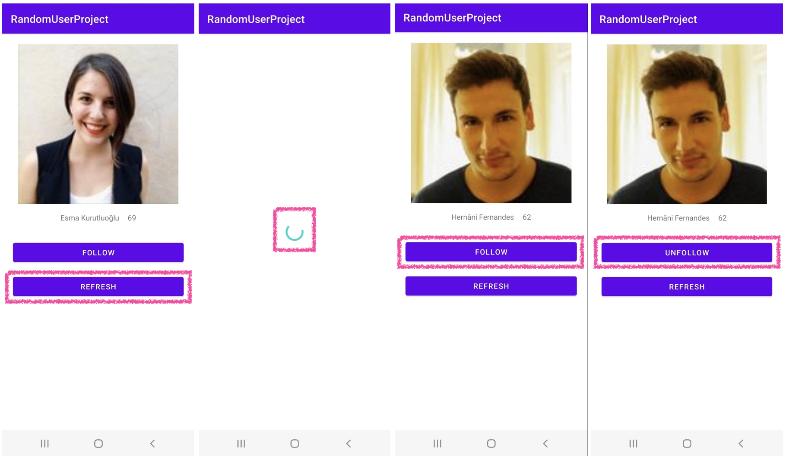
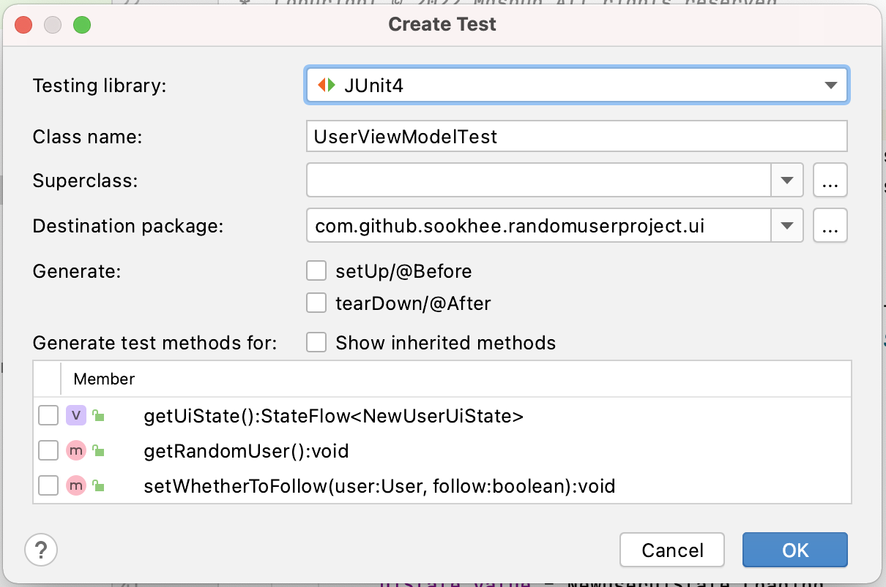
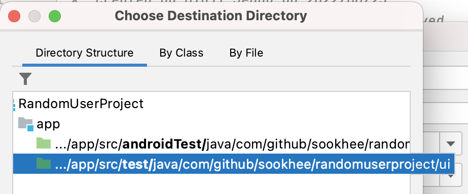

안녕하세요 안드로이드 12기 정민지입니다.

테스트 코드는 좋은 프로그램을 만들기 위한 필수적인 과정인 것 같습니다. 하지만 한편으로는 추가로 시간을 써야 한다는 점과 기능개발에 비해 당장 눈에 보이는 성과가 적은 느낌이어서 지금까지 테스트 코드 작성을 미루고 있었는데요… 이번 글을 통해서 Coroutine(StateFlow)를 사용하는 Android Unit Test 방법과 전체적인 흐름을 알아보려고 합니다! ♡⁺◟(●˙▾˙●)◞⁺♡

본격적으로 시작하기 전, 테스트 코드를 왜 작성해야 하는지 다시 한번 생각해볼까요?!

### 💕 테스트 코드를 작성해야 하는 이유

1. <b>코드의 결함을 사전에 방지하고 작성한 코드에 대해 자신감을 얻을 수 있습니다.</b><br/>
   테스트 코드는 모든 상황에 대해 작성하기 때문에, 생각하지 못했던 결함을 발견해 수정할 수 있습니다. 특히 리팩토링 시 수정한 코드가 기존의 테스트 코드를 무사히 통과할 경우
   해당 로직에 대한 확신을 가질 수 있습니다.
2. <b>코드를 보충 설명해줍니다.</b><br/>
   테스트 코드에는 작성자 의도나 코드 사용법 등이 자연스럽게 드러나기 때문에 코드를 보충 설명해주는 역할로도 사용됩니다.
3. <b>더 나은 아키텍처를 구성하는 데 도움이 됩니다.</b><br/>
   테스트 코드를 작성하다 보면 의존성이 너무 심하거나, 역할 분리가 제대로 되어있지 않아서 테스트하기 힘든 코드를 발견할 수도 있는데, 이런 상황이 생겼을 때 해당 소스가 테스트
   가능해지도록 리팩토링을 진행하는 과정에서 프로젝트 구조를 더 좋은 방향으로 발전시킬 수 있습니다.

이렇게 테스트 코드는 많은 장점이 있는데요. 테스트 코드를 작성해야 할 이유는 충분히 알아본 것 같으니 이제 프로젝트에 테스트 코드를 직접 적용해봅시다!

### ✨ Unit Test

테스트는 크게 두 가지로 나눌 수 있습니다.

- Ui Test: 뷰와 뷰 모델 간의 상호 작용, 특정 화면에서 뷰 클릭, 글자 입력 등 상호작용에 대한 결과를 테스트하며 안드로이드 프레임워크와의 의존성이 높다.
- Unit Test: 소스 코드의 특정 모듈이 의도대로 정확히 작동하는지 검증하는 절차. 즉, 모든 함수와 메서드에 대하여 테스트한다.

이번 글에서는 ViewModel의 로직과 StateFlow를 테스트해볼 것이므로 Unit Test를 진행해보겠습니다. Ui Test가 궁금하다면
민욱 님의 [Android Ui Test](https://mashup-android-yuchocopie.vercel.app/mashup-10th/minuk/Ui%20Test/)를
참고해주세요! ( ͡~ ͜ʖ ͡°)✧

### 💻 샘플 프로젝트 소개

직접 테스트 코드를 작성해보기 위해서 [Random User API](https://randomuser.me/)를 사용한 간단한 프로젝트를 만들었습니다. 프로젝트에는 MVVM,
Hilt, Coroutine(StateFlow), Retrofit, kotlinx-serialization을 사용했고, 기능은 다음과 같습니다.

- 랜덤한 인물 한 명을 화면에 보여준다.
- 그 사람을 팔로우/언팔로우 할 수 있다.



소스 코드는 [RandomUserProject - Github](https://github.com/Sookhee/RandomUserProject) 여기에 있습니다. 직접 테스트
코드를 작성해보고 싶으시다면 start 브랜치, 완성된 코드가 보고 싶다면 end 브랜치를 참고해주세요! :D

### 🏃‍♀️ 본격적으로 테스트 코드 작성을 시작해봅시다

우선 테스트할 ViewModel을 살펴보겠습니다.

샘플 프로젝트에 있는 UserViewModel은 두 개의 public 함수를 가지고 있습니다.

- `getRandomUser()` : API로부터 랜덤한 인물 한 명을 불러온 후 uiState를 업데이트한다.
- `setWhetherToFollow(user: User, follow: Boolean)` : 특정 인물을 팔로우 할 것인지 언팔로우 할것인지 받아서 uiState를 업데이트한다.

화면의 ui 상태를 내보내는 StateFlow<NewUserUiState>도 public으로 가지고 있습니다.

```kotlin
sealed class NewUserUiState {
    data class Success(val user: User, val isFollow: Boolean) : NewUserUiState()
    data class Error(val exception: Throwable) : NewUserUiState()
    object Loading : NewUserUiState()
}
```

그리고 한 가지 주의할 점이 있는데, UserViewModel이 생성될 때 init 블록에서 getRandomUser()가 바로 호출된다는 것입니다.

살펴본 것들을 바탕으로 ViewModel이 제대로 작동하는지 테스트해보겠습니다.<br/>
제가 생각한 시나리오는 다음과 같습니다.

1. UserViewModel을 생성할 때 uiState의 초기 상태는 Loading일 것이다.
2. UserViewModel을 생성하면 Success 상태가 발행될 것이다.
3. UserViewModel을 생성할 때 에러가 발생한다면 Error 상태가 발행될 것이다.
4. 만약 내가 특정 인물을 이미 팔로우하고 있으면 uiState의 isFollowing은 true일 것이다.
5. `getRandomUser()`호출이 성공하면 기존 uiState에 새로운 인물이 세팅될 것이다.
6. `setWhetherToFollow(user, true)`를 호출하면 `followUserUseCase` 가 호출될 것이다.
7. `setWhetherToFollow(user, false)`를 호출하면  `unfollowUserUseCase` 가 호출될 것이다.

### 👀 테스팅 준비

#### 테스트 파일 생성

UserViewModel에서 Cmd + N(mac) 또는 Alt + Insert(Window)를 눌러서 "Generate" 창을 연 후 Test 코드를 작성할 파일을 생성해줍니다.


그다음 팝업에서 Testing library를 선택해주세요. 저는 JUnit4를 사용하겠습니다.


OK 버튼을 누르면 마지막으로 테스트 코드 파일을 생성할 디렉토리 위치를 설정할 수 있는데요, 저희는 유닛 테스트를 작성할 것이기 때문에 **test** 디렉토리를 선택하겠습니다.

- **androidTest** : 물리적 또는 애뮬레이트 된 Android 장치에서 실행되는 Android 계측 테스트용 디렉토리. (Ui Test용)
- **test: Android** 프레임워크가 필요없는 로컬 단위 테스트 또는 통합테스트용 디렉토리. (Unit Test용)
  

이제 파일도 만들어졌으니 테스트 코드를 작성하면 됩니다.

우선 JUnit 어노테이션 @Test를 사용해서 테스트를 생성해줍니다. 그리고 함수명을 지어주면 되는데 테스트 코드 함수명은 각자의 취향대로 지어줘도 된다고 합니다.

> 역따옴표(\`)를 사용해서 일반 문장처럼 메서드 이름을 지을 수도 있습니다 :)<br/>
> ex) fun \`creating a viewmodel exposes loading ui state\`() {}

```kotlin
@Test
fun `creating a viewmodel exposes loading ui state`() {

}
```

#### Given-When-Then

테스트 코드를 표현하는 방식으로는 [Given-When-Then](https://martinfowler.com/bliki/GivenWhenThen.html) 패턴을 사용할건데,
단어의 뜻 그대로 “준비-실행-검증"을 하는 것입니다.

```kotlin
@Test
fun `creating a viewmodel exposes loading ui state`() {
    // Given
    val viewModel = UserViewModel() // !!Error!!

    // When

    // Then

}
```

앗, Given(준비) 단계에서 UserViewModel을 생성하려고 했지만 뷰모델이 너무 많은 유즈케이스에 의존하고 있어서 UserViewModel 인스턴스를 생성할 수
없네요ㅠㅠ 그렇다면 저 유즈케이스들을 다 구현해줘야 하는 걸까요?

#### Test Doubles: Fakes

Fakes를 사용한다면 현재 문제상황을 간단히 해결할 수 있습니다! 😉<br/>
테스트를 진행하기 위한 방법들(Test Doubles) 중 하나인 Fakes는 아래 그림처럼 실제로 사용되는 객체는 아니지만 같은 동작을 하는 구현 객체 입니다.


UserViewModel이 의존하고 있는 유즈케이스들을 Fakes로 만들고, 만든 FakeUseCase들은 `.fake.usecase` 패키지에 저장하도록 하겠습니다.

가장 먼저 만들 Fake 유즈케이스는 GetRandomUserUseCase입니다

```kotlin
class FakeGetRandomUserUseCase() : GetRandomUserUseCase {
    override suspend fun invoke(): NetworkResponse<User> {
        TODO("Not yet implemented")
    }
}
```

실제 구현에서는 네트워크에서 데이터를 가져오는 이 유즈케이스를 Fakes로는 어떻게 구현하는게 좋을까요?

조금 살펴보면 Success, Error 상태의 wrapper 클래스인 NetworkResponse<T>를 반환한다는 것을 알 수 있습니다. 그렇다면 Success와 Error 두
시나리오를 모두 테스트 할 수 있도록 구현해야한다는 것을 알 수 있고, 그러기 위한 가장 쉬운 방법은 생성자에 성공/실패 여부를 구분할 수 있는 인자를 전달하는 것입니다. 그러면
인자로 전달하는 값에 따라 Fakes의 동작이 변경될 것입니다. 👍

```kotlin
class FakeGetRandomUserUseCase(
    private val isSuccessful: Boolean = true
) : GetRandomUserUseCase {
    override suspend fun invoke(): NetworkResponse<User> {
        return if (isSuccessful) {
            NetworkResponse.Success(user1)
        } else {
            NetworkResponse.Error(RuntimeException("Boom..."))
        }
    }
}
```

테스트 과정에서 더미 데이터도 필요할테니 TestModels.kt를 만들어서 가짜 User 데이터들도 만들어주겠습니다.

```kotlin
val user1 = User(
    name = "Minji Jeong",
    age = 21,
    gender = "female",
    image = ""
)

val user2 = User(
    name = "Ranta Niklas",
    age = 32,
    gender = "male",
    image = ""
)
```

나머지 Fake 유즈케이스들도 만들어보겠습니다!
조금 전에 만들었던 Fake처럼 IsFollowingUserUseCase도 생성자에 인자를 전달해서 동작의 변화를 줄 수 있도록 합니다.

```kotlin
class FakeIsFollowingUserUseCase(
    private val isFollowing: Boolean = false
) : IsFollowingUserUseCase {
    override fun invoke(user: User): Boolean {
        return isFollowing
    }
}
```

`FollowUserUseCase`와 `UnfollowUserUseCase`는 첫번째 시나리오에서 당장 필요하진 않기 때문에 우선 함수 내부를 비워두도록 하겠습니다.

```kotlin
class FakeFollowUserUseCase() : FollowUserUseCase {
    override fun invoke(user: User) {
        TODO("Not yet implemented")
    }
}
```

```kotlin
class FakeUnfollowUserUseCase() : UnfollowUserUseCase {
    override fun invoke(user: User) {
        TODO("Not yet implemented")
    }
}
```

### 👩🏻‍💻 시나리오를 검증해보자 (테스트코드 작성)

이제 정말 테스트 코드를 작성할 준비가 되었습니다! ˊᵒ̴̶̷̤ ꇴ ᵒ̴̶̷̤ˋ

#### 시나리오1. UserViewModel을 생성할 때 uiState의 초기 상태는 Loading일 것이다.

Fakes를 사용해서 UserViewModel 인스턴스를 생성하면 이렇게 됩니다.

```kotlin
class UserViewModelTest {
    @Test
    fun `creating a viewmodel exposes loading ui state`() {
        // Given
        val viewModel = UserViewModel(
            FakeGetRandomUserUseCase(),
            FakeIsFollowingUserUseCase(),
            FakeFollowUserUseCase(),
            FakeUnfollowUserUseCase(),
        )

        // When


        // Then

    }
}
```

이제 ViewModel을 생성했을 때 uiState의 초기값이 Loading인지 테스트하면 됩니다.

```kotlin
class UserViewModelTest {
    @Test
    fun `creating a viewmodel exposes loading ui state`() {
        // Given
        val viewModel = UserViewModel(
            FakeGetRandomUserUseCase(),
            FakeIsFollowingUserUseCase(),
            FakeFollowUserUseCase(),
            FakeUnfollowUserUseCase(),
        )

        // When


        // Then
        assert(viewModel.uiState.value is NewUserUiState.Loading)
    }
}
```

앗 이게 무슨 일이죠?? 테스트를 실행했더니 처음보는 에러가 나왔습니다. ㅠㅠ
> Exception in thread "Test worker" java.lang.IllegalStateException:
> Module with the Main dispatcher had failed to initialize.
> For tests Dispatchers.setMain from kotlinx-coroutines-test module can be used

확인해보니 UserViewModel 인스턴스가 만들어지면서 init 블록에서 getRandomUser() 메서드가 실행될 때 에러가 발생하고 있었습니다.

Unit Test를 할 때는 Dispatchers.Main을 다른 Dispatcher로 교체해야 하는데, 전체 어플리케이션이 실행되지 않으면 Dispatchers.Main이
실행되지 않기 때문입니다. 이를 해결하기 위해서는 ‘kotlinx-coroutines-test' test dependency를 추가해주면 됩니다!

```groovy
// project build.gradle
coroutines_test_version = '1.6.1'

// module build.gradle
testImplementation "org.jetbrains.kotlinx:kotlinx-coroutines-test:$coroutines_test_version"
```

이제 coroutines-test 라이브러리에서 제공하는 `StandardTestDispatcher`를 각 테스트 전/후에 set/reset 해주어야합니다. 이때 JUnit에서
제공하는 @Before, @After 어노테이션을 사용하겠습니다.

```kotlin
@ExperimentalCoroutinesApi
class UserViewModelTest {
    private val testDispatcher = StandardTestDispatcher()

    @Before
    fun setUp() {
        Dispatchers.setMain(testDispatcher)
    }

    @After
    fun tearDown() {
        Dispatchers.resetMain()
    }

    ...
}
```

> 참고: kotlinx-coroutines-test 내부에 있는 대부분의 내용은 실험적이므로 @ExperimentalCoroutinesApi 또는 @OptIn(ExperimentalCoroutinesApi::class)를 추가해야합니다.

Dispatcher 설정 후 다시 테스트를 실행하면 오류 없이 테스트가 동작합니다!

### Test Rule 추가하기

첫번째 테스트 하나를 실행하는데에 굉장히 많은 일들이 있었는데요, 아직 테스트 환경을 설정 중이여서 그렇고 점점 속도가 빨라질겁니다. 화이팅..ㅠㅠ

그 일환으로 테스트 코드를 더 빠르고 간편하게 작성할 수 있도록 rule을 만들어봅시다! Dispatchers.Main을 set, reset하는 규칙을 만들건데요, 다른 테스트
코드 파일에서도 쓸 수 있도록 CoroutineRule이라는 새 클래스를 생성했습니다.<br/>
그리고 @Before 및 @After 동작을 오버라이드 하기 위해 TestWatcher 클래스를 상속받아 재정의하면~

```kotlin
@ExperimentalCoroutinesApi
class CoroutineRule(
    val testDispatcher: TestDispatcher = StandardTestDispatcher
) : TestWatcher() {
    override fun starting(description: Description?) {
        Dispatchers.setMain(testDispatcher)
    }

    override fun finished(discription: Description?) {
        Dispatchers.resetMain()
    }
}
```

CoroutineRule이 준비되었습니다.

이제 다시 UserViewModelTest 파일로 돌아가서 @Before, @After 로직을 CoroutineRule 클래스를 이용해 바꿔줍니다.

```kotlin
@get:Rule
val coroutineRule = CoroutineRule()
```

이제 테스트 파일은 이렇게 변화했습니다.

```kotlin
@ExperimentalCoroutinesApi
class UserViewModelTest {

    @get:Rule
    val coroutineRule = CoroutineRule()

    @Test
    fun `creating a viewmodel exposes loading ui state`() {
        // Given
        val viewModel = UserViewModel(
            FakeGetRandomUserUseCase(),
            FakeIsFollowingUserUseCase(),
            FakeFollowUserUseCase(),
            FakeUnfollowUserUseCase()
        )

        // When

        // Then
        assert(viewModel.uiState.value is NewActivityUiState.Loading)
    }
}
```

다시 한 번 테스트를 실행해서 이전과 동일하게 작동하는지 확인해봅시다~

### Test Dispatcher에 대한 이해

두번째 시나리오를 테스트하기 전에, TestDispatcher에 대해서 알아보고 가겠습니다. ViewModel을 생성하고 곧바로 init에서 getRandomUser()를
호출했는데 uiState가 항상 Success가 아니라 Loading 일 수 있는 이유가 궁금하지 않으신가요?

그 이유는 바로 StandardTestDispatcher 덕분입니다. StandardTestDispatcher는 코루틴의 실행을 중지하고, 다시 시작시킬 수 있는 함수가 있습니다.
이것이 kotlinx-coroutine 1.6.0 이전의 테스트 방식과 비교했을 떄 가장 큰 차이인데요. 다음 주석은 StandardTestDispatcher에서 가져왔습니다.

```kotlin
/**
 * In practice, this means that [launch] or [async] blocks
 * will not be entered immediately (unless they are
 * parameterized with [CoroutineStart.UNDISPATCHED]),
 * and one should either call [TestCoroutineScheduler.runCurrent] to
 * run these pending tasks, which will block until there are
 * no more tasks scheduled at this point in time, or, when
 * inside [runTest], call [yield] to yield the (only) thread
 * used by [runTest] to the newly-launched coroutines.
 */
```

즉, getRandomUser() 메서드 내에서 시작하는 코루틴은 명시적으로 지정하지 않으면 실행되지 않는다는 것인데, 이에 대해서는 [시나리오2] 테스트코드를 작성하며 확인해보겠습니다.

만약 이전 API처럼 run blocking 테스트가 필요하다면 StandardTestDispatcher()를 UnconfinedTestDispatcher()로 바꾸면 되는데
위에서 작성했던 CoroutineRule.kt를 UnconfinedTestDispatcher()로 바꿔서 테스트해보면 코루틴이 즉시 실행되기 때문에 테스트가 실패하게 됩니다.

#### [시나리오2] UserViewModel을 생성하면 Success 상태가 발행될 것이다.

두번째 시나리오에서는 UserViewModel 인스턴스가 생성되고 모든 코루틴이 성공적으로 완료되었을 때 Success가 발행되는지 테스트합니다. 테스트를 위해 테스트 결과로
예상되는 값을 expectedUiState에 준비해두었습니다.

```kotlin
@Test
fun `creating a viewmodel updates ui state to success after loading`() {
    // Given
    val viewModel = ...
    val expectedUiState = NewUserUiState.Success(user1, false)

    // When

    // Then

}
```

Success를 받기 위해서는 FakeGetRandomUserUseCase로부터 새 User를 가져오는 코루틴을 실행해야합니다. 코루틴을 실행할 수 있는 방법은
TestDispatcher에서 사용하는 TestCoroutineSchedule의 runCurrent()를 호출하는 것인데요. 완성된 코드는 다음과 같습니다.

```kotlin
@Test
fun `creating a viewmodel updates ui state to success after loading`() {
    // Given
    val viewModel = UserViewModel(
        FakeGetRandomUserUseCase(),
        FakeIsFollowingUserUseCase(),
        FakeFollowUserUseCase(),
        FakeUnfollowUserUseCase(),
    )
    val expectedUiState = NewUserUiState.Success(user1, false)

    // When
    coroutineRule.testDispatcher.scheduler.runCurrent()

    // Then
    val actualState = viewModel.uiState.value
    assertEquals(actualState, expectedUiState)
}
```

테스트를 실행시키면 기대했던 값과 결과 값이 같은 것을 확인할 수 있습니다 :D

#### [시나리오3] UserViewModel을 생성할 때 에러가 발생한다면 Error 상태가 발행될 것이다.

GetRandomUserUseCase가 성공하면 좋지만 만약 실패했다면 올바르게 Error상태가 발행되는지도 확인해봐야 합니다. 유연한 Fakes를 만들기 위해 isSuccess
플래그를 만들어뒀었는데요, 이걸 활용한다면 3번째 시나리오에 대한 테스트 코드를 쉽게 작성할 수 있습니다.

```kotlin
@Test
fun `creating a viewmodel updates ui state to error in case of failure`() {
    // Given
    val viewModel = UserViewModel(
        FakeGetRandomUserUseCase(isSuccessful = false),
        FakeIsFollowingUserUseCase(),
        FakeFollowUserUseCase(),
        FakeUnfollowUserUseCase(),
    )

    // When
    coroutineRule.testDispatcher.scheduler.runCurrent()

    // Then
    val currentState = viewModel.uiState.value
    assert(currentState is NewUserUiState.Error)
}
```

#### [시나리오4] 만약 내가 특정 인물을 이미 팔로우하고 있으면 uiState의 isFollowing은 true일 것이다.

```kotlin
@Test
fun `if user is already followed, ui state's isFollowing is set to true`() {
    // Given
    val viewModel = UserViewModel(
        FakeGetRandomUserUseCase(),
        FakeIsFollowingUserUseCase(isFollowing = true),
        FakeFollowUserUseCase(),
        FakeUnfollowUserUseCase(),
    )
    val expectedUiState = NewUserUiState.Success(user1, true)

    // When
    coroutineRule.testDispatcher.scheduler.runCurrent()

    // Then
    val actualState = viewModel.uiState.value
    assertEquals(actualState, expectedUiState)
}
```

#### [시나리오5] getRandomUser()호출이 성공하면 기존 uiState에 새로운 인물이 세팅될 것이다.

다섯번째 시나리오는 GetRandomUserUseCase를 호출할 때 새 인물로 교체되는지를 테스트해야하기 때문에 조금 까다롭습니다.

이 시나리오를 테스트하기 위해서는 FakeGetRandomUserUseCase를 두번째 호출했을 때 새로운 인물을 반환하도록 수정해야합니다.

```kotlin
class FakeGetRandomUserUseCase(
    private val isSuccessful: Boolean = true
) : GetRandomUserUseCase {
    override suspend fun invoke(): NetworkResponse<User> {
        var user: User? = null

        return if (isSuccessful) {
            NetworkResponse.Success(user ?: user1)
        } else {
            NetworkResponse.Error(RuntimeException("Boom..."))
        }
    }
}
```

그리고 다시 테스트 코드를 작성하면 이렇게 됩니다.

```kotlin
@Test
fun `calling getRandomUserUseCase() updates ui state with a new user`() {
    // Given
    val fakeGetRandomUserUseCase = FakeGetRandomUserUseCase()
    val viewModel = UserViewModel(
        fakeGetRandomUserUseCase,
        FakeIsFollowingUserUseCase(),
        FakeFollowUserUseCase(),
        FakeUnfollowUserUseCase(),
    )
    val expectedUiState = NewUserUiState.Success(user2, false)
    fakeGetRandomUserUseCase.user = user2

    // When
    viewModel.getRandomUser()
    coroutineRule.testDispatcher.scheduler.runCurrent()

    // Then
    val actualState = viewModel.uiState.value
    assertEquals(actualState, expectedUiState)
}
```

#### [시나리오6] `setWhetherToFollow(user, true)`를 호출하면 `followUserUseCase` 가 호출될 것이다.

여섯번째 시나리오의 목표는 setWhetherToFollow(user, true)를 호출했을 때 올바르게 FollowUserUseCase를 호출하는지 여부를 테스트하는 것입니다.

해당 유즈케이스가 호출됐는지 확인하기 위해서 Fakes에 wasCalled라는 변수를 만들어주겠습니다.

```kotlin
class FakeFollowUserUseCase : FollowUserUseCase {
    var wasCalled = false
        private set

    override fun invoke(user: User) {
        wasCalled = true
    }
}
```

wasCalled를 private set으로 설정해서 invoke()가 실행됐을 때만 상태를 바꿔주도록 했고 테스트 코드를 작성하면 아래와 같습니다!

```kotlin
@Test
fun `calling setWhetherToFollow(user, true) triggers FollowUserUseCase`() {
    // Given
    val fakeFollowUserUseCase = FakeFollowUserUseCase()
    val viewModel = UserViewModel(
        FakeGetRandomUserUseCase(),
        FakeIsFollowingUserUseCase(),
        fakeFollowUserUseCase,
        FakeUnfollowUserUseCase(),
    )

    // When
    viewModel.setWhetherToFollow(user1, true)
    coroutineRule.testDispatcher.scheduler.runCurrent()

    // Then
    assert(fakeFollowUserUseCase.wasCalled)
}
```

#### [시나리오7] setWhetherToFollow(user, false)를 호출하면 unfollowUserUseCase 가 호출될 것이다.

드디어 마지막 시나리오입니다! (›´-`‹ )

시나리오6과 시나리오7은 테스트 방식이 동일하므로 빠르게 작성해보겠습니다.

```kotlin
@Test
fun `calling setWhetherToFollow(user, false) triggers UnfollowUserUseCase`() {
    // Given
    val fakeUnfollowUserUseCase = FakeUnfollowUserUseCase()
    val viewModel = UserViewModel(
        FakeGetRandomUserUseCase(),
        FakeIsFollowingUserUseCase(),
        FakeFollowUserUseCase(),
        fakeUnfollowUserUseCase,
    )

    // When
    viewModel.setWhetherToFollow(user1, false)
    coroutineRule.testDispatcher.scheduler.runCurrent()

    // Then
    assert(fakeUnfollowUserUseCase.wasCalled)
}
```

🎉🥳👏🎉🥳👏🎉🥳👏🎉🥳👏🎉🥳👏🎉🥳👏<br/>
드디어 모든 시나리오에 대한 검증을 마쳤습니다!<br/>
🎉🥳👏🎉🥳👏🎉🥳👏🎉🥳👏🎉🥳👏🎉🥳👏


### 🍿 마무리

쓰다 보니 글이 많이 길어졌는데요, 이상으로 안드로이드 테스트 코드 작성하는 방법을 알아봤습니다.

긴 글 읽어주셔서 감사합니다. (ᴗ̤ .̮ ᴗ̤ )₎₎ᵗᑋᵃᐢᵏ ᵞᵒᵘෆ

### 🔗 참고 링크

- [https://maxkim.eu/full-guide-to-testing-android-applications-in-2022](https://maxkim.eu/full-guide-to-testing-android-applications-in-2022)
- [https://blog.banksalad.com/tech/test-in-banksalad-android/](https://blog.banksalad.com/tech/test-in-banksalad-android/)
- [https://developer.android.com/kotlin/coroutines/test](https://developer.android.com/kotlin/coroutines/test)
- [Testing Coroutines on Android (Android Dev Summit '19)](https://youtu.be/KMb0Fs8rCRs)
