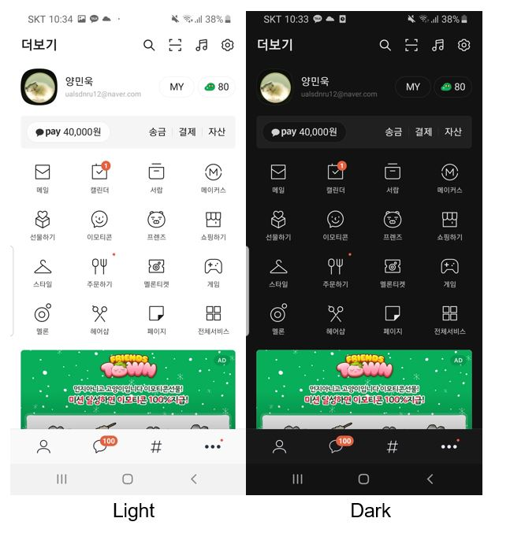
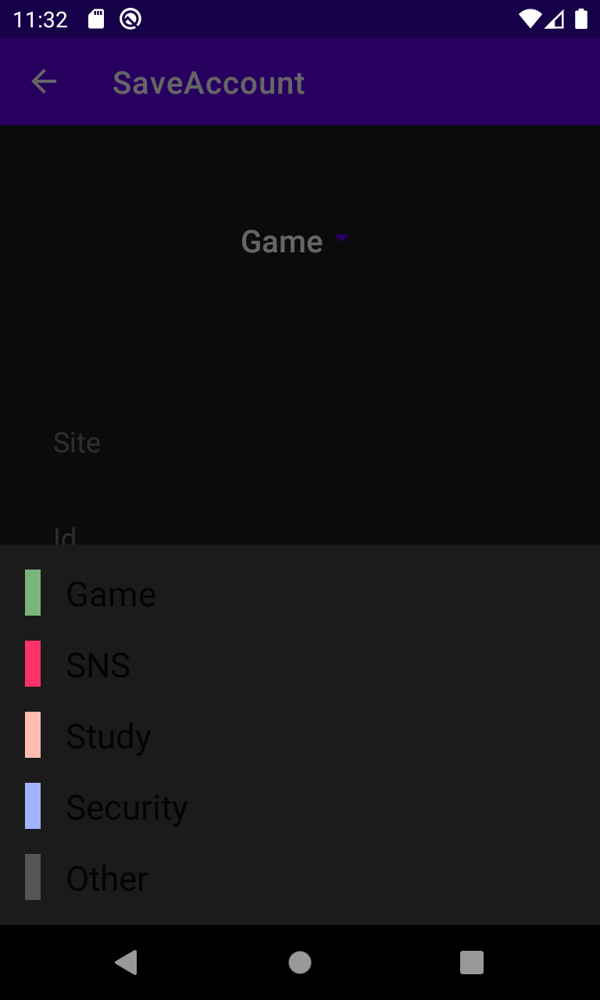
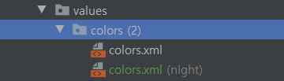

안녕하세요. 점냥입니다 :) 
오늘의 주제는 `Android Q`에 도입된 굉장히 인기가 많았던 기능으로 저 또한 평소에 선호하고 있는 `Dark Theme`입니다!!

### Dark Theme

<p align="center">

</p>

**다크 테마**는 안드로이드 스튜디오, 크롬과 최근에 GitHub에서 다크 테마를 공식적으로 지원해주면서 Mash-UP 전체 톡방에 한번 이슈가 되었던 기능이기도 합니다. 다크 테마를 앱에서 사용하면 어떤 점이 좋을까요?<br></br>

**다크 테마의 장점**
- 전력 사용량을 상당히 절약할 수 있습니다(기기 화면 기술에 따라 다름).
- 시력이 낮은 사용자와 밝은 빛에 민감한 사용자를 위한 가시성을 개선합니다.
- 누구나 어두운 환경에서 쉽게 기기를 사용할 수 있습니다.

필수적인 기능은 아니지만 다크 테마를 좋아하는 저와 같은 사람들을 위해, **Dark Mode 기능을 프로젝트에 도입하는 방법**에 대해서 블로그에 정리하고자 합니다. 

<br></br>

### Dark Theme 활성화

Android Q 이후로 프로젝트에 Dark Theme 설정하는 방법은 **2가지**가 있습니다.
<br>

#### 1. **[Force Dark](https://github.com/jaeryo2357/SaveAccount/tree/feature/darktheme_forcedark)**


```xml
    <style name="AppTheme" parent="Theme.MaterialComponents.Light...">
		...
         <item name="android:forceDarkAllowed" tools:targetApi="q">true</item>
    </style>
```

<br>

**Force Dark**는 다크 테마를 추가하는 가장 간단한 방법으로 기기 시스템 내에서 다크 테마가 활성화되어있다면 현재 앱도 다크 테마를 **강제로** 적용하는 기능입니다.<br></br>

이 기능은 추가하는 방법은 Activity theme에서 `android:forceDarkAllowed` 속성을 **true**로 명시해주면 됩니다. 매우 간단하죠? :)
단, 이미 `Theme.Material`이나 이후에 나올 `DayNight` 등 다크 테마가 미리 적용되어 있다면 위 속성은 적용되지 않아요!<br></br>

#### Force Dark의 단점

이 방법은 빠르게 Dark Theme를 적용하는 방법이지만 아쉽게도 구글에서 권장하고 있지 않아요.<br></br>


<p align="center">

  <br>
  카테고리 텍스트 색상이 검정으로 잘못 계산되었네요..
</p>

그 이유 중 하나로 Force Dark는 실제로 뷰를 랜더링할 때, 어떤 색상을 반전해야 하는 지 분석하여 자동으로 알맞은 다크 테마를 적용시키는 원리로 다소 어색한 다크 테마가 적용될 때도 있고 디자이너가 요구한 디자인과 다를 수도 있기 때문이에요.

```kotlin

View.setForceDarkAllowed(false)
```
```xml
<View
 ...
 android:forceDarkAllowed="false"/>
```

위 코드 처럼 특정 뷰에 대해 다크 테마를 강제로 적용시키는 설정을 비활성화 할수는 있지만, 다른 뷰는 모두 다크 테마인데 특정 뷰만 밝은 테마인 것은 오히려 디자인적으로 이상해지기도 합니다.<br></br>

또 다른 이유로 Force Dark는 Android Q에서 새로 지원해주는 기능이기 때문에 **Android Q 이전 버전 기기에는 다크 테마가 적용이 안되는 큰 아쉬움**이 있습니다.<br></br>

### 2. [DayNight](https://github.com/jaeryo2357/SaveAccount/tree/feature/darktheme_custom)

```xml
<style name="AppTheme" parent="Theme.AppCompat.DayNight">
or
<style name="AppTheme" parent="Theme.MaterialComponents.DayNight">
```

**DayNight**는 Activity Theme에서 적용시키는 AppCompat의 기능 중 하나로 `values-night` 리소스를 활성화시키고, `AppCompat.DayNight` 모드 값에 따라서 동적으로 테마를 전환 합니다.<br></br>

**AppCompat.DayNight 모드**
- `MODE_NIGHT_NO` - Light 테마
- `MODE_NIGHT_YES` - Dark 테마
- `MODE_NIGHT_AUTO_BATTERY` - 배터리 절전 모드일 때, Dark 테마로 전환
- `MODE_NIGHT_FOLLOW_SYSTEM` - 시스템 테마 설정 값에 따름


**DayNight**는 Light 테마일때는 `values` 폴더에 , Dark 테마일 경우 `values-night` 폴더에 접근하여 테마에 맞는 뷰를 그리게 되고, `values-night` 리소스가 없어도 자동적으로 분석하여 그려줍니다. <br></br>

#### DayNight과 Force Dark의 차이점

>Force Dark도 뷰를 분석하여 다크 테마를 적용해주고, DayNight도 동일하다고 설명했는 데 그럼 동일한 방법아닌가요?

DayNight는 values 리소스 파일의 속성에 영향이 있습니다.

```xml
     <TextView
        ...
        android:textColor="@android:color/black"
    	.../>
```

기본 TextView 텍스트 컬러는 검정색이 아니기 때문에 위 처럼 텍스트 컬러를 명시적으로 선언할 경우가 있는데, 이는 다크 모드에서도 검정 텍스트로 표시되어 안좋은 디자인이 됩니다. 

```xml
     <TextView
        ...
        android:textColor="?android:attr/textColorPrimary"
    	.../>
```

이를 해결하기 위해 [Color Theming System](https://material.io/develop/android/theming/color)에서 제공해주는 색상을 사용할 수 있습니다.
`?android:attr/textColorPrimary` 속성은 `Color Theming System`에 지정된 컬로로 Light 테마에서는 검정색을 Dark 테마에서는 흰색을 표현한다고 합니다. <br></br>


<p align="center">

</p>

물론, Color Theming에서 지원해주는 컬러 속성도 색상이 고정이기 때문에 별도로 다크 테마에 적용되는 리소스인 `values-night`에서 컬러를 지정하여 개발할 수도 있습니다.<br></br>


#### 인앱에서 동적으로 테마 변경

DayNight는 `AppCompat.DayNight` 모드 값에 의해 동적으로 테마를 변경할 수 있다는 장점이 있듯이 구글에서도 다음과 같이 3가지 방법으로 앱 내에서 테마를 설정할 수 있도록 권장하고 있습니다.<br></br>

**Android Q 이상**
- Light 테마 
- Dark 테마
- **시스템 기본값**(권장 기본 옵션)

**Android P 이하**
- Light 테마
- Dark 테마
- **절전 모드에서 설정**(권장 기본 옵션)

<p align="center">

</p>

<br></br>

**AppCompat.DayNight 값 설정**

```kotlin
object ThemeHelper {
    public const val LIGHT_MODE = "light"
    public const val DARK_MODE = "dark"
    public const val DEFAULT_MODE = "default"

    fun applyTheme(@NonNull themePref: String) {
        when (themePref) {
            LIGHT_MODE -> {
                AppCompatDelegate.setDefaultNightMode(AppCompatDelegate.MODE_NIGHT_NO)
            }

            DARK_MODE -> {
                AppCompatDelegate.setDefaultNightMode(AppCompatDelegate.MODE_NIGHT_YES);
            }

            else -> {
                if (Build.VERSION.SDK_INT >= Build.VERSION_CODES.Q) {
                    AppCompatDelegate.setDefaultNightMode(AppCompatDelegate.MODE_NIGHT_FOLLOW_SYSTEM);
                } else {
                    AppCompatDelegate.setDefaultNightMode(AppCompatDelegate.MODE_NIGHT_AUTO_BATTERY);
                }
            }
        }
    }
}
```


[Google Dark Theme Sample](https://github.com/android/user-interface-samples/blob/main/DarkTheme/Application/src/main/java/com/example/android/darktheme/ThemeHelper.java) 코드를 참고하여 kotlin으로 변경한 `ThemeHelper` 입니다. **Default 모드**일 때, 구글 권장 사항에 따라서 버전별로 분기해주는 부분을 보실 수 있습니다.

<br></br>

**AppCompat.DayNight 지속성**

```kotlin
@HiltAndroidApp
class AccountApplication : Application() {
    override fun onCreate() {
        super.onCreate()
        val sharedPreferences = PreferenceManager.getDefaultSharedPreferences(this)
        val themePref = sharedPreferences.getString("themePref", ThemeHelper.DEFAULT_MODE)

        applyTheme(themePref ?: ThemeHelper.DEFAULT_MODE)
    }
}
```

AppCompat.DayNight로 설정한 테마는 아쉽게도 **지속성이 없습니다.** 따라서 앱 프로세스가 생성될 때마다 테마를 설정해야 합니다.
또 사용자가 설정한 테마를 저장하기 위해 `PreferenceManager`를 사용해 테마값을 관리합니다 :)<br></br>

**참고**
- [Google I/O 19 Dark Theme](https://youtu.be/OCHEjeLC_UY)
- [Android Dark Theme Docs](https://developer.android.com/guide/topics/ui/look-and-feel/darktheme)
- [Material Dark](https://material.io/develop/android/theming/dark)
