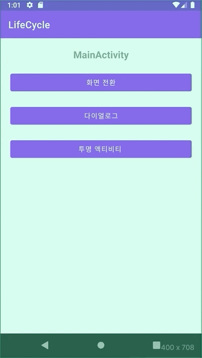
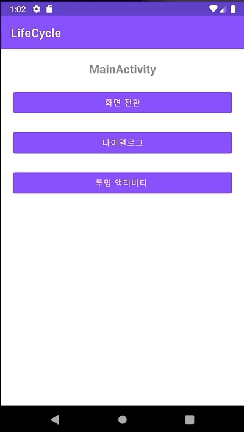

# 헷갈리는 LifeCycle

안녕하세요. Mash-Up 안드로이드 10기 양민욱입니다 :) <br>

2021년 1월의 끝이 벌써 다가오고 있어요. 그리고 곧 채용 시즌인가봐요. 🤗 채용 공고 정보를 올려 주는 톡방에 들어가 있으면 요즘 여러 좋은 기업에서 채용 공고들이 올라오고 있는 것을 볼 수 있어요. 저는 그럴때마다 얼른 기술 면접 준비는 해야지 해야지하고 다짐하고 있습니다.<br></br>

그런 의미에서 이번 포스팅 주제로 Android 기술 면접에서  기초적인 개념일 수도 있지만 헷갈리는 여러 Lifecycle 질문에 대해서 답을 확인해보려고 해요.<br></br>

이 포스팅을 준비하기 전, "Lifecycle에 대해서 어느정도 다룰 예정이신가요? 범위 엄청 넓어요!" 라는 질문을 받았어요. 사실 주제를 처음 생각할 때는 간단한 개념처럼 느껴졌는데 포스팅을 위해 정리 하다보니 `Activity` , Fragment, View 들의 각 Lifecycle와 데이터 처리를 Lifecycle에 맞게 알아서 관리해주는 DataBinding 라이브러리 등등 다양하더라구요. 그래서 저는 이번 포스팅에서 아래와 같은 질문에 답을 알아보는 내용이 될 것 같다고 미리 말씀 드리고 시작하겠습니다<br></br>

> 액티비티에서 홈 버튼을 눌렀을 때는 어떤 콜백이 호출될까요?

<br></br>

## Activity Lifecycle

우선 `Activity Lifecycle` , 생명주기에 대해서 간단히 알아보려고 해요.

Activity Lifecycle은 앱을 사용하는 사용자의 행동에 따라서 변경되는 Activity의 상태를 의미해요. 이렇게 상태가 변경될 때 마다 시스템은 Lifecycle 콜백 함수들을 호출하고 우리는 아래의 문제 상황을 막기 위해 콜백 함수들이 실행이 될 때 적절한 처리를 해주게 되어 올바르게 앱을 개발해야 해요! <br></br>

- 사용자가 앱을 사용하는 도중에 전화가 걸려오거나 다른 앱으로 전환할 때 비정상 종료되는 문제
- 사용자가 앱을 활발하게 사용하지 않는 경우 귀중한 시스템 리소스가 소비되는 문제
- 사용자가 앱에서 나갔다가 나중에 돌아왔을 때 사용자의 진행 상태가 저장되지 않는 문제
- 화면이 가로 방향과 세로 방향 간에 회전할 경우, 비정상 종료되거나 사용자의 진행 상태가 저장되지 않는 문제

<br></br>


<br>

Activity는 위 그림과 같이 상태에 따른 콜백 메소드를 가지고 있습니다. 

이번 포스팅에서 간단하게 주요 콜백 6가지 `onCreate`, `onStart` , `onResume` , `onPause`, `onStop` , `onDestroy` 에 대해 하나씩 살펴봐요! <br></br>

### onCreate

Activity가 생성됨을 의미하는 `Created` 상태일 때 호출되는 콜백 함수입니다.

`onCreate` 함수는 반드시 `override` 해야하는 함수이고 Activity 전체 생명 주기에서 한번만 호출되는 함수로 레이아웃을 inflate하고 필요한 변수들을 초기화하는 작업이 이 함수내에서 이루어집니다.<br>

추가적으로 onCreate 함수 매개변수로 `Bundle` 이 있습니다. 이 변수는 액티비티가 시스템에 의해 강제 종료 되거나 , 가로모드 등 `config change`가 발생될 때 UI에 필요한 Data를 유지시키기 위해 사용할 수 있어요. 하지만 만약 Bitmap 등 커다란 Data를 유지하려고 한다면  `AAC ViewModel` 을 이용해야 합니다.

```kotlin
override fun onCreate(savedInstanceState: Bundle?) {
    super.onCreate(savedInstanceState)
		
		setContentView(R.layout.activity_main)

		if (savedInstanceState != null) {
			...
    }
    textView = findViewById(R.id.text_view)
	  
    
}
```

<br></br>

### onStart

Activity가 `Started` 상태일 때 호출되는 콜백 함수입니다.

이 상태일 때는 뷰가 로드가 되어 화면 내에 UI가 표시되고 아직 사용자와 **상호작용은 할 수 없는 상태입니다.**  따라서 시스템은 이 상태를 빠르게 완료하고 넘어가길 원하기 때문에 이 함수에서 복잡한 연산을 하는 것은 안좋다고 해요

<br></br>

### onResume

Activity가 `Resumed` 상태일 때 호출되는 콜백 함수입니다.

이 상태일 때 비로서 **앱이 사용자와 상호 작용을 할 수 있습니다**! 그리고 앞서 언급된 상태와 다르게 다른 이벤트가 없다면 Activity는 `Resumed` 상태에서 머물게 됩니다.<br></br>

다른 Activity로 전환되었다가 다시 돌아와 Activity가 활성화 될때도 최종적으로 `Resumed` 상태가 되므로 이 콜백 함수 내에서 최신 정보를 갱신하는 작업이 이루어진다고 생각합니다.

<br></br>

### onPause

Activity가 `Paused` 상태일 때 호출되는 콜백 함수입니다.

사용자가 포그라운드의 Activity를 벗어날 때 처음 호출되는 함수로 아직 Activity가 소멸된 것은 아니지만 화면이 아직 일부분 보이는 상태이며 사용자와 상호작용을 할 수 없는 상태입니다. 

시스템 리소스, 카메라 처럼 배터리를 많이 소모하는 리소스를 해제하는 작업이 이 함수 내에서 이루어질 수 있지만, onPause는 화면이 일부분 보이는 상태이며 곧 Activity가 포그라운드로 돌아올 가능성이 있고 멀티 윈도우 환경에서 `Paused` 상태는 아직 UI가 보이는 상태일 수도 있기 때문에 UI 리소스를 해제하는 작업은 하면 안된다고 합니다.

<br></br>

### onStop

Activity가 `Stopped` 상태일 때 호출되는 콜백 함수입니다.

화면이 모두 다른 Activity에 의해 가려진 상태를 의미하고 onPause에서 해제하지 못했던 UI 관련 리소스들을 해제하는 작업이 이 함수내에서 이루어지면 좋다고 합니다.

<br></br>

### onDestory

Activity가 `Destroyed` 상태일 때 호출되는 콜백 함수입니다.

Activity가 소멸되는 상태이며 다음과 같은 2가지 상황으로 인해 변경되었다고 해요.

- `finish` 함수를 호출하여 Activity가 명시적으로 종료
- `config changed` 가 발생, 예를 들어 가로 모드 전환 등으로 인해 Activity를 재생성 할 때

onDestroy 콜백 함수내에서는 onStop에서 하지 못한 리소스 해제를 진행해야 하는 데요. 위의 2가지 상황 중 config changed로 인한 `Destroyed` 상태는 다시 뷰가 생성되는 작업으로 `AAC ViewModel` 내에서 저장하고 있던 데이터를 해제하면 안되겠죠! 그래서 이를 구분하기 위해 `isFinish` 함수를 제공해준다고 합니다.

<br></br>

## Activity Lifecycle Quiz❓

이제 이번 포스팅 주제를 선정하고자 했던 내용입니다. 앞서 간단한게 설명한 Activity Lifecycle 개념을 이해해도  여러 상황에서 발생되는 콜백들을 모두 외우기는 쉽지 않더라구요. 그래서 이번 기회에 여러 면접에서 나왔던 생명주기 질문을 알아보고 어떤 결과를 발생할지 예측 해보고 답을 알아보는 시간을 가지면 좋을 것 같아요 :)

<br></br>

### Q. MainActivity에서 SubActivity로 전환될 때 호출되는 생명주기

MainActivity는 `Resumed` 상태입니다.


<br></br>

<details>
<summary>답</summary>

```kotlin
  Paused: MainActivity

  Created: SubActivity
  Started: SubActivity
  Resumed: SubActivity

  Stopped: MainActivity
  SaveInstanceState: MainActivity

  //Pause 이후 Stop이 바로 호출된다고 예상 할 수도 있지만 전환되는 
  //Activity가 포그라운드에 올라왔을 때 onStop이 된다고 해요!
```
</details>

<br></br>

### Q. SubActivity에서 MainActivity로 다시 돌아갈 때 호출되는 생명주기


<br></br>


<details>
<summary>답</summary>

```kotlin
  Paused: SubActivity

  Started: MainActivity
  Resumed: MainActivity

  Stopped: SubActivity
  Destroyed: SubActivity
```
</details>

<br></br>

### Q.MainActivity가 다이얼로그 가려졌을 때 호출되는 생명주기

다이얼로그는 `AlertDialog` 입니다.



<br></br>

<details>
<summary>답</summary>

```kotlin
  정답은 콜백이 호출되지 않는다 입니다.

  //놀랍게도 AlertDialog는 Acitivty가 아니기 때문에,
  //생명주기에 영향을 주지 않는다고 합니다!
```
</details>
 

<br></br>

### Q.MainActivity에서 홈 버튼을 눌렀을 때는 어떤 콜백이 호출될까요?



<br></br>

<details>
<summary>답</summary>

```kotlin
  Paused: MainActivity
  Stopped: MainActivity
  SaveInstanceState: MainActivity

  //홈 버튼은 Activiy를 종료하진 않지만 UI는 더 이상 화면에 표시되지
  //않기 때문에 Stop 상태가 된다고 해요.
```
</details>

<br></br>

### Q. MainActivity에서 강제종료 후, 다시 앱을 켰을 때


<details>
<summary>답</summary>

```kotlin
  Created: MainActivity
  Started: MainActivity
  Resumed: MainActivity

  //프로세스로 강제 종료할 시 SaveInstanceState가 호출되지 않기 때문에
  //데이터를 유지하기 위해서는 AAC ViewModel을 사용해야 한다고 해요!
```
</details>

<br></br>

### Q.MainActivity가 투명 Acitivity인 TransparentActivity로 호출될 때 발생되는 생명주기


<br></br>

<details>
<summary>답</summary>

```kotlin
  Paused: MainActivity

  Created: TransparentActivity
  Started: TransparentActivity
  Resumed: TransparentActivity

  //투명하기 때문에 MainActivity의 UI는 아직 화면에 표시되는 상황으로
  //Paused로 유지됩니다!
```
</details>


<br></br>

## 정리하며

많이 맞추셨나요? ㅎㅎㅎ 저는 이번 포스팅을 준비하면서 처음 알게된 부분이 많았어요.

여러분도 이 포스팅을 읽고서 다양한 이벤트의 생명주기 콜백이 궁금하시다면 직접 해보시는 것을 추천드립니다!

 `ActivityLifecycleCallbacks` 을 사용하면 앱에서 발생되는 모든 Activity Callback을 알 수 있었어요!

```kotlin
registerActivityLifecycleCallbacks(object : ActivityLifecycleCallbacks {
          ...
```

더 재밌고 흥미로운 생명주기 질문이 있다면 알려주세요. 같이 알아보아요 :)

### 참고

- [Activity 생명주기]([https://developer.android.com/guide/components/activities/activity-lifecycle](https://developer.android.com/guide/components/activities/activity-lifecycle))
