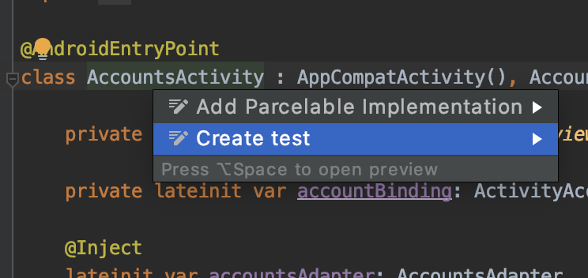
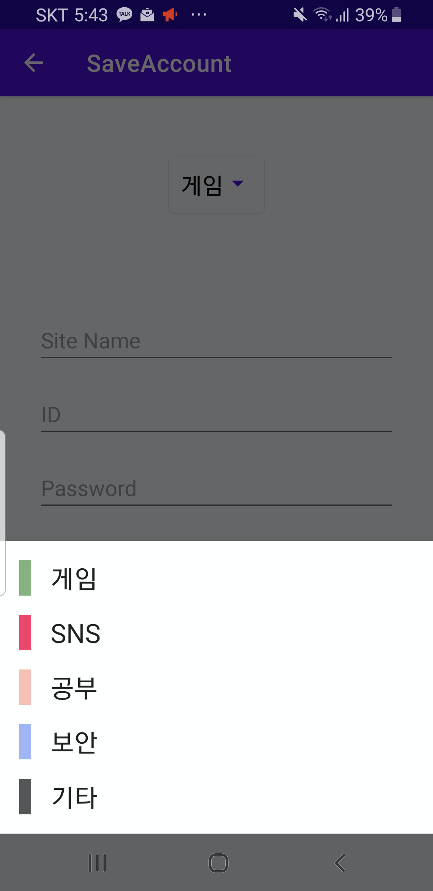

# Android Ui Test

안녕하세요. **Mash-UP** 안드로이드 10기 양민욱 입니다 :) <br></br>

> 여러분은 Android 개발 과정에서 테스트를 도입하시나요?

<br>

저도 이번 포스팅을 공부 하면서 처음 도입 했는데요. 테스트는 Android 프로젝트를 생성할 때 기본으로 생성되어 있을 정도로 구글에서 권장하고 있습니다.

> 개발 과정에서 테스트를 도입하면 어떤 점이 좋을 까요?

<br>

이 질문에 대한 구글의 공식 답변은 아래와 같습니다.

- 서비스 장애를 초기에 **신속한 발견**
- 기존 코드의 호환성을 신경 쓰지 않고 **코드 수정/ 기능 추가 가능**
- 코드의 **안전성 보장**

<br>
테스트는 작성한 코드에 대한 안정성과 정확성, 기능 동작이 올바르게 동작하는지 확인 해주고, 무엇보다 이미 테스트로 정확성을 인정된 코드를 수정한 이후 기존 코드와 호환성을 확인할 때 유용하게 사용할 수 있습니다.

<br></br>

## Ui Test란?

테스트에는 2가지 종류가 있습니다.

- Unit Test: 작은 단위의 테스트로 함수 입 출력, 클래스 등을 대상이며 실기기 없이도 로컬에서 테스트를 수행할 수 있습니다. 또한 간단한 Android FrameWork를 사용 중인 클래스도 **Mockito**, **PowerMock** 라이브러리를 사용하여 Unit Test를 수행합니다.

- **UI Test**: 뷰와 뷰 모델 간의 상호 작용, 특정 화면에서 뷰 클릭, 글자 입력 등 상호작용에 대한 결과를 테스트하며 테스트 대상이 Android FrameWork 의존성이 높기 때문에 실제 기기를 사용하여 테스트를 수행합니다. **Espresso, UIAutomator** 라이브러리를 사용합니다.

이번 포스팅에서는 `UI Test` 를 다룰 예정이며, 포스팅에서 사용되는 예시 코드는 이 [GitHub](https://github.com/jaeryo2357/SaveAccount)에서 참고하실 수 있습니다.

<br></br>

## 프로젝트 설정

UI Test를 사용하기 위해서 `Espresso` 와 `UIAutomator` 라이브러리를 사용할 예정입니다.

우선 app gradle에서 다음과 같이 추가 해주세요 (2020.12.25 기준)

```gradle
// Test
testImplementation 'junit:junit:4.12'
androidTestImplementation "androidx.test:core-ktx:1.3.0"
androidTestImplementation 'androidx.test.espresso:espresso-core:3.3.0'
androidTestImplementation 'androidx.test:runner:1.3.0'
```

<br>
추가적으로, 만약 테스트를 수행할 기기의 개발자 옵션에서 아래 옵션을 사용 중이라면 오류가 생길 수 있습니다.

테스트 진행 중에 옵션을 잠시 꺼두는 것이 좋습니다

- 창 애니메이션 배율
- 전환 애니메이션 배율
- Animator 길이 배율

<br></br>

## 프로젝트 소개 & 테스트 시나리오 설명

코드를 작성하기 전, 마지막 단계입니다. 서두가 너무 긴 것 같아서 지루 하실까봐 걱정이네요ㅜㅜ 😂

**프로젝트 구조**

- SQLite에 저장된 계정을 리스트로 보여주는 화면 : **AccountsActivity**

  - 앱의 진입점
  - **FloatingActionbutton** 이 화면 하단에 존재하며, 해당 버튼을 클릭하면 계정을 추가하는 화면으로 이동합니다.
  - 계정 목록을 특정 계정 리스트를 롱 클릭하면 삭제할 것 인지를 질문하는 Dialog가 화면에 보이며, positive 버튼을 누르면 계정이 삭제됩니다.

- 계정을 추가/ 수정하는 화면 : **AddEditAccountActivity**
  - 계정의 **Category, SiteName, UserId, UserPwd**를 입력 받으며, 저장 버튼을 누르면 SQLite에 계정이 저장됩니다.
  - 뒤로 가기 버튼을 누르면 화면이 종료되어 **AccountsActivity** 화면으로 되돌아 갑니다.

<br></br>
**테스트 시나리오**

1. 계정을 올바르게 저장하고 난 후, AccountsActivity 화면으로 되돌아 왔을 때 **리스트에 저장된 계정이 화면에 표시 되는지를 확인한다.**
2. 1의 기능을 수행한 후, 해당 뷰를 **롱 클릭**을 하면 보여지는 다이얼로그에서 **삭제 버튼을 누르면** 리스트에서 해당 계정이 리스트에서 표시 안되는 것을 확인한다.

<br>
자! 이제 테스트를 작성해 봅시다.
<br></br>

## Espresso로 UI Test 작성

우선 테스트 클래스를 작성해야 합니다.

UI Test는 실제 기기를 통한 테스트를 수행하므로, 프로젝트 폴더에서 **androidTest폴더**에 클래스를 생성해야 해요.

androidTest 폴더는 프로젝트 생성할 때 자동으로 생성되지만 찾기 어렵다면 테스트를 수행하려는 클래스에 대해 `option + enter` 를 누르면 쉽게 테스트 클래스를 생성할 수 있습니다. `JUnit4` 를 선택하여 생성해주세요 :)



<br></br>

### 테스트 클래스 설정

**Espresso**

```kotlin
@RunWith(AndroidJUnit4::class)
@LargeTest
class AccountsActivityTest {

   @Test
    fun createAccount() {
       //ToDo createAccount Test
    }

    @Test
    fun createAccount_deleteAccount() {
       //ToDo createAccount_deleteAccount Test
    }
}
```

**Espresso** 는 뷰에 대한 제어만 제공해서 테스트 환경을 구성하기 위해 `JUnit` 라이브러리를 사용하려고 해요.

자바용 단위 테스트 프레임워크인 **JUnit**은 테스트 환경을 구성하는 **어노테이션**을 제공해주고 있어 가독성이 좋은 **테스트 코드**를 작성할 수 있습니다.

- `@Test`: 어노테이션을 적용한 함수는 **각각의 테스트 케이스**를 의미하게 됩니다.
- `@Before`: 각각의 **테스트 케이스**가 실행되기 전에 수행하고자 하는 함수에 적용하고 테스트의 필요한 리소스를 할당할 때 사용합니다.
- `@After`: 각각의 **테스트 케이스**가 끝난 후 수행하고자 하는 함수에 적용하고 테스트에서 사용한 리소스를 해제할 때 사용합니다.
- `@BeforeClass`: 테스트 클래스가 시작할 때 한 번만 실행하고자 하는 함수에 적용하는 어노테이션입니다.
- `@AfterClass`: 테스트 클래스의 모든 테스트가 종료된 후 실행하고자 하는 함수에 적용하는 어노테이션입니다.
- `@Test(timeout=)` : @Test 룰에 대한 timeout을 지정하게 됩니다. timeout 안에 테스트가 완료되지 않으면 fail이 되며, time은 milliseconds로만 사용할 수 있습니다. 예) @Test(timeout=500)

<br></br>

### Espresso 코드 작성 규칙

```kotlin
onView(withId(R.id.my_view))            // withId(R.id.my_view) is a ViewMatcher
            .perform(click())               // click() is a ViewAction
            .check(matches(isDisplayed()))  // matches(isDisplayed()) is a ViewAssertion
```

1. 테스트하려는 UI를 찾아야 합니다. `Espresso.onView` 로 뷰를 찾는 방법이 있고, 찾으려는 뷰가 AdapterView를 구현한 리스트 형태면 `onData` 로 찾을 수 있습니다.
2. 찾은 뷰에 대한 `ViewAction` 을 사용하여 여러 액션을 수행합니다. 버튼을 누르거나, 글자를 입력하는 행동을 할 수 있습니다.
3. 테스트하고자 하는 시나리오에 맞게 1과 2를 제한 없이 반복하여 수행할 수 있습니다.
4. 테스트에 필요한 액션이 완료되었다면 `ViewAssertions` 를 통해 테스트합니다. 이 함수의 결괏값이 테스트 케이스를 통과하는지를 결정합니다.

<br></br>

### 첫번째 시나리오 작성

우선 UI 테스트는 실제 기기를 통한 테스트로 앱이 실제로 실행되어야 하므로 `ActivityScenario` 를 사용하여 Activity를 실행해야 합니다.

**ActivityScenario API는** Activity 실행과 접근, LiftCycle 상태를 변경하는 기능을 제공해주고 있습니다.

**Activity 접근**

```kotlin
activityScenario.onActivity(activity -> {
       assertThat(activity.getSomething()).isEqualTo("something");
     });
```

**LifeCycle 변경**

```swift
scenario.moveToState(State.RESUMED);    // Moves the activity state to State.RESUMED.
scenario.moveToState(State.STARTED);    // Moves the activity state to State.STARTED.
scenario.moveToState(State.CREATED);    // Moves the activity state to State.CREATED.
scenario.moveToState(State.DESTROYED);  // Moves the activity state to State.DESTROYED.
```

<br></br>

다시 돌아와서 시나리오를 작성합시다.

**ActivityScenario로 Activity 실행**

```kotlin
@Test
fun createAccount() {
   val activityScenario = ActivityScenario.launch(AccountsActivity::class.java)

   activityScenario.close()
}
```

`ActivityScenario` 로 인해 현재 테스트 케이스를 실행하면 테스트할 실제 기기에 AccoutsActivity가 실행되는 것을 확인하실 수 있습니다. 하지만 사용한 리소스, 변경된 상태에 대한 정리를 자동으로 하지 않기 때문에 `close()` 로 종료해야 합니다.

<br></br>

**Espresso 사용하여 뷰 접근**

```kotlin
@Test
fun createAccount() {
   val activityScenario = ActivityScenario.launch(AccountsActivity::class.java)

   //화면에 100%로 표시되어 있는 뷰 중 R.id.add_account_fab id를 가진 뷰를 찾고 click 액션을 수행
   onView(withId(R.id.add_account_fab)).perform(click())

   //이 아래부터는 AddEditAccountActivity가 화면에 표시되고 있다.


   activityScenario.close()
}
```

계정 목록을 보여주는 **RecyclerView**가 존재하고 화면 하단에 **AddEditAccountActivity로 이동하는 FAB(**FloationgActionButton**)이** 존재합니다. 따라서 계정을 저장하는 화면으로 이동하기 위해 FAB을 클릭해야 합니다.

<br></br>

**Espresso 접근한 뷰 제어**

```kotlin
@Test
fun createAccount() {
   ...

   //이 아래부터는 AddEditAccountActivity가 화면에 표시되고 있다.

   onView(withId(R.id.add_account_site_edit_text))
            .perform(typeText("testAccount"), closeSoftKeyboard())
   onView(withId(R.id.add_account_userid_edit_text))
            .perform(typeText("test"), closeSoftKeyboard())
   onView(withId(R.id.add_account_userpwd_edit_text))
	    .perform(typeText("123"), closeSoftKeyboard())

	 //계정을 저장하는 함수를 실행하는 버튼
   onView(withId(R.id.add_account_save_btn)).perform(click())

   ...
}
```

**AddEditAccountActivity**에는 `EditText`로 선언되어 있는 SiteName, UserId, UserPwd를 Text를 입력하고 저장버튼을 누르게 되면 로컬 데이터베이스에 계정이 저장이 됩니다.

Espresso의 **perform**은 뷰 제어에 관한 함수로 **뷰를 클릭**하는 `click()`, Text를 입력하는 `typeText()` 등이 존재합니다. 또한 `,` 를 통해 여러 액션을 동시에 실행할 수도 있습니다.

<br></br>

**Espresso 뒤로가기 기능**

```kotlin
@Test
fun createAccount() {
   ...

   //이 아래부터는 AddEditAccountActivity가 화면에 표시되고 있다.

   ...
   Espresso.pressBack()
   //이 아래부터는 AccountsActivity가 화면에 표시되고 있다.
   ...
}
```

`Espresso.pressBack()` 함수를 통해 뒤로 가기 기능을 실행할 수 있습니다.

<br></br>

**Espresso 생성 테스트**

```kotlin
@Test
fun createAccount() {
   ...

   //이 아래부터는 AddEditAccountActivity가 화면에 표시되고 있다.

   ...
   Espresso.pressBack()
   //이 아래부터는 AccountsActivity가 화면에 표시되고 있다.

   // isDisplayed로 접근한 뷰가 화면에 표시되고 있으면 성공!, 아니면 실패
   onView(withText("testAccount")).check(matches(isDisplayed()))
}
```

이제 테스트 케이스의 성공 여부를 판단하는 `ViewAssertions` 를 사용하여 마무리하면 됩니다.

리스트에는 계정 **SiteName**이 표시되고 있습니다. 위에서 SiteName에 "testAccount" 값을 입력했기 때문에 저장이 정상적으로 실행되었다면 화면에 testAccount 텍스트가 표시되고 있을 것입니다. Espresso는 뷰에 대한 Id뿐만 아니라 텍스트를 통해서도 특정 뷰에 접근할 수 있습니다.

<br></br>

### 두 번째 시나리오 작성

```kotlin
    @Test
    fun createAccount_deleteAccount() {
        val activityScenario = ActivityScenario.launch(AccountsActivity::class.java)

        onView(withId(R.id.add_account_fab)).perform(click())

        onView(withId(R.id.add_account_site_edit_text))
            .perform(typeText("createAccount"), closeSoftKeyboard())
        onView(withId(R.id.add_account_userid_edit_text))
            .perform(typeText("lol"), closeSoftKeyboard())
        onView(withId(R.id.add_account_userpwd_edit_text)).perform(typeText("456"), closeSoftKeyboard())
        onView(withId(R.id.add_account_save_btn)).perform(click())

        Espresso.pressBack()

				//위의 코드는 시나리오 1과 유사한 계정을 저장하고 되돌아온 상황입니다.
				//ToDo 삭제 테스트

        activityScenario.close()
    }
```

첫 번째 시나리오와 매우 유사하고 추가된 계정에 대해서 **삭제하는 기능**을 테스트하는 시나리오입니다.
Activity를 실행하고, 계정 정보를 입력하고 저장하는 부분은 시나리오 1과 유사합니다.

계정 삭제는 삭제하려고 하는 리스트 Item의 **Long Click**에서 시작됩니다. 그 후 정말 삭제할 의사가 있는지를 질문하는 다이얼로그가 화면에 표시되고 해당 다이얼로그에는 취소하는 버튼과 삭제하는 버튼이 존재합니다.


<br></br>

**다이얼로그에서 삭제 버튼 클릭**

```kotlin
    @Test
    fun createAccount_deleteAccount() {

        ...
	//위의 코드는 시나리오 1과 유사한 계정을 저장하고 되돌아온 상황입니다.

        //삭제하려는 Item 롱 클릭
        onView(withText("createAccount")).perform(longClick())
        //다이얼로그의 삭제 버튼( strings.xml에 정의한) Text로 뷰에 접근
        onView(withText(R.string.delete_action)).perform(click())

        ...
    }
```

다이얼로그에 대한 접근도 어려워할 필요가 없습니다. 현재 화면에 표시되는 UI만 신경 쓰면 됩니다.
텍스트를 통해 뷰에 접근했던 것처럼 "삭제"라는 텍스트로 다이얼로그 버튼에 접근하면 됩니다.

<br></br>

**Espresso 삭제 테스트**

```kotlin

   @Test
    fun createAccount_deleteAccount() {

        ...
	//위의 코드는 시나리오 1과 유사한 계정을 저장하고 되돌아온 상황입니다.

	...
	//해당 뷰가 화면에 존재하지 않으면 성공!, 아니면 실패
	onView(withText("createAccount")).check(doesNotExist())

        ...
    }
```

삭제 기능이 정상적으로 실행되었다면 리스트 Item에서 찾을 수 없을 것입니다.

<br></br>

**Espresso 테스트 실행 방법**


테스트 실행은 테스트 케이스 옆 실행 버튼을 클릭해도 되고, 클래스 파일 옆에 실행 버튼을 눌러 클래스 내 전체 테스트 케이스를 한 번에 실행할 수 있습니다.


현재 테스트 클래스에 두 가지 테스트 케이스가 작성되어 있습니다. 따라서 테스트 클래스를 전체 실행하면 위 사진과 같이 2개의 테스트가 통과되었다는 결과를 확인하실 수 있습니다 :)

<br></br>

## Hilt Test 설정

시나리오 2는 문제없지만, 시나리오 1은 테스트를 수행할 때마다 계정을 저장하고 있습니다. 테스트가 끝나면 지우는 것이 좋겠죠?. 저는 그 방법으로 `@After` 어노테이션을 이용하여 각각 테스트 케이스 끝날 때마다 로컬 데이터베이스의 모든 계정을 지우는 로직을 선택했습니다.

이 프로젝트는 비즈니스 로직에서 **AccountRepository 객체**을 이용해 필요한 데이터를 요청/ 삭제하고 있습니다.
해당 객체는 Dagger Hilt 라이브러리를 통해 의존성을 주입 받고 있어 테스트 클래스의 변경이 필요합니다.

app.gradle 추가 (2020.12.25 기준)

```kotlin
androidTestImplementation 'com.google.dagger:hilt-android-testing:2.28-alpha'
kaptAndroidTest 'com.google.dagger:hilt-android-compiler:2.28-alpha'
```

그리고 UI Test에서 Hilt를 이용하기 위해서는 **Hilt Test 전용 AndroidJUnitRunner**를 생성해야 합니다.

androidTest 폴더에서 다음과 같은 클래스를 생성해주세요.

```kotlin
// A custom runner to set up the instrumented application class for tests.
class CustomTestRunner : AndroidJUnitRunner() {

    override fun newApplication(cl: ClassLoader?, name: String?, context: Context?): Application {
        return super.newApplication(cl, HiltTestApplication::class.java.name, context)
    }
}
```

그리고 app.gradle에서 class path로 설정해주세요!

```kotlin
defaultConfig {
	//다른 프로젝트에서 적용중이시라면 com.mut_jaeryo.saveaccount 패키지를 변경해야 합니다!
        testInstrumentationRunner "com.mut_jaeryo.saveaccount.CustomTestRunner"
    }
```

그리고 Hilt를 사용할 테스트 클래스에 `@HiltAndroidTest` 어노테이션을 적용해주고, Hilt Rule을 선언하면 준비가 모두 끝났습니다. 이제 Hilt로 의존성 주입을 할 수 있습니다.

```kotlin
@RunWith(AndroidJUnit4::class)
@LargeTest
@HiltAndroidTest
class AccountsActivityTest {

    @get:Rule
    var hiltRule = HiltAndroidRule(this)

    @Inject
    lateinit var accountRepository : AccountRepository

    @Before
    fun init() {
        hiltRule.inject()
    }

     /**
     * @After: 각각 테스트케이스가 끝날 때마다 실행
     *  accountRepository.deleteAllAccounts()는 suspend 함수로 기본 쓰레드에서
     *  실행되는 Espresso에서는 호출이 불가능 runBlocking으로 호출
     */
    @After
    fun clearTestAccounts() = runBlocking {
        accountRepository.deleteAllAccounts()
    }

		...
}
```

각 테스트 케이스마다 init 함수에서 **의존성 주입**이 되어 `accountRepository` 객체를 사용할 수 있게 되고, clearTestAccounts 함수에서 로컬 DB에 저장된 모든 계정을 지우는 작업을 수행하게 된다.

이제 테스트 케이스에서 실행한 불필요한 정보가 저장될 걱정 없이 테스트 케이스를 작성할 수 있게 되었고 더불어 Hilt를 어떻게 테스트 클래스에서 사용할 수 있는지도 간단히 확인해 보았습니다!

<br></br>

## Ui Automator를 이용한 UI Test

이번에는 `Ui Automator` 를 이용한 UI Test를 해봅시다 :)

시스템 설정 앱에 들어가거나 카메라 사진 공유 등등 Ui Automator는 개발한 앱뿐만 아니라 **실기기 전반적인 테스트를** 할 수 있게 도와주는 라이브러리입니다.
이미지 공유 등 예시를 들 프로젝트 코드가 없어서 대신 `Ui Automator` 에서 사용해 간단한 `configuration changes` 을 테스트해 보도록 하겠습니다.

Android Activity가 실행 중에 **가로 모드 또는 세로 모드**로 변경된 경우, Activity LifeCycle은 `onDestory()` 콜백 후, `onCreate()` 호출됩니다. 즉 화면이 새로 생성되어 이전에 화면에 필요한 정보들을 위해 사용했던 값들을 유지시켜야 합니다.

이런 상황에서 사용하는 방법이 **onSaveInstanceState()**, `ViewModel (AAC)` 등이 있지만 UI Test는 일종의 Black Box Test 기법으로 해당 기능을 어떻게 구현했는지, 어떤 라이브러리를 구현해서 했는지 알 필요 없어 이만 말을 줄이겠습니다 😈

<br></br>

### 프로젝트 설정

app.gradle에 uiAutomator 라이브러리를 추가합시다. (2020.12.25 기준)

```kotlin
androidTestImplementation "androidx.test.uiautomator:uiautomator:2.2.0"
```

<br></br>

### 시나리오 설명

AddEditAccountActivity 화면에서는 계정의 종류를 표시하는 **카테고리 뷰**가 있습니다.
**기본으로 게임으로 설정**되어 있으며 해당 카테고리를 클릭하게 되면 `BottomDialogFramgnet` 로 카테고리를 변경할 수 있습니다.

BottomDialogFragment로 카테고리를 변경하면 카테고리 뷰도 그것에 맞게 변경됩니다.
가로 모드로 변경하면 onCreate가 다시 호출 되면서 뷰가 생성될 텐데,
**기본으로 설정된 게임이 아닌 변경된 카테고리 값을 유지하는지 테스트해 보는 것이 이번 시나리오입니다.**



<br></br>

### 시나리오 작성

**Ui Automator**

Ui Automator 테스트도 `JUnit` 을 이용하여 테스트 할 수 있습니다. 그래서 Espresso에서 설명한 테스트 클래스 생성, 어노테이션이 동일합니다.

```kotlin
//프로젝트 기본 Test Runner을 Hilt CustomRunner로 설정해 두었기 때문에
//의존성 주입이 없더라도 Hilt Test Class로 생성해야 했습니다. 이점은 고려해서 봐주세요.

@RunWith(AndroidJUnit4::class)
@HiltAndroidTest
class CategoryTest {

    @get:Rule
    var hiltRule = HiltAndroidRule(this)

}
```

Ui Automator는 `UiDevice` 객체를 통해 현재 연결된 실기기에 접근할 수 있고 다양한 기능을 사용할 수 있습니다.

- **실기기의 방향을 변경할 수 있습니다.** (가로모드 or 세로모드)
- 실기기의 볼륨을 조절할 수 있습니다.
- Home 버튼, Back 버튼, Menu 버튼을 누를 수 있습니다.
- 현재 화면을 스크린샷으로 저장할 수 있습니다.

<br></br>

```kotlin
@RunWith(AndroidJUnit4::class)
class CategoryTest {

    lateinit var device: UiDevice

	  @Before
    fun startAccountActivityFromHomeScreen() {
        device = UiDevice.getInstance(getInstrumentation())

        //Home Screen에서 시작
        device.pressHome()

        //SaveAccount 앱 실행
        val context: Context = getApplicationContext()
        val intent = context.packageManager
            .getLaunchIntentForPackage(BASIC_PACKAGE)
        intent?.run {
            addFlags(Intent.FLAG_ACTIVITY_CLEAR_TASK)
            context.startActivity(this)
        }

        //앱이 화면에 표시 될때까지 대기
        device.wait(Until.hasObject(By.pkg(BASIC_PACKAGE).depth(0)), LANCH_TIMEOUT)
    }

    companion object {
        val BASIC_PACKAGE = "com.mut_jaeryo.saveaccount"
        val LANCH_TIMEOUT = 5000L
    }
}
```

우선 `@Before` 를 통해 **UiDevice**를 테스트를 위해 연결되어 실기기를 불러옵니다.
Espresso에서 Activity를 실행했던 것과 마찬가지로 **UiDevice로 Activity를 실행시킵니다.** 단지 다른 점은 실행시키고자 하는 **앱의 패키지가 필요하다는 점**입니다.

이러한 점에서 Ui Automator는 다른 앱의 패키지 명으로 개발한 앱뿐만 아니라 다른 앱도 실행시킬 수 있을 것이라는 짐작을 할 수 있습니다.

`UiDevice.wait()` 는 매개 변수로 주어지는 Long 값만큼 대기하는 함수입니다. 테스트해 본 결과
함수 내에 코드들이 순차적으로 실행되는 시간보다 **앱이 실행되는 시간, Activity 전환되는 시간이 상대적으로 느리기 때문에** 기다리지 않으면 미처 보이지 않은 화면에 접근하여 `NullPointException` 을 경험할 수 있습니다.

<br></br>

```kotlin
@RunWith(AndroidJUnit4::class)
class CategoryTest {

    lateinit var device: UiDevice

    ...

		@Test
    fun checkCategory_configurationChange() {
        //Before 클래스에 의해 현재 화면은 AccountsActivity

    }

    ...
}
```

테스트 케이스를 작성합니다. Espresso와 다른 점은 테스트 실행의 흐름이 UiDevice이기 때문에 테스트 케이스 실행 시점부터 이미 Activity는 실행되고 있는 상태입니다. 따라서 뷰에 대해 제어만 하면 됩니다.

<br></br>

**Ui Automator 화면 전환**

```kotlin
@RunWith(AndroidJUnit4::class)
class CategoryTest {

    lateinit var device: UiDevice

    ...

		@Test
    fun checkCategory_configurationChange() {
        //Before 클래스에 의해 현재 화면은 AccountsActivity

        device.findObject(By.res(BASIC_PACKAGE, "add_account_fab"))
            .click()
        //앱이 화면에 표시 될때까지 대기
        device.wait(Until.hasObject(By.pkg(BASIC_PACKAGE).depth(0)), LANCH_TIMEOUT)
	// 아래 코드부터는 AddEditAccountActivity
    }

		...
}
```

Espresso에서 뷰의 ID로 접근한 것과 동일 합니다. `UiDeivce.findObject()` 함수 내에서 패키지 명과 리소스 값과 일치하는 현재 화면에 표시되고 있는 `UiObject2` 객체를 가져옵니다.
그리고 해당 객체에 대해서 `click()` 함수로 클릭 액션을 수행하여 Activity를 전환합니다.

<br></br>

**Text와 일치하는 뷰 찾는 Ui Automator**

```kotlin
@RunWith(AndroidJUnit4::class)
class CategoryTest {

    lateinit var device: UiDevice

    ...

		@Test
    fun checkCategory_configurationChange() {

	...
        // 아래 코드부터는 AddEditAccountActivity

	device.findObject(By.res(BASIC_PACKAGE, "category_card"))
               .click()

        //다이얼로그가 화면에 표시 될때까지 대기
        device.wait(Until.hasObject(By.pkg(BASIC_PACKAGE).depth(0)), LANCH_TIMEOUT)

        val studyCategory = getApplicationContext<Context>().getString(R.string.category_study)

	//studyCategory Text와 일치하는 뷰를 찾아 click
        device.findObject(
            UiSelector().text(studyCategory)
                .className("android.widget.TextView"))
            .click()
	//카테고리 변경 완료

	...
    }

	...
}
```

카테고리 버튼을 리소스 id `R.id.category_card` 로 찾아 `click()` 액션을 수행하여
카테고리를 선택할 수 있는 `BottomDialogFramgnet` 화면에 표시합니다. 이때도 기다리는 작업이 필요합니다.

Ui Automotor도 리소스 id뿐만 아니라 **화면에 표시된 Text와 일치하는 뷰를 가져올 수 있습니다.**
카테고리 중 **공부 Text와 일치하는** 카테고리 뷰를 찾은 후 클릭합니다.

<br></br>

**값이 일치하는 지 확인하는 JUnit Assert**

```kotlin
@RunWith(AndroidJUnit4::class)
class CategoryTest {

    lateinit var device: UiDevice

    ...

		@Test
    fun checkCategory_configurationChange() {

	...

	//카테고리 변경 완료
        var categoryText : UiObject2 =
		device.findObject(By.res(BASIC_PACKAGE, "selected_category"))
	// 두 매개변수 값이 동일하면 성공!, 아니면 실패
        assertEquals(categoryText.text, studyCategory)
	...
    }

	...
}
```

카테고리 설정값을 나타내는 뷰의 리소스 ID `R.id.selected_category` 로 해당 뷰를 가져옵니다.
그리고 JUnit의 `asserEquals` 함수로 두 매개변수의 값이 동일한지 테스트합니다.

<br></br>

**Ui Automator 화면 회전**

```kotlin
@RunWith(AndroidJUnit4::class)
class CategoryTest {

    lateinit var device: UiDevice

    ...

    @Test
    fun checkCategory_configurationChange() {

	...

	// 디바이스 왼쪽으로 회전
	device.setOrientationLeft()
        //앱이 화면에 표시 될때까지 대기
        device.wait(Until.hasObject(By.pkg(BASIC_PACKAGE).depth(0)), LANCH_TIMEOUT)

	//뷰가 재생성되었으므로 객체를 다시 찾아야한다.
        categoryText = device.findObject(By.res(BASIC_PACKAGE, "selected_category"))

        //이전에 변경된 카테고리가 유지되었는지 확인
        assertEquals(categoryText.text, studyCategory)
	...
    }

	...
}
```

Espresso는 못 하는 Ui Automator만의 기능입니다. 자동 회전 설정한 실기기라면 화면 회전을 통해 Activity가 재생성될 것입니다. 테스트를 통해 변경된 카테고리가 유지되는지 테스트합니다.

이제 시나리오는 끝이 났습니다!! 테스트가 성공했는지 실행해봅시다 :)

<br></br>

## 정리하며

UI Test를 해보시니 어떠신가요?
저는 핸드폰이 스스로 앱을 실행하고 글자를 입력하며 버튼을 클릭하는 상황이 너무 신기했어요.
스스로 작성한 코드에 대해 확신하는 안 좋은 습관이 있어서 매번 릴리즈 후 에러를 발견하는 실수가 있었는데요.
이러한 테스트 코드를 작성하는 습관을 만든다면 좋을 것 같습니다.

Ui 테스트 자동화에 관한 포스팅이었습니다. 감사합니다:)

<br></br>

**참고**

- [Test Sample](https://github.com/android/architecture-samples)
- [Ui Automator](https://developer.android.com/training/testing/ui-automator)
- [ActivityScenario](https://developer.android.com/reference/androidx/test/core/app/ActivityScenario)
- [Hilt Test](https://developer.android.com/training/dependency-injection/hilt-testing)
