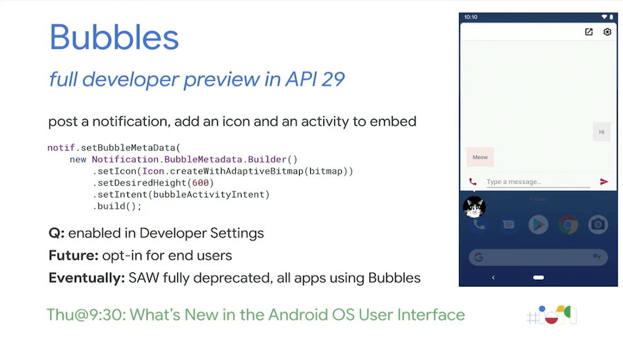
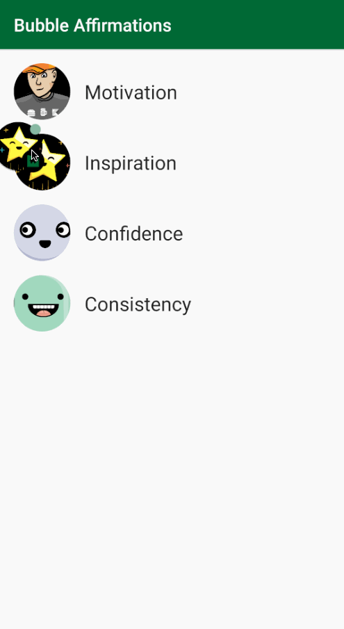
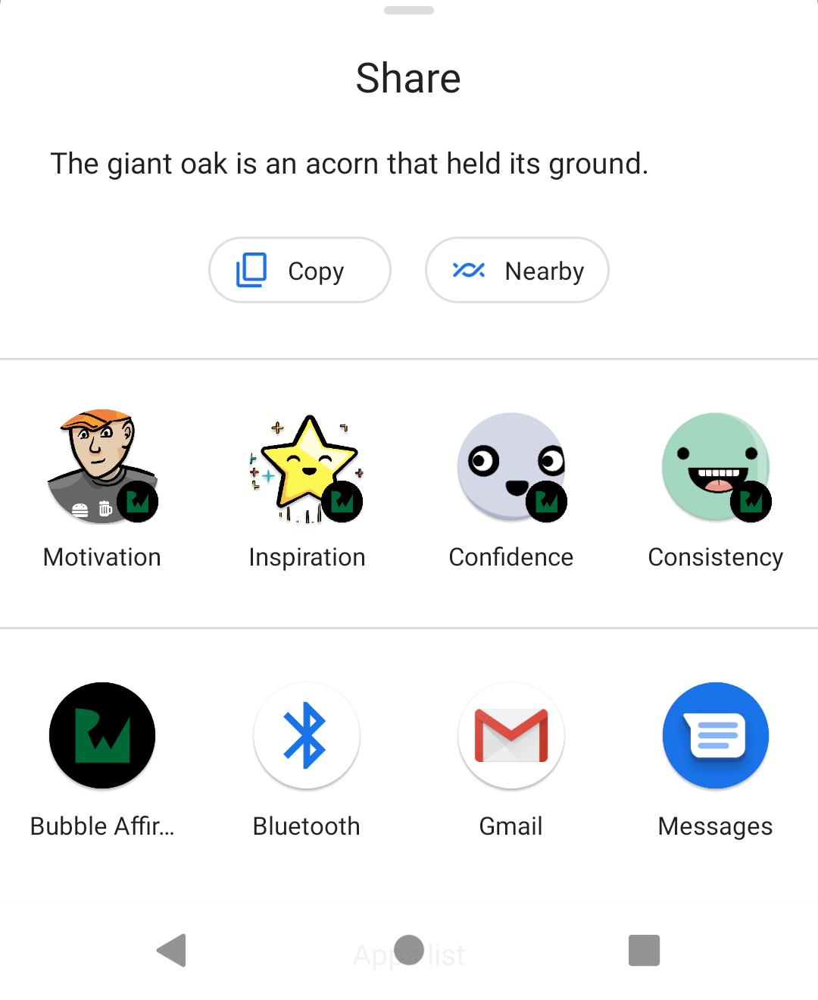

# Bubbles in Android


​	안녕하세요. 아직 안드로이드에 대해 얕고 좁게 지식을 가진 신입 박서희입니다. 
저번에 올린 블로그 글들을 모두 너무 에쁘게 적으셨더라구요. 저는 구글 번역기처럼 로봇같이 적었는데요. 그래서 이번에는 이렇게 시작해봤습니다. 
   사실 아직도 안드로이드 신기술을 보면 머리에 물음표가 가득 떠다니지만, 그나마 제가 흥미롭게 봤던 주제를 공유해보고자 가져왔습니다.혹시 내용에 틀린 점이 있거나 부족한 점이 있으면 한 번 놀리셔도 됩니다... 대신 답이 뭔지 알려주..세요. ^ㅁㅠ


## 개요

혹시 버블을 아시나요? 저는 위클리 번역을 읽다가 이름이 귀여워서 관련 글을 처음 읽고 주제로 가져오게 되었습니다. ~~처음봤~~

<p align = "center"></p>

**Bubbles**은 사용자가 손쉽게 대화를 보고 참여할 수 있도록 도와주는 기술입니다.

**Bubbles** 은 다른 앱 콘텐츠 위를 떠다니며 어디든 사용자가 이동하는 곳으로 따라다닙니다. 버블을 펼쳐 앱 기능과 정보를 살펴볼 수 있으며 사용하지 않을 때는 접을 수 있습니다.

기기가 잠겨 있거나 항상 켜져 있는 화면이 활성화되어 있으면 일반적인 알림이 표시될 때처럼 버블이 나타납니다.


<p align = "center"></p>

<p align = "right"></p>

  **Bubbles**기능은 멀티태스킹 중에도 대화 내용을 계속 표시할 수 있습니다. 사실 안드로이드10에서 페이스북 메신저에서 널리 사용되고있는 기능인 버블 채팅과 같은 프레임워크를 추가했었다고 합니다. 그리고 이 기능이 안드로이드11에서 조금 더 확장된 것이 이 **Bubbles** 입니다.


**버블 관리**

버블은 선택 해제 기능입니다. 앱에 첫 번째 버블이 표시되면 다음 두 가지 선택사항을 제공하는 권한 대화상자가 표시됩니다.

- 앱에 표시되는 버블을 모두 차단 - 알림이 차단되지는 않지만 버블로 표시되지 않습니다.
- 앱에서 모든 버블 허용 - `BubbleMetaData`를 포함해 전송한 모든 알림이 버블로 표시됩니다.


 메시지 앱에서 버블 API 사용이 권장된다고 합니다. 메시지 앱에서 버블 API 사용을 하면 다른 앱을 사용하게 되면 대화에 지장을 받는 상황을 피할 수 있습니다. 또한 키보드와 자동완성을 통합해 비밀번호나 신용카드 데이터와 같은 민감한 자동완성 내용을 직접 선택해 안전하게 전달할 수 있다고 합니다.

안드로이드10에서는 이러한 기능을 지원하는 앱(안드로이드 메시지 및 페이스북 메시지 등)만 지원했다면, 안드로이드11에서는 모든 메시징 앱이 **Bubbles** 을 지원합니다. +그러나 몇몇은 안드로이드 11에서 버블은 몇 개의 앱이 지원되지 않아 완벽히 지원된다고는 할 수 없다고 말합니다. 


## Bubble API 기술


**Bubbles**은 알림 API를 통해 생성되며, 알림을  **Bubbles**로 표시하려면 알림에 추가 데이터를 연결해야 합니다.

버블 펼쳐 보기는 개발자가 선택하는 activity에서 생성됩니다. 그 activity 는 [resizeable](https://developer.android.com/guide/topics/manifest/activity-element#resizeableActivity) 와 [embedded](https://developer.android.com/guide/topics/manifest/activity-element#embedded) 가능해야합니다. 이러한 요구사항 중 하나라도 부족하면 활동이 도움말 풍선이 아니라 알림으로 표시됩니다.

다음 코드에서는 간단한 도움말 풍선을 구현하는 방법입니다.

```xml
<activity
  android:name=".bubbles.BubbleActivity"
  android:theme="@style/AppTheme.NoActionBar"
  android:label="@string/title_activity_bubble"
  android:allowEmbedded="true"
  android:resizeableActivity="true"
/>
```

여러 대화 상대와의 다중 채팅 대화와 같이, 유형이 같은 여러 개의 도움말 풍선이 앱에 표시되는 경우 해당 활동에서 여러 인스턴스를 실행할 수 있어야 합니다. 
  Android 10을 실행하는 기기에서는 [`documentLaunchMode`](https://developer.android.com/guide/topics/manifest/activity-element?hl=ko#dlmode)를 명시적으로 `"always"`로 설정하지 않으면 알림이 도움말 풍선으로 표시되지 않습니다. 

Android 11부터는 시스템에서 모든 대화의 `documentLaunchMode`를 자동으로 `"always"`로 설정하므로 이 값을 명시적으로 설정할 필요가 없습니다.


**Bubble**을 전송하려면 다음 단계가 필요합니다.

- 평소처럼 [알림을 생성](https://developer.android.com/training/notify-user/build-notification?hl=ko)합니다.

- [`BubbleMetadata.Builder(PendingIntent, Icon)`](https://developer.android.com/reference/android/app/Notification.BubbleMetadata.Builder?hl=ko#Notification.BubbleMetadata.Builder(android.app.PendingIntent, android.graphics.drawable.Icon)) 또는 [`BubbleMetadata.Builder(String)`](https://developer.android.com/reference/android/app/Notification.BubbleMetadata.Builder?hl=ko#Notification.BubbleMetadata.Builder(java.lang.String))을 호출하여 BubbleMetadata 객체를 생성합니다.

- [`setBubbleMetadata()`](https://developer.android.com/reference/android/app/Notification.Builder?hl=ko#setBubbleMetadata(android.app.Notification.BubbleMetadata))를 사용하여 알림에 메타데이터를 추가합니다.

  

```kotlin
// Create bubble intent
val target = Intent(context, BubbleActivity::class.java)
val bubbleIntent = PendingIntent.getActivity(context, 0, target, 0 /* flags */)

// Create bubble metadata
val bubbleData = Notification.BubbleMetadata.Builder(bubbleIntent,
            Icon.createWithResource(context, R.drawable.icon))
    .setDesiredHeight(600)
    .build()

// Create notification
val chatPartner = Person.Builder()
    .setName("Chat partner")
    .setImportant(true)
    .build()

val builder = Notification.Builder(context, CHANNEL_ID)
    .setContentIntent(contentIntent)
    .setSmallIcon(smallIcon)
    .setBubbleMetadata(bubbleData)
    .addPerson(chatPartner)
```

  사용자가 앱에서 버블이나 알림을 차단하지 않은 경우, 버블이 전송될 때 앱이 포그라운드에 있는 경우 중요도가 무시되고 버블이 항상 표시됩니다.


### 펼친 Bubble 만들기

버블이 자동으로 펼침 상태로 표시되도록 구성할 수 있습니다. 사용자가 버튼을 탭하여 새 채팅을 시작하는 것과 같이 버블이 표시되게 하는 작업을 실행하는 경우에만 이 기능을 사용하는 것이 좋습니다. 이 경우 버블이 생성될 때 전송되는 초기 알림을 숨기는 것도 괜찮습니다.

[`setAutoExpandBubble()`](https://developer.android.com/reference/android/app/Notification.BubbleMetadata.Builder?hl=ko#setAutoExpandBubble(boolean))이나 [`setSuppressNotification()`](https://developer.android.com/reference/android/app/Notification.BubbleMetadata.Builder?hl=ko#setSuppressNotification(boolean))과 같은 동작을 활성화하는 플래그를 설정하는 데 사용할 수 있는 메서드가 있습니다.

```kotlin
val bubbleMetadata = Notification.BubbleMetadata.Builder()
    .setDesiredHeight(600)
    .setIntent(bubbleIntent)
    .setAutoExpandBubble(true)
    .setSuppressNotification(true)
    .build()
```


## Bubble content lifecycle 생명주기

버블이 펼쳐지면 콘텐츠 활동이 일반 [process lifecycle](https://developer.android.com/guide/components/activities/process-lifecycle) 를 거치므로 애플리케이션이 포그라운드 프로세스가 됩니다.

버블이 접히거나 닫히면 활동이 삭제됩니다. 그러면 앱에 실행 중인 다른 포그라운드 구성요소가 있는지 여부에 따라 프로세스가 캐시되고 나중에 종료될 수 있습니다.


## Bubble 사용

사용자에게 방해되는 경우를 줄이기 위해 도움말 풍선은 특정 상황에서만 표시됩니다.

- 버블은 화면 공간을 차지하고 <u>다른 앱 콘텐츠를 가립니다</u>. 진행 중인 커뮤니케이션과 같이 중요도가 높거나 사용자가 일부 콘텐츠에 대해 버블을 명시적으로 요청한 경우에만 알림을 버블로 전송해야 합니다.

- 버블은 사용자가 비활성화할 수 있습니다. 이 경우 버블 알림은 일반적인 알림으로 표시됩니다. 

  

  앱 정보 페이지를 열고 '알림'을 선택하여 위에서 한 설정을 바꿀수도 있습니다. 

  설정을 관리할 특정 대화를 선택하거나 '버블'을 선택하여 전체 대화 또는 일부 대화가 동일안 앱의 버블로 표시되도록 구성합니다. **설정 > 앱 및 알림 > 알림 > 버블** 에서도 버블 메뉴를 찾을 수 있으며, 각각의 메시징 앱 마다 버블을 켜거나 끌 수있는 옵션이 있습니다. 

  작업표시줄을 내려 **'대화'섹션**에 있는 앱에서 알림이 도착하면 왼쪽이나 오른쪽으로 살짝 밀어주게되면 두 개의 버튼이 표시됩니다. 여기에서 톱니바퀴 모양의 **'설정'**을 눌러 '**우선순위'**를 선택합니다.  버블로 표시할 수 있는 대화, 특정 대화 또는 앱 내의 모든 대화를 변경하고자 한다면 **'모든 버블 설정'**을 선택해줍니다.  활성화되면 이후의 모든 알림은 버블로 표시되고 알림창에서 대화섹션 맨 위에 표시됩니다.


- 대화를 우선 순위로 설정가능합니다. 사용자가 처음이 작업을 수행하면 시스템은 해당 대화가 우선 순위임을 확인합니다. 대화를 우선 순위로 설정하면 다음과 같은 효과가 있습니다.

  - 아바타 주위에 주황색 원이 추가됩니다.

  - 이제 대화가 대화 섹션 상단에 나타납니다.

  - 잠금 화면에 아바타가 표시됩니다.

  - 사용자는 우선 대화를 통과하도록 방해 금지 설정을 지정할 수 있습니다.

    <p align = "center"></p>

- 버블에서 실행하는 프로세스(예: 활동 및 대화상자)는 **버블 컨테이너** 안에 표시됩니다. 이는 즉, 버블에 작업 스택이 있을 수 있음을 의미합니다. 버블 내에 기능이나 탐색이 많이 있는 경우 상황이 복잡해질 수 있습니다. 기능을 가능한 한 구체적이고 <u>가볍게 유지</u>하는 것이 좋습니다.

- 버블 아이콘이 활성화되어있는 동안 동일한 대화의 모든 새로운 메시지는 대화 버블의 팝업으로 나타나고 알림 창에도 계속 함께 표시됩니다. (a.k.a faceb**k jjap)

-  버블을 눌러 화면의 다른위치로 끌어 옮길 수 있고 대화 버블을 없애기 위해서는 아이콘을 길게 누르면 디스플레이 아래쪽에 **'X'**가 뜨고 길게 눌렀던 아이콘을 그대로 끌고 내려와 'X'에 갖다 놓으면 해당 대화 버블이 없어집니다. [위클리 첨부파일]

  <p align = "center"></p>

- **Bubble 로 바로 공유 가능** 

  <p align = "center"></p>


제가 예제로 사용해 본 결과, 메세지를 좀 더 시각적이고 간편하게 확인할 수 있어 굉장히 좋았습니다. 다만, 실제로 사용할 경우 사용할 수 있는 최소 버전이 높은 것을 고려해야 할 것 같습니다. 
이상으로 Bubbles 소개를 마치겠습니다. 읽어주셔서 감사해요!! 

아래의 참고 자료를 더 보시면 좋을 것 같습니다. 

```
#### reference

---
//처음 읽었던 안드로이드 위클리 
https://www.raywenderlich.com/18503960-bubbles-conversations-in-android-11-getting-started


https://github.com/android/user-interface-samples/tree/main/People
https://onna.kr/44
http://meeco.kr/news/28122352

//영상
https://youtu.be/td3Kd7fOROw -> android 29 발표 영상입니다. 초반 4분간 bubble 내용이 발표됩니다.

//image from
https://developer.android.com/codelabs/android-people#1
https://www.raywenderlich.com/18503960-bubbles-conversations-in-android-11-getting-started
```
