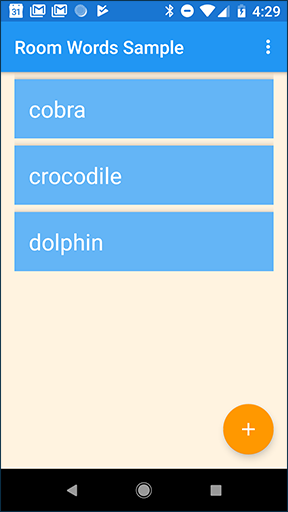
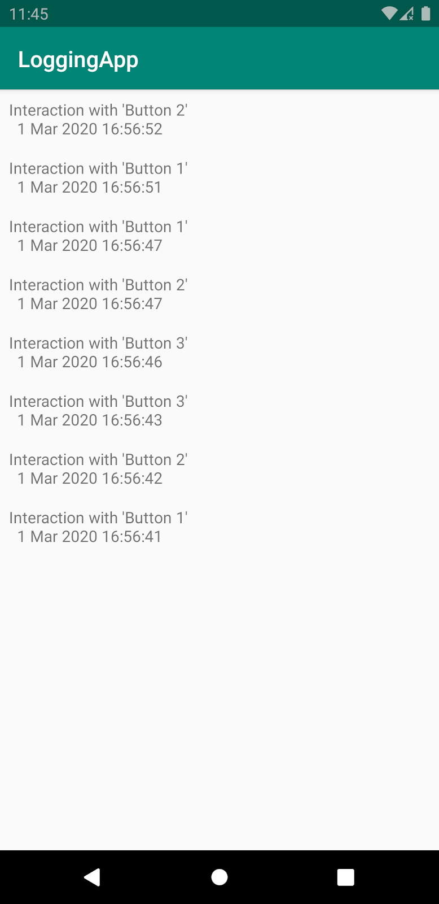

---


title: MVVM && Hilt etc Study Record
date: "2021-01-29"
tags: ["mash-up", "3rd", "seohui", "MVVM", "Hilt", "Practice", "android"]
description: "MVVM & Hilt study."
cover: "./cover3.png"
---

# MVVM && Hilt (etc) Study Record


​	안녕하세요. 10기 박서희입니다. 세 번째 주제는 제가 지금 현재 학습하고 있는 MVVM과 Hilt를 가지고 왔습니다. 
저는 아직 Kotlin, Rxjava 등 새로 배우는 것도 많고 경험해보지 못한 것이 많아서 제가 새로 배우는 내용을 같이 다루는 프로젝트를 해커톤 전까지 실습해보고 익숙해지자는 작은 목표를 설정했어요. 그래서 이번 블로그 글로는 상황 공유와 함께 해당 내용을 학습하며 알게 된 내용을 기록하고 실습할 수 있는 프로젝트들을 리스트업 해보았습니다. 
   아래 내용들은 #ref 에 기재한 링크에서 clone하거나 해석해 본 것들입니다. 해당 링크에서 학습하는 내용을 더 자세히 확인할 수 있습니다. 틀린 내용이 있으면 알려주시면 감사하겠습니다 ღ'ᴗ'ღ 


## MVVM

- ##### Model, View, ViewModel

- 1. 뷰가 데이터를 실시간으로 관찰
  2. 생명주기로부터 안전 + 메모리 누수 방지
  3. 역할 분리(모듈화)
     - View - UI 담당 - 액티비티 / 프래그먼트/ 생명주기 감지 생명
     - ViewModel - UI를 위한 데이터를 가짐 
     - LiveData - Observable 데이터 홀더 / 생명주기에 따른 데이터 전달
     - Repository - DB, 외부 웹 서버 등에서 데이터 가져옴
     - Room - SQLite 데이터 베이스를 편하게 사용하게 해주는 라이브러리

### + AAC

Android Architecture Component 
앱 구조를 더 튼튼하 테스트에 용이하고 유지보수성이 뛰어나게 만들도록 하는 라이브러리의 모음

[Android, ViewModel - AAC의 ViewModel 사용 방법 정리](https://black-jin0427.tistory.com/322?category=727620) 	ᕕ( ᐛ )ᕗ  와아ㅏ! 진성님 블로그다!!  👏

==> 안드로이드 스튜디오 4.1 기준 AAC ViewModel 초기화를 순서대로 확인해볼 수 있습니다.


###### 📝DI 가 함께 있는 MVVM을 처음 구현하기 어려울 수 있어요. 

대체 -> Koin을 사용한 MVVM 패턴 사용해 보기 

- https://black-jin0427.tistory.com/138 	ᕕ( ᐛ )ᕗ  와아ㅏ! 진성님 블로그다!!  2👍 
  ==> 이외의 MVVM 관련 내용 정독! 

###### 📖+) DI란

- https://velog.io/@wlsdud2194/what-is-di

  **Dependency Injection : 의존성 주입**

  [링크 참고] 아래 코드에서 볼 수 있듯 `Programmer` 클래스에서 `startProgramming` 함수가 호출되기 위해서는 `Coffee` 클래스가 필요. 이것을 **Programmer 클래스는 Coffee 클래스의 의존성을 가진다** 라고 합니다. 

  ```java
  // Programmer.java
  class Programmer {
      private Coffee coffee;
  
      public Programmer() {
      	this.coffee = new Coffee();
      }
      
      public startProgramming() {
      	this.coffee.drink(); // 일단 마시고 시작하자
          ...
      }
  }
  https://velog.io/@wlsdud2194/what-is-di
  ```

  ```java
  // Programmer.java ====의존성 주입 하면====
  class Programmer {
      private Coffee coffee;
  
      // 그 날 마실 커피를 고를 수 있게된 개발자
      public Programmer(Coffee coffee) {
      	this.coffee = coffee;
      }
      
      public startProgramming() {
      	this.coffee.drink();
          ...
      }
  }
  https://velog.io/@wlsdud2194/what-is-di
  ```

  

  ###### why ? 왜 쓰지?

- Unit Test가 용이해진다.
- 코드의 재활용성을 높여준다.
- 객체 간의 의존성(종속성)을 줄이거나 없엘 수 있다.
- 객체 간의 결합도이 낮추면서 유연한 코드를 작성할 수 있다.


## Hilt

Hilt는 Android용 종속 항목 삽입 라이브러리.

Hilt는 프로젝트의 모든 Android 클래스에 컨테이너를 제공하고 수명 주기를 자동으로 관리함으로써 애플리케이션에서 DI를 사용하는 표준 방법을 제공합니다. Hilt는 Dagger가 제공하는 컴파일 시간 정확성, 런타임 성능, 확장성 및 [Android 스튜디오 지원](https://medium.com/androiddevelopers/dagger-navigation-support-in-android-studio-49aa5d149ec9)의 이점을 누리기 위해 인기 있는 DI 라이브러리 [Dagger](https://developer.android.com/training/dependency-injection/dagger-basics?hl=ko)를 기반으로 빌드되었습니다. 

+[Hilt 및 Dagger](https://developer.android.com/training/dependency-injection/hilt-android?hl=ko#hilt-and-dagger)를 참조


- **Dagger Hilt - What**

  [공식 블로그](https://dagger.dev/hilt/)

  : 처음 Dagger Hilt를 입문하는 사람들을 위한 Quick-Start Guide가 첨부되어 있다.

  

- `HiltAndroidApp` - 해당 annotation은 구성 요소에 붙여줘야 하는 모든 모듈의 진입점

- `AndroidEntryPoint` - Activity, Fragment, View, Service, BroadCast Receiver 등에 사용

- `InstallIn` - 모듈에 컴포넌트 추가

- `Components`  - lifecycle

  <p align = "center"></p>

- `ViewModelInject` - 해당 annotation을 ViewModel에 붙여주기만 하면 자동으로 주입이 가능
                                      <u>[viewModelInject.kt -->viewModelInjectActivity.kt ]</u>

- `WorkerInject` - 해당 어노테이션이 달려있는 클래스를 모두 찾아서 `WorkManager`와 함께 `worker`를 주입하는데 사용할 수 있는 HiltWorkerFactory를 생성


## 실습  프로젝트

여러 가지 실습을 해보고자 찾아보았습니다. 

### 1. **Pokemon**  

##### Libraries Used:

- [Hilt](https://developer.android.com/training/dependency-injection/hilt-android)
- [RxJava3](https://github.com/ReactiveX/RxJava)
- [ViewModel](https://developer.android.com/topic/libraries/architecture/viewmodel)
- [LiveData](https://developer.android.com/topic/libraries/architecture/livedata)
- [ViewBinding](https://developer.android.com/topic/libraries/view-binding)
- [Retrofit](https://square.github.io/retrofit/#:~:text=Retrofit Configuration,are turned into callable objects.)
- [Room](https://developer.android.com/training/data-storage/room)

<p align = "center"></p>


해당 내용을 가장 먼저 찾았지만 이해하기 어려워 다른 내용을 찾아보았습니다. 비교적 간단한 예제들을 먼저 보는 것이 좋은 것 같습니다.

### 2. Guitar

- [Android Kotlin Fundamentals: Data binding with ViewModel and LiveData](https://developer.android.com/codelabs/kotlin-android-training-live-data-data-binding?hl=en#0)

<p align = "center"></p>


 LiveData를 통해 화면이 가로와 세로 변경이 되어도 어떻게 데이터를 유지하는지 알 수 있는 예제입니다.

안드로이드 ADB를 사용.

이 예제는 liveData가 어떤 건지 확인해 보고자 학습해보았습니다.


### 3.Room with MVVM

- [Room with MVVM]https://developer.android.com/codelabs/android-training-livedata-viewmodel#1

<p align = "center"></p>

저장 가능

데이터베이스와 함께 작동하여 단어를 가져오고 저장합니다.

표시하는 모든 단어는 `MainActivity`의 `RecyclerView`에 있습니다.

`Activity`사용자가 단어를 입력하면 앱이 해당 단어를 데이터베이스에 추가 한 다음 목록이 자동으로 업데이트됩니다.


### 4.Using Hilt

- [Using Hilt in Android](https://developer.android.com/codelabs/android-hilt?hl=ko#1)

<p align = "center"></p>

 번호가 매겨진 버튼 중 하나와 상호 작용할 때마다 로그가 생성되고 저장됩니다. **모두보기 화면에서 이전의 모든 상호 작용의 목록이 표시됩니다. 로그를 제거하려면 로그 **삭제 버튼을 누릅니다.

이 코드 랩에서는  [Room](https://developer.android.com/topic/libraries/architecture/room?hl=ko) 을 사용 하여 로컬 데이터베이스에 데이터를 저장 하는 애플리케이션에 Hilt를 추가 합니다.


### +5. MVVM + AAC


<p align = "center"></p>


연락처(Contacts) 리스트를 보여주는 예제. 연락처 목록과 추가의 두 개의 액티비티를 가집니다.

목록 안에는 RecyclerView로 연락처가 나열되고, 새 연락처를 추가하면 자동으로 추가/정렬됩니다.. 리스트의 연락처를 클릭하면 편집할 수 있고, 길게 누르면 삭제할 것인지 다이얼로그를 보여줍니다. 

해당 예제는 아직 살펴보는 중입니다!


### 6. 다현님의 MVVM 실습 코드!

https://github.com/dahyun1226/mvvm1212  ᕕ( ᐛ )ᕗ  와아ㅏ! 다현님 실습 프로젝트다!!  👏 


### 7. MVVM + koin

<p align = "center"></p>


  AAC의 ViewModel /LiveData / DataBinding 을 사용한 MVVM 패턴+ Koin 을 사용하여 의존성을 없앤 프로젝트입니다.

ᕕ( ᐛ )ᕗ  와아ㅏ! 진성님 실습 프로젝트다!! 👏


## 실습하고 난 후

진성님 블로그를 좀 더 열심히 읽어보려고 합니다. :) 

- 저는 개인적으로 기본 설명글을 읽고 간단했던 블로그 예제, 진성님, 다현님 설명, 코드를 다시 보는 것이 더 빠르게 이해가 가능했습니다. 
- 처음 하는 예제로는 3, 6, 7, 2 번을 보는 것이 좋은 것 같습니다. +) 몇몇 프로젝트는 다시 살펴볼 계획입니다.
- 이후에는 이러한 실습코드를 바탕으로 To do-list 비슷하게 작성을 해보고자 합니다.


```
#### reference

---
// Codelabs
https://developer.android.com/codelabs/android-hilt?hl=ko#0
https://developer.android.com/codelabs/kotlin-android-training-view-model#0
https://developer.android.com/codelabs/kotlin-android-training-live-data-data-binding?hl=en#1
https://developer.android.com/codelabs/android-training-livedata-viewmodel#1


//Mediums articless
https://medium.com/swlh/mvvm-with-hilt-rxjava-3-retrofit-room-live-data-and-view-binding-8da9bb1004bf
					- Pokemon github: https://github.com/abhinav0612/Pokemon
https://medium.com/hongbeomi-dev/dagger-hilt-%EC%B2%AB-%EA%B1%B8%EC%9D%8C-daaa925deca4


//blog,tistory
https://blog.yena.io/studynote/2019/03/16/Android-MVVM-AAC-1.html
https://woovictory.github.io/2019/06/10/Android-MVVM/
https://blog.yena.io/studynote/2019/03/27/Android-MVVM-AAC-2.html
https://deque.tistory.com/108

//+ Dagger Hilt MVVM
https://github.com/gabriel-TheCode/Dagger-Hilt-MVVMs

//git
https://github.com/dahyun1226/mvvm1212
```
