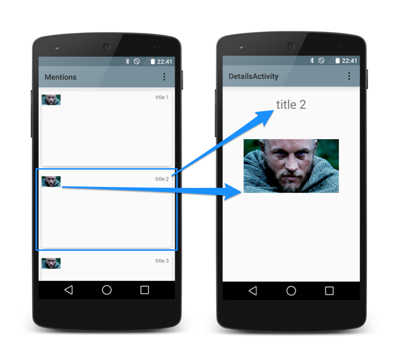

<br>

</br>

안드로이드 **JetPack Navigation**을 사용 중일 때 프래그먼트 간에 위와 같이 요소(이미지)를 공유하려면 어떻게 해야 할까요?
​
안드로이드 공식문서에 이렇게 나와있습니다.
​
[FragmentNavigator.Extras](https://developer.android.com/reference/androidx/navigation/fragment/FragmentNavigator.Extras?hl=ko)클래스를 사용하면[FragmentTransaction.addSharedElement()](https://developer.android.com/reference/androidx/fragment/app/FragmentTransaction?hl=ko#addSharedElement(android.view.View,%20java.lang.String))를 사용하는 것과 유사하게 공유 요소를 전환 이름으로 한 대상에서 다음 대상으로 매핑할 수 있습니다. 그런 다음 아래 예와 같이 추가 항목을navigate()에 전달하면 됩니다.
​
> FragmentNavigatiorExtras
​
```kotlin
@Suppress("FunctionName")
fun FragmentNavigatorExtras(vararg sharedElements: Pair<View, String>) =
        FragmentNavigator.Extras.Builder().apply {
            sharedElements.forEach { (view, name) ->
                addSharedElement(view, name)
            }
        }.build()
```
​
**FragmentNavigatiorExtras**의 내부를 보게 되면 **sharedElements**가 내장되어 있군요. 그래서 **view**와 **string** 값을 쌍으로 공유해주는 방식입니다.
​
**SharedElement**를 잠깐 정리하고 가자면,
​
-   Activity->Activity 간 화면 전환에 사용가능.
-   Fragment->Fragment 간 다른 방법으로 사용 가능.
-   Activity -> Activity +Fragment 구조에서는 사용 불가능.
​
**sharedElements**에는 유니크한 **transitionName**이 필요하기 때문에 우선 **xml**의 공유할 **view**에 **transitionName**을 설정해줍시다.
​
> First Fragment
​
```kotlin
   <ImageView
                android:id="@+id/imgSkin"
                android:layout_width="match_parent"
                android:layout_height="match_parent"
                android:adjustViewBounds="true"
                android:scaleType="centerInside"
                android:transitionName="@string/transition_name"
                tools:ignore="ContentDescription" />
​
```
​
물론 다음 프래그먼트에서도 뷰를 공유해야 하기 때문에 같은 이름의 **transitionName**이 필요하겠죠?
​
> Second Fragment
​
```kotlin
 <ImageView
            android:id="@+id/ivMainSkin"
            android:layout_width="100dp"
            android:layout_height="100dp"
            android:layout_marginStart="20dp"
            android:layout_marginTop="20dp"
            android:padding="20dp"
            android:transitionName="@string/transition_name"
            app:layout_constraintStart_toStartOf="parent"
            app:layout_constraintTop_toTopOf="parent"
            tools:ignore="ContentDescription"
            tools:src="@drawable/md_item_selected" />
```
​
이제 사용 방법을 보겠습니다.
​
> First Fragment
​
```kotlin
 val extras = FragmentNavigatorExtras(
            imageView to getString(R.string.transition_name)
        )
        val action = SkinFragmentDirections.actionSkinFragmentToDetailFragment(skinType)
        NavHostFragment.findNavController(this@SkinFragment).navigate(action, extras)
```
​
제 코드 같은 경우에는 버튼 클릭 시에 내비게이션의 다음 프래그먼트로 **argument**도 보내기 때문에 **action**에 인자가 들어 있는데,<br>인자 없이 다음 프래그먼트로 액션만 선언해줘도 됩니다.
​
> Second Fragment
​
```kotlin
 sharedElementEnterTransition =
            TransitionInflater.from(context).inflateTransition(R.transition.change_bounds)
```
​
다음 프래그먼트에서는 **FragmentNavigatiorExtras**가 알아서 요소를 공유해주기 때문에 위의 코드만 작성하면 됩니다.
​
**inflateTransition**로 애니메이션을 줄 수 있는데 아래와 같이 5개의 요소가 있습니다.<br></br>
​
<p align="center"></p>
<br></br>
​
만드는 방법은 res -> transition 폴더 생성 

​
> change\_bounds.xml
​
```kotlin
<?xml version="1.0" encoding="utf-8"?>
<transitionSet>
    <changeBounds/>
</transitionSet>
```
​
이후에 **inflateTransition**에 적용해 사용하면 되겠습니다.

​
### **Reference**
​
[Fragment Transitions with Shared Elements using Android Navigation](https://jtmuller5-98869.medium.com/fragment-transitions-with-shared-elements-using-android-navigation-7dcfe01aacd)

---