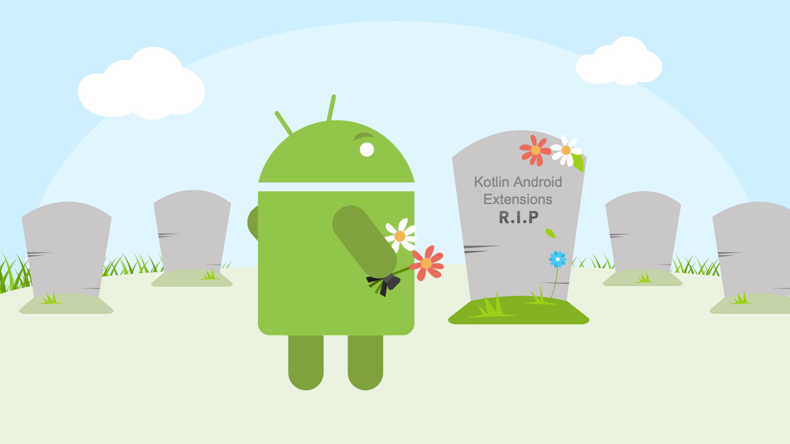

## View Binding은 왜 등장했을까?

오늘은 2019년 Google I/O에서 소개된 View Binding에 대해 알아보겠습니다.<br>
현재까지 안드로이드에서 뷰에 접근할 수 있는 다양한 방법이 제공되었습니다.

<br>

</br>

위의 표에서 안드로이드 팀은 해당 방법들을 다음과 같은 세세 가지의 기준을 정해 비교했습니다.

- **Elegance** : 코드를 깔끔하게 작성할 수 있는지
- **Compile Time Safety** : 컴파일 시간에 안전한지
- **Build Speed Impact** : 빌드 속도가 빠른지

> **findViewById의 문제점**<br></br>

```kotlin
val textView = findViewById<TextView>(R.id.txtView)
```

- 뷰의 개수대로 코드를 추가해줘야 합니다. (100개면 100줄을??)
- Null safety하지 못합니다. 잘못된 뷰 id로 인해 NPE(Null Pointer Exception)가 발생할 위험이 있습니다.

> **Butter Knife의 문제점**<br></br>

```kotlin
@BindView(R.id.btnNext) val nextButton : Button
```

- findViewById의 코드를 좀 더 간결하고 번거로움을 덜어 줄 수 있지, 여전히 boiler plate code들이 발생합니다.
- 2020년 3월 기준 deprecated 되었습니다. (역사속으로..)

> **Kotlin Synthtic의 문제점**<br></br>

```kotlin
btnSend.setOnClickListener { startActivity(Intent(this, SecondActivity::class.java)) }
```

- 뷰의 id로 바로 접근 가능하지만, 동일한 id를 가진 서로 다른 뷰에 의해 실수 할 가능성이 있습니다.
- 전역 네임 스페이스 오염, Kotlin 전용 등 여러가지 문제가 Android 앱의 비정상 종료 횟수를 증가시킵니다.
- 안드로이드 4.1 버전 기준으로 제거되었습니다. 구글에서는 바인딩 방법으로 View Binding을 권장하고 있습니다.
- 개인적으로 유용하게 사용해왔던 방법이라 아쉬움이 남습니다.



<br></br>
**아쉽게도 세 가지의 기준을 모두 만족하는 바인딩 방법은 존재하지 않았습니다.**

> But Why Not?<br></br>

세 가지 기준을 모두 만족할 수 있는 바인딩 방법은 없을까?<br>  
현재 가장 많이 사용되는 **Data Binding**의 목적은 **View와 Model을 엮어주는 역할**인데 많은 개발자들이 단순히 **View에 대한 참조를 얻기 위한 목적**으로 Data Binding을 사용하는 것을 보고, 이러한 맥락에서 구글에서 View에 대한 참조를 얻기 위한 목적으로 오늘의 **View Binding**이 탄생하게 되었습니다.

> **View Binding의 특징**<br></br>

- **Null 안전** - 뷰의 직접 참조를 생성하므로 유효하지 않은 뷰 ID로 인해 null 포인터 예외가 발생할 위험이 없습니다. 또한 레이아웃의 일부 구성에만 뷰가 있는 경우 결합 클래스에서 참조를 포함하는 필드가 @Nullable로 표시됩니다.
- **유형 안전** - 각 바인딩 클래스에 있는 필드의 유형이 XML 파일에서 참조하는 뷰와 일치하기 때문에 클래스 변환 예외가 발생할 위험이 없습니다.
- **빠른 컴파일 속도**와 따로 xml 파일에 태그가 필요하지 않고 자동으로 적용되므로 사용 편의성이 있습니다.
- Data Binding과 비교했을 때 레이아웃 변수 또는 레이아웃 표현식을 지원하지 않으므로 XML 레이아웃 파일에서 직접 **동적 UI 콘텐츠를 선언하는 데 사용할 수 없습니다.**
- 양방향 데이터 결합을 지원하지 않습니다.

# Usage

- **프로젝트 설정**<br>

```kotlin
// Android Studio 4.0
android {
    buildFeatures {
        viewBinding = true
    }
}
```

안드로이드 스튜디오 4.0 부터는 param의 위치가 **buildFeatures**로 이동되어 위와 같이 선언합니다.<br>

- **View Binding in Activity**

```kotlin
class MainActivity : AppCompatActivity() {

    private lateinit var binding: ActivityMainBinding

    override fun onCreate(savedInstanceState: Bundle?) {
        super.onCreate(savedInstanceState)
        binding = ActivityMainBinding.inflate(layoutInflater)
        setContentView(binding.root)

        binding.txtSample.text = "View Binding Sample"

    }
}
```

사용방법은 Data Binding과 유사해보이지만, Data Binding과 달리 xml파일에 전체를 감싸는 layout태그를 선언해주지 않아도 최상단의 부모를 **root**라는 property로 제공합니다.
<br><br>그래서 액티비티의 setContentView에 binding 객체의 root를 넘겨주고 뷰에 접근 할 수 있습니다.

- **View Binding in Fragment**

```kotlin
class DetailFragment : Fragment() {

    private var _binding: FragmentDetailBinding? = null

    // This property is only valid between onCeateView and
    // onDestroyView.
    private val binding get() = _binding!!

    override fun onCreateView(
        inflater: LayoutInflater,
        container: ViewGroup?,
        savedInstanceState: Bundle?
    ): View? {
        _binding = FragmentDetailBinding.inflate(inflater, container, false)
        return binding.root
    }

    override fun onViewCreated(view: View, savedInstanceState: Bundle?) {
        super.onViewCreated(view, savedInstanceState)

        binding.textView.text = "View Binding in Fragment"
    }

    override fun onDestroyView() {
        super.onDestroyView()
        _binding = null
    }
}
```

프래그먼트에서 사용법은 위와 같습니다. 프래그먼트의 생명주기에서 자신의 UI를 그리기 시작하는 부분인 onCreateView에서 바인딩을 시켜주고 binding 객체의 root를 리턴해 넘겨줍니다.<br>
<br>프래그먼트에서는 Nullable 처리를 위해 추가적인 코드가 필요합니다. 프래그먼트는 뷰 보다 오래 지속되기 때문에 onDestroyView()에서 binding class 인스턴스 null 값으로 변경하여 참조를 정리해주어야 합니다.

# DataBinding vs ViewBinding

```kotlin
Result APK size // DataBinding, ViewBinding

Databinding = 2670 kb
ViewBinding = 2620 kb
```

[Comparator binding Project](https://github.com/hardbobby/bindingComparatorAndroid)

- 위의 결과는 같은 구조의 프로젝트에 각각 Data Binding과 View Binding으로 바인딩하여 구현한 프로젝트의 APK 크기들입니다.<br>
- 위의 결과에서 APK 크기가 50kb 차이나듯이 바인딩 방법에 의해 영향을 받게 되고, 충분히 View Binding 사용을 고려할만한 가치가 있습니다.
- View Binding과 Data Binding은 호환이 되기 때문에 같은 모듈에서 동시에 사용할수 있습니다.

## 결론

- **무조건 View Binding을 사용하라는 글은 아닙니다**.
- Data Binding은 양방향 바인딩, Binding Adapter를 이용해 동적으로 UI를 관리하는 장점들이 있습니다.<br>그렇기 때문에 개발자는 상황에 따라 적절한 바인딩 방법을 선택하는 것이 가장 좋은 방법이라고 생각합니다.

**References**

- [Simple Comparison](https://medium.com/@hardianbobby/databinding-vs-viewbinding-simple-comparison-792fa8d72e8)
- [View Binding 알아보기](https://choheeis.github.io/newblog//articles/2020-09/viewBinding)
- [뷰 결합](https://developer.android.com/topic/libraries/view-binding?hl=ko)
- [코틀린 안드로이드 익스텐션 폐기](https://yoon-dailylife.tistory.com/42)
