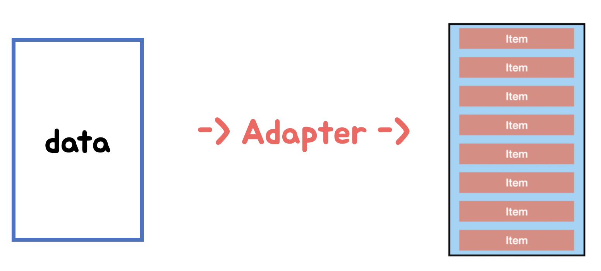

오늘 글에서는 RecyclerView의 list 관리를 효율적으로 다룰 수 있는 ListAdapter에 대해 살펴보려 합니다

먼저, 아래 그래픽은 RecyclerView, Adapter, ViewHolder 및 데이터가 모두 함께 작동하는 방식을 보여주는데요 각각 다음의 역할을 가지고 있습니다.


- **ViewHolder:** RecyclerView의 single item view에 대한 정보를 저장
- **RecyclerView**: 화면에 표시하는 데 필요한만큼의 ViewHolder와 캐시에 추가로 몇 개만 만듦
- **ViewHolders**: 사용자가 스크롤 할 때 "재활용"(새 데이터로 다시 채워짐). 기존 항목은 한쪽 끝에서 사라지고 새 항목은 다른 쪽 끝에서 나타남
- **Adapter** : 데이터 소스에서 데이터를 가져 와서 보유하고있는 뷰를 업데이트하는 ViewHolder로 전달

여기서 **Adapter**는 데이터 리스트를 실제 눈으로 볼 수 있게 itemView로 변환하는 중간다리 역할을 합니다.



## RecyclerView의 Adapter

RecyclerView는 정적 데이터 list에서 리스트를 효율적으로 표시하는 좋은 방법입니다. 하지만 대부분의 RecyclerView 데이터는 동적이죠

Adapter를 사용한 list의 갱신에는 문제점이 있습니다.

먼저 `notifyItemInserted()` 는 지정된 index에 새 task를 삽입할 수 있지만 항목을 제거할 경우에는 문제가 발생합니다.

그리고, `notifyItemRemoved()`은 제거하려는 task의 위치가 있어야지만 유용합니다. 제거 할 위치를 파악 한 뒤에 호출할 수도 있지만 코드는 지저분해질 수도 있죠

**notifyDataSetChanged () 메소드는 비효율적 이다**

`RecyclerView` list의 항목이 변경되어 업데이트해야 함 을 알리기 위해 코드를 아래와 같이 하여[`notifyDataSetChanged()`](https://developer.android.com/reference/android/widget/BaseAdapter)에서를 호출 할 수 있습니다.

```kotlin
var data =  listOf<Person>()
   set(value) {
       field = value
       notifyDataSetChanged()
   }
```

하지만 결과적으로 `RecyclerView` 에서 `notifyDataSetChanged()` 은 옵션이지만 변경되지 않은 부분까지표시되지 않는 화면을 포함해 모든 list를 리바인드 하고 다시 그리게 됩니다.

이것은 불필요한 작업으로 데이터의 양이 크거나 복잡한 list의 경우, 이 프로세스는 사용자가 list를 스크롤 할 때 디스플레이가 깜박이거나 끊길 정도로 오래 걸리는 문제가 발생할 수 있습니다.

> 만약 `RecyclerView`단일 요소를 업데이트하기위한 풍부한 API가 있어 수동으로 해결할 수 있지만, 상당한 양의 코드가 필요 할 것 입니다

## ListAdapter

ListAdapter 는 전체 뷰를 다시 그릴 필요 없이 추가와 제거가 가능하고 이러한 작업을 애니메이션화 할 수 있습니다.

> ListAdapter 없이도 애니메이션 구현은 가능하지만 직접 구현해야하며 뷰가 애니메이션과 함께 다시그려지기 때문에 동일한 성능을 갖지 못합니다.

## DiffUtil

DiffUtil은 ListAdapter 에서 리스트를 효율적으로 변경할 수 있도록 하는 핵심입니다.

`DiffUtil` 은 두 list 간의 차이를 계산 하는 클래스 가 있는데 `DiffUtil` 에서는 new list 와 old list 를 비교하여 이동 및 제거 된 항목을 파악하고, 추가, 제거 또는 변경된 항목을 찾습니다. 그리고 변경된 사항을 파악한 후에 해당 정보를 사용하여 변경, 추가, 제거 또는 이동 된 항목만 RecyclerView에 업데이트 할 수 있습니다.
이는 전체 list를 다시 그리는 것보다 훨씬 효율적이죠!

새로운 데이터를 식별하려면 DiffUtil에서 areItemsTheSame () 및 areContentsTheSame ()을 override 해야하는데요.

DiffCallback 구현 방법을 알아보겠습니다 ~~ :-)

`DiffUtil`클래스 의 기능을 사용하려면 `DiffUtil.ItemCallback` 을 사용해야합니다

1.  `PersonAdapter.kt` 의 가장 아래 `Person` 을 generic 파라미터로 `DiffUtil.ItemCallback` 를 상속받는 `PersonDiffCallback`를 만든다.

    ```kotlin
    class PersonDiffCallback : DiffUtil.ItemCallback<Person>() {
    }
    ```

2.  `PersonDiffCallback`이름에 커서를 놓고 `Option+Enter` 를 눌러 `areItemsTheSame()`및 `areContentsTheSame()`방법을 선택한 다음 **확인** 을 클릭 한다
3.  이렇게하면 `PersonDiffCallback`아래와 같이 두 메서드에 대한 내부 스텁이 생성 된다.
    `DiffUtil` 은 두 가지 방법을 사용하여 리스트와 아이템이 어떻게 변경되었는지 파악한다.

    ```kotlin
     override fun areItemsTheSame(oldItem: Person, newItem: Person): Boolean {
            TODO("not implemented")
        }

    override fun areContentsTheSame(oldItem: Person, newItem: Person): Boolean {
            TODO("not implemented")
        }
    ```

4.  내부 `areItemsTheSame()`에서 전달 된 두 `oldItem` 과 `newItem`이 동일한 지 여부를 테스트하는 코드로를 작성한다.
    두 항목항목의 id 를 비교하여 같으면 `true` 다르면 `false` 를 리턴해 **항목이 추가, 제거 또는 이동**되었는지 확인

    ```kotlin
    override fun areItemsTheSame(oldItem: Person, newItem: Person): Boolean {
    return oldItem.id == newItem.id
    }
    ```

      

5.  `areContentsTheSame()` 은 내부 에서 동일한 데이터가 있는지 확인한다 . 즉, 동일한 지 여부를 판단하는 것이다. 이 동등성 검사는 `Person` 데이터 클래스 이기 때문에 모든 필드를 검한다 . `Data`클래스는 자동으로 `equals` 을 정의하고 몇 가지 다른 방법을 제공한다. `oldItem`그리고 `newItem` 의 차이가있는 경우, `DiffUtil` 에게 list 가 업데이트 되었음을 알려준다.

    ```kotlin
    override fun areContentsTheSame(oldItem: Person, newItem: Person): Boolean {
       return oldItem == newItem
    }
    ```


**getChangePayload**

areItemsTheSame() && !areContentsTheSame()인 경우 해당 메서드가 호출되거 변경내용에 대한 페이로드를 가져옵니다.RecyclerView에서 payload 처리가 필요한 경우에만 사용하기 때문에 이 메서드는 선택적으로 구현하고 default 는 null을 리턴합니다.

```kotlin
 @Nullable
    @Override
    public Object getChangePayload(int oldItemPosition, int newItemPosition) {
        // Implement method if you're going to use ItemAnimator
        return super.getChangePayload(oldItemPosition, newItemPosition);
    }
```

위와같이 DiffCallback을 만들면 ListAdapter를 사용하여 list 관리가 가능해집니다.

### `ListAdapter`

ListAdapter는 AsyncListDiffer의 wrapper 클래스로 lsit를 추적하고 list이 업데이트되면 어댑터에 알립니다.

위와같이 DiffCallback을 만들면 ListAdapter를 사용하여 list 관리가 가능해집니다.

`ListAdapter` : AsyncListDiffer의 wrapper 클래스로 lsit를 추적하고 list이 업데이트되면 어댑터에 알립니다.

변경되는 lsit를 표시 하기 위해 `RecyclerView`를 사용하는 것은 일반적인 패턴 인데요. `RecyclerView`는 list로 지원되는 `RecyclerView` 어댑터를 빌드하는 데 도움이되는 어댑터 클래스 인 `ListAdapter`를 제공하고 바로 이 ListAdapter를 사용하는 방법을 살펴보겠습니다

ListAdapter의 주 사용 메서드

- `getCurrentList()` : 현재 리스트를 반환
- `onCurrentListChanged()` : 리스트가 업데이트 되었을 때 실행할 콜백 지정
- `submitList(MutableList<T> list)` : 리스트 데이터를 교체할 때 사용

#### 1 단계 : 어댑터를 변경하여 ListAdapter 확장

1.  `PersonAdapter.kt`파일의 클래스에서 `ListAdapter` 을 상속받고 첫 번째 파라미터를 `Person`, 두 번째 파라미터로 `PersonAdapter.ViewHolder` 을 추가하며 생성자 매개변수로 `PersonDiffCallback()` 을 추가한다.

```kotlin
class PersonAdapter : ListAdapter<Person, PersonAdapter.ViewHolder>(PersonDiffCallback()) {
```

2. `ListAdapter` 에서 해당 메소드를 구현하므로 override 된 `getItemCount()` 를 지운다.

3. `onBindViewHolder()` 에서 예전 `item`. `data`를 사용하여 항목을 가져 오는 대신 ListAdapter가 제공하는 getItem (position) 메서드를 한다.

```kotlin
//item. deta
val item = getItem(position)
```

#### 2 단계 : submitList ()를 사용하여 list 업데이트 유지

코드는 변경된 list를 사용할 수있을 때 `ListAdapter` 에 알려야한다. `ListAdapter` 는 list의 새 버전을 사용할 수 있음을 `ListAdapter` 에 알리기 위해 submitList ()라는 메서드를 제공한다. 이 메서드가 호출되면 `ListAdapter` 는 새 list를 이전 list과 비교하고 추가, 제거, 이동 또는 변경된 항목을 검색한다. 그런 다음 `ListAdapter` 는 `RecyclerView`에 표시된 항목을 업데이트합니다.

1.  `MemoFragment.kt` 를 연다.
2.  `MemoViewModel` 의 observer `onCreateView()`에서 삭제 한 `data` 변수가 참조되는 오류룰 찾는다.
3.  `adapter.data = it` 을 `adapter.submitList(it)` 에 대한 호출로 대체한다.

```kotlin
MemoViewModel.persons.observe(viewLifecycleOwner, Observer {
   it?.let {
       adapter.submitList(it)
   }
})
```

## RecyclerView와 함께 데이터 바인딩 사용

데이터바인딩 레이아웃으로 빠르게 변경하는 법!

1. ConstraintLayout`태그 에 커서를 놓고`Alt+Enter`(`Option+Enter` Mac의 경우)를 누릅니다!
2. "빠른 수정"메뉴가 열리면 **데이터 바인딩 레이아웃으로 변환을** 선택 합니다.

   ```xml
   <data>
     <variable
       name="viewModel"
       type="com....ViewModel" />
   </data>
   ```

3. `PersonAdapter.kt` 의 `onCreateViewHolder()` 에서 서 `ViewHolder`클래스 찾는 방법을 아래와 같이 해준다.

   ```kotlin
   val binding = ListItemPersonBinding.inflate(layoutInflater, parent, false)
   return ViewHolder(binding)
   ```

4. ViewHolder 는 다음과 같이 됩니다

   ```kotlin
   class ViewHolder private constructor(val binding: ListItemPersonBinding) : 			   		RecyclerView.ViewHolder(binding.root){
            val name: TextView = binding.tvName
   }
   ```

## ++ recyclerview setHasStableIds

recyclerview에서 데이터를 수정할 때 깜박임 현상이 발생하는 경우가 있습니다.

깜박임의 원인은 notifyDataSetChanged 를 하였을 때, Adapter가 이미 존재하는 전체 데이터셋중 어느것이 변경된것인지 몰라 viewHolder를 모두 다시 매칭시켜줄 때 발생하는 것 입니다.

이 문제를 해결하기 위해서는 **setHasStableIds**를 사용해 Adapter에게 각 아이템들이 유니크한 값을 가지고 있다고 알려줘야합니다.

setHasStableIds를 true로 설정하면 Adapter가 아이템들을 추적 할 수 있어 onBindViewHolder() 를 최적화 되게 호출할 수 있게 됩니다.

특히, 똑같은 데이터가 반복적으로 나타나거나 notifyDataSetChanged를 자주 호출 할 경우 성능이 크게 향상하게 됩니다.

setHasStableIds를 사용하기 위해서는 각 아이템에 유니크한 아이디를 부여해야 하기 때문에 실드클래스로 묶어 사용하거나 서버에서 받은 데이터 경우에는 유니크하면 그대로, 스트링이고 유니크 하지 않다면 해시코드로 바꿔넣는 등 유니크한 아이디를 부여합니다.

그리고 Adapter 클래스에서 getItemId() 을 override 하여 구현합니다.

이렇게 RecyclerView의 ListAdapter - DiffUtil 사용법에 대해 알아봤습니다!
RecyclerView를 처음 배우고 사용하며 마주쳤던 notifyDataSetChanged() 등등의 메소드 들이 비효율적인 부분을 가지고 있었다니..! 리펙터링 할 곳이 여기저기 있겠네요 @\_@

reference

https://medium.com/androiddevelopers/adapting-to-listadapter-341da4218f5b
